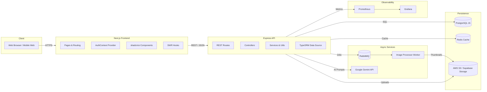
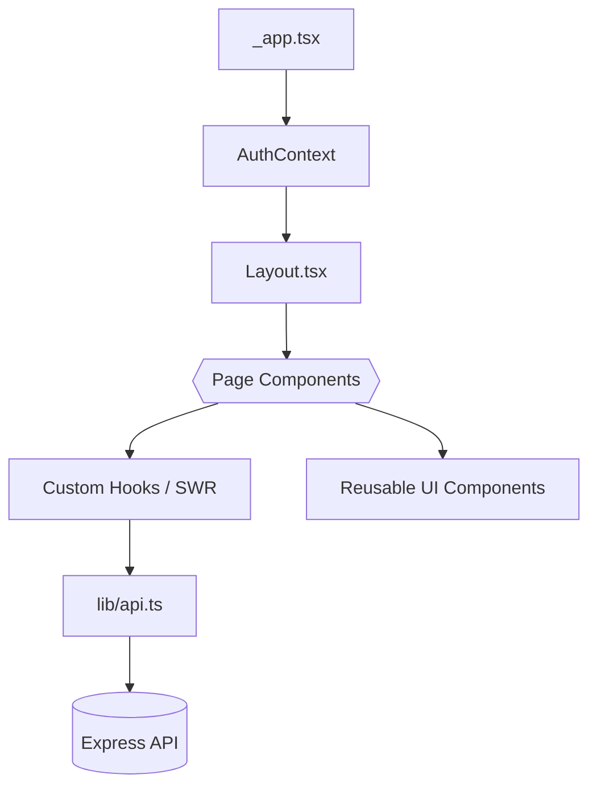
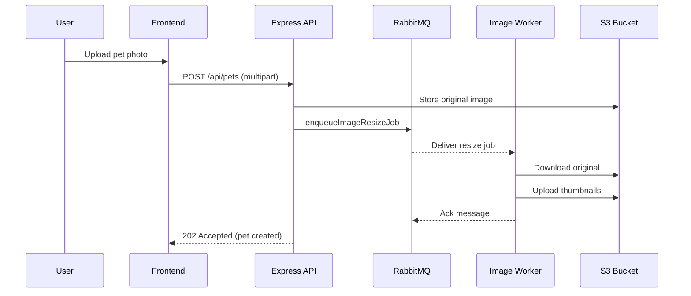
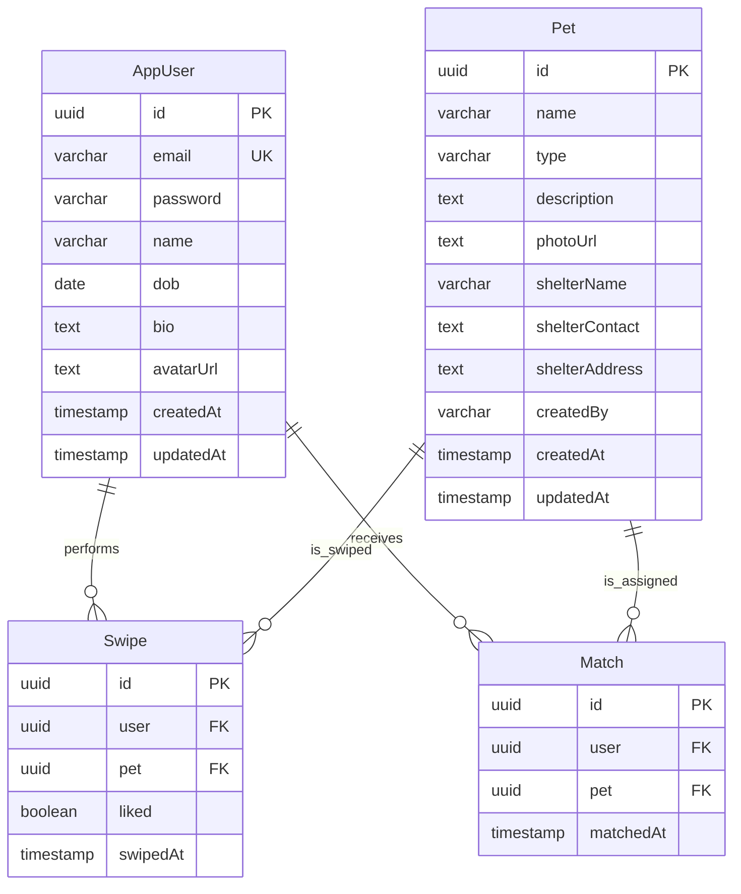

# PetSwipe Architecture

> Comprehensive overview of the PetSwipe swipe-to-adopt platform. This document is the canonical reference for understanding how the application is structured, how components communicate, and how the system is deployed and operated.

## Table of Contents
- [System Overview](#system-overview)
- [Runtime Architecture](#runtime-architecture)
  - [Frontend Architecture](#frontend-architecture)
  - [Backend Architecture](#backend-architecture)
  - [Real-Time and Asynchronous Workloads](#real-time-and-asynchronous-workloads)
- [Domain Model](#domain-model)
- [Infrastructure and DevOps](#infrastructure-and-devops)
- [Cross-Cutting Concerns](#cross-cutting-concerns)
- [Local Development Workflow](#local-development-workflow)
- [Appendix: Directory Map](#appendix-directory-map)

## System Overview
PetSwipe delivers a Tinder-inspired adoption experience. Users interact with a Next.js frontend, which communicates with an Express + TypeORM API. Data persists in PostgreSQL, hot paths are cached with Redis, media is stored in S3/Supabase, and heavy lifting (e.g., image resizing) is delegated to RabbitMQ workers. Observability is handled with Prometheus and Grafana, and the stack is provisioned via Terraform and Ansible.



## Runtime Architecture

### Frontend Architecture
The frontend (`/frontend`) is a TypeScript Next.js application that uses the Pages router for compatibility with the existing authentication flows.



Key building blocks:
- **Pages and routing** – `/pages` defines the primary navigation experiences (`home.tsx`, `swipes.tsx`, `my-pets.tsx`, `pet/[id].tsx`, etc.), including authentication pages and the admin bulk upload flow.
- **Global state** – `AuthContext` wraps the app, bootstraps the authenticated user, and exposes imperative auth helpers (login, signup, reset password, logout). Token persistence is synchronized with the backend via Axios interceptors in `lib/api.ts` to mitigate Safari cookie limitations.
- **Data fetching** – Screens use `swr` to declaratively load profile data, swipe decks, liked pets, and matches while leveraging caching and revalidation semantics.
- **UI composition** – Components under `/components` (e.g., `Navbar`, `Layout`, `DraggableChatbot`, shadcn/ui primitives) encapsulate styling via Tailwind and support theming via `theme-provider.tsx`. Public assets and static copy live under `/public` and `/styles`.
- **Testing** – Frontend tests combine Playwright end-to-end specs (`/frontend/tests/e2e`) and helper utilities for component-level assertions (`/frontend/tests/helpers`). Continuous integration is wired through the root `Makefile` and `package.json` scripts.

### Backend Architecture
The backend (`/backend`) is an Express application organized along clear layers: routes, controllers, services, entities, and infrastructure adapters.

```mermaid
flowchart LR
    Routes[/Routes (auth, users, pets, matches, swipes, chat)/]
    Controllers[/Controllers/]
    Services[/Services & Utils/]
    Entities[(TypeORM Entities)]
    Cache[(Redis Cache)]
    MQ[(RabbitMQ)]
    Storage[(S3/Supabase)]
    DB[(PostgreSQL)]

    Routes --> Controllers
    Controllers --> Services
    Services --> Entities
    Entities --> DB
    Services --> Cache
    Services --> MQ
    Services --> Storage
```

Highlights:
- **HTTP surface** – Route modules in `/routes` register versioned endpoints (`/api/auth`, `/api/pets`, `/api/matches`, `/api/swipes`, `/api/chat`) and enforce auth via middleware when needed.
- **Controllers** – Controllers implement request orchestration, e.g., CSV pet import with validation and streaming, match assignment, swipe recording, and Gemini-powered chat responses.
- **Services & utilities** – Cross-cutting helpers encapsulate token signing, AI prompts, image uploads, and assignment rules (`/services`, `/utils`).
- **Persistence** – TypeORM entities (`AppUser`, `Pet`, `Swipe`, `Match`) map to PostgreSQL tables. The shared `AppDataSource` bootstraps the connection and exposes repositories per request.
- **Middleware** – Authentication middleware verifies JWT bearer tokens, fetches the `AppUser`, and attaches it to the request context before hitting controllers.
- **Configuration** – `config/index.ts` centralizes environment variables (database, JWT, AWS, Supabase) and `ormconfig.ts` tunes pooling/SSL for Aiven-compatible deployments.

### Real-Time and Asynchronous Workloads
Beyond synchronous HTTP requests, PetSwipe offloads heavy work to dedicated services and integrates external APIs.



- **Image pipeline** – `enqueueImageResizeJob` publishes resize work to RabbitMQ; the `imageProcessor` consumer downloads original images from S3, generates thumbnails with `sharp`, and uploads derivatives back to S3 before acknowledging the message.
- **Caching** – `cache/redisClient.ts` maintains a singleton Redis connection (TLS-ready) for hot data such as swipe decks or session metadata.
- **Conversational AI** – The `/api/chat` endpoint relays user prompts plus conversation history to Google Gemini via `chatWithPetswipeAI`, returning contextual adoption advice.

## Domain Model
The core domain revolves around users, pets, swipe gestures, and matches. Relationships are enforced via TypeORM with cascade semantics.



## Infrastructure and DevOps
PetSwipe is designed to run locally with Docker Compose and scale in production using AWS-managed services orchestrated by Terraform.

- **Container topology** – `docker-compose.yml` spins up PostgreSQL, the backend, the frontend, and the Prometheus/Grafana monitoring stack for local development.
- **Infrastructure as Code** – `terraform/` defines production resources: encrypted PostgreSQL (RDS), ECS Fargate services, ALB, S3 buckets, KMS, and supporting modules for Consul, Vault, and Nomad clusters. Variables allow per-environment deployments and enforce tagging standards.
- **Configuration management** – `ansible/` hosts playbooks for provisioning instances and hardening hosts once Terraform has created them.
- **CI/CD** – The repository includes a Jenkins pipeline (`Jenkinsfile`, `/jenkins` scripts) alongside npm/tox tasks orchestrated via the root `Makefile`. Container images are published with `upload_to_ghcr.sh` and the `Dockerfile.compute` builder.
- **Monitoring** – Prometheus scrape configs and Grafana dashboards live under `/monitoring`. Application logs go to stdout (captured by ECS/CloudWatch in production) while structured metrics feed Prometheus.

## Cross-Cutting Concerns
- **Security & auth** – JWT-based stateless authentication with bearer tokens, enforced by `authMiddleware`. Sensitive secrets (JWT, DB, AWS, Gemini) are injected via environment variables and, in production, stored in Vault/KMS.
- **Validation** – Controllers perform input validation (e.g., CSV header verification, request body checks). Additional schema validation can be layered via middleware.
- **Error handling** – Centralized error handler (`middlewares/errorHandler.ts`) converts thrown errors into HTTP responses while logging context. Async boundaries use `try/catch` with `next(err)` patterns.
- **Logging & metrics** – `morgan` provides HTTP request logs, and domain logs annotate queue consumption. Prometheus scrapes backend metrics via the Compose-defined endpoints.
- **Scalability** – Backend uses connection pooling (configurable in `ormconfig.ts`), RabbitMQ queue prefetching, and horizontal scaling behind an ALB. Frontend assets can be served via Next.js ISR/SSR depending on environment.

## Local Development Workflow
1. **Install dependencies** – `npm install` in both `/frontend` and `/backend`. Use `pyproject.toml`/`tox` for Python-based tooling if required.
2. **Environment variables** – Copy `.env.example` (if available) and populate secrets (JWT, DB, AWS, Supabase, Gemini). The backend expects these values at boot per `config/index.ts`.
3. **Start services** – `docker-compose up` launches Postgres, backend, frontend, Prometheus, and Grafana locally.
4. **Run tests** – Execute `npm test` or `npm run lint` in each package. Backend tests live under `/backend/tests`; frontend E2E tests run via Playwright (`npm run test:e2e`).
5. **Iterate** – Hot reload is enabled via `npm run dev` for both frontend and backend containers.

## Appendix: Directory Map
A non-exhaustive map of notable directories and files:

- `/frontend`
  - `pages/` – Next.js page-level routes (authentication, swipe deck, maps, FAQ, admin tools).
  - `components/` – Shared UI (layout, navigation, chatbot) and shadcn/ui exports.
  - `context/AuthContext.tsx` – Global authentication provider and hooks.
  - `lib/api.ts` – Axios client, API typings, JWT interception.
  - `tests/` – Playwright specs, helpers, and Mocha unit tests.
- `/backend`
  - `src/app.ts` – Express application setup (CORS, Swagger, routes, middleware).
  - `src/index.ts` – TypeORM bootstrap and dev server entrypoint.
  - `src/routes/` – Route definitions per domain area.
  - `src/controllers/` – Request handlers with OpenAPI annotations.
  - `src/entities/` – TypeORM models for users, pets, matches, swipes.
  - `src/messaging/` – RabbitMQ channel management, producers, and consumers.
  - `src/cache/` – Redis client initialization.
  - `src/utils/` – Helpers (JWT, CSV processing, AI chat, storage adapters).
- `/monitoring` – Prometheus scrape configs and Grafana provisioning.
- `/terraform` – AWS infrastructure stacks and modules.
- `/ansible` – Host configuration and deployment playbooks.
- `/docs` – Additional product documentation and diagrams.

---
**Last updated:** 2025-10-09
