# PetSwipe Architecture Documentation

Comprehensive architectural overview of the PetSwipe pet adoption platform

## Table of Contents

1. [Executive Summary](#executive-summary)
2. [System Overview](#system-overview)
3. [Architecture Layers](#architecture-layers)
4. [Component Details](#component-details)
5. [Data Architecture](#data-architecture)
6. [Security Architecture](#security-architecture)
7. [Deployment Architecture](#deployment-architecture)
8. [Infrastructure as Code](#infrastructure-as-code)
9. [Monitoring & Observability](#monitoring--observability)
10. [CI/CD Pipeline](#cicd-pipeline)
11. [Scalability & Performance](#scalability--performance)
12. [Disaster Recovery](#disaster-recovery)

---

## Executive Summary

PetSwipe is a production-grade, cloud-native full-stack application built on modern microservices principles. The architecture leverages AWS cloud services, containerization, Infrastructure as Code (IaC), and comprehensive DevOps practices to deliver a scalable, secure, and maintainable pet adoption platform.

### Key Architecture Decisions

- **Cloud-Native**: Built on AWS with multi-region capability
- **Containerized**: Docker containers orchestrated via ECS Fargate
- **API-First**: RESTful API with OpenAPI/Swagger documentation
- **Type-Safe**: TypeScript throughout frontend and backend
- **Infrastructure as Code**: Terraform + Ansible for reproducible deployments
- **Zero-Trust Security**: JWT authentication, secrets management via Vault
- **Observable**: Prometheus + Grafana + CloudWatch for full-stack monitoring

---

## System Overview

### High-Level Architecture

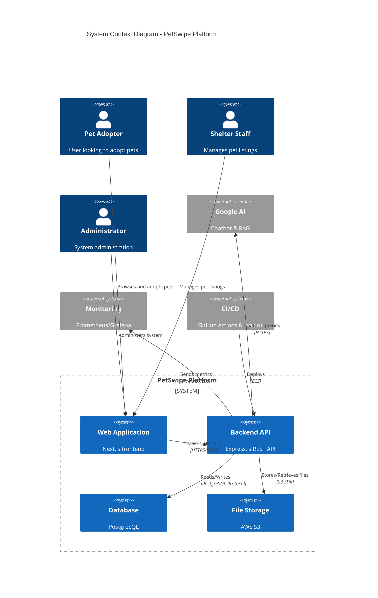
```mermaid
C4Context
    title System Context Diagram - PetSwipe Platform

    Person(user, "Pet Adopter", "User looking to adopt pets")
    Person(shelter, "Shelter Staff", "Manages pet listings")
    Person(admin, "Administrator", "System administration")

    System_Boundary(petswipe, "PetSwipe Platform") {
        System(web, "Web Application", "Next.js frontend")
        System(api, "Backend API", "Express.js REST API")
        System(db, "Database", "PostgreSQL")
        System(storage, "File Storage", "AWS S3")
    }

    System_Ext(ai, "Google AI", "Chatbot & RAG")
    System_Ext(monitoring, "Monitoring", "Prometheus/Grafana")
    System_Ext(cicd, "CI/CD", "GitHub Actions & Jenkins")

    Rel(user, web, "Browses and adopts pets")
    Rel(shelter, web, "Manages pet listings")
    Rel(admin, web, "Administers system")
    Rel(web, api, "Makes API calls", "HTTPS/REST")
    Rel(api, db, "Reads/Writes", "PostgreSQL Protocol")
    Rel(api, storage, "Stores/Retrieves files", "S3 SDK")
    Rel(api, ai, "Chatbot queries", "HTTPS")
    Rel(api, monitoring, "Sends metrics", "Prometheus")
    Rel(cicd, api, "Deploys", "ECS")
```

### Component Architecture

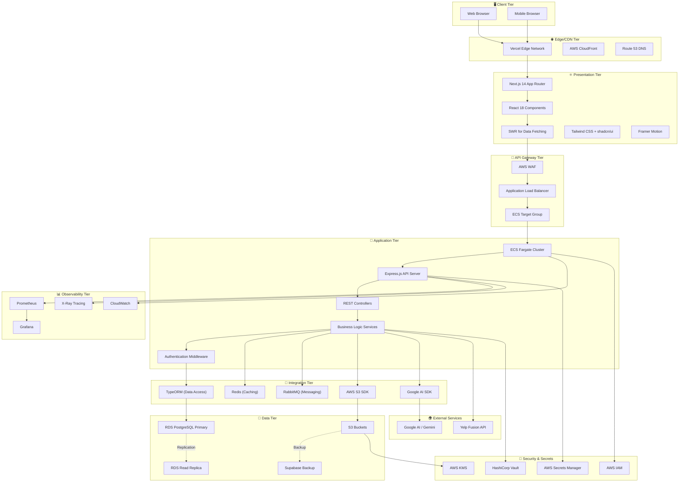
```mermaid
flowchart TB
    subgraph Client["🖥️ Client Tier"]
        direction TB
        Browser["Web Browser"]
        Mobile["Mobile Browser"]
    end

    subgraph Edge["🌐 Edge/CDN Tier"]
        direction TB
        Vercel["Vercel Edge Network"]
        CloudFront["AWS CloudFront"]
        DNS["Route 53 DNS"]
    end

    subgraph Presentation["⚛️ Presentation Tier"]
        direction TB
        NextJS["Next.js 14 App Router"]
        React["React 18 Components"]
        SWR["SWR for Data Fetching"]
        TailwindCSS["Tailwind CSS + shadcn/ui"]
        FramerMotion["Framer Motion"]
    end

    subgraph Gateway["🚪 API Gateway Tier"]
        direction TB
        ALB["Application Load Balancer"]
        TargetGroup["ECS Target Group"]
        WAF["AWS WAF"]
    end

    subgraph Application["🔧 Application Tier"]
        direction TB
        ECS["ECS Fargate Cluster"]
        Express["Express.js API Server"]
        Controllers["REST Controllers"]
        Services["Business Logic Services"]
        Middleware["Authentication Middleware"]
    end

    subgraph Integration["🔌 Integration Tier"]
        direction TB
        TypeORM["TypeORM (Data Access)"]
        Redis["Redis (Caching)"]
        RabbitMQ["RabbitMQ (Messaging)"]
        S3Client["AWS S3 SDK"]
        GoogleAI["Google AI SDK"]
    end

    subgraph Data["💾 Data Tier"]
        direction TB
        RDS["RDS PostgreSQL Primary"]
        RDSReplica["RDS Read Replica"]
        S3["S3 Buckets"]
        Supabase["Supabase Backup"]
    end

    subgraph External["🌍 External Services"]
        direction TB
        GoogleAIService["Google AI / Gemini"]
        YelpAPI["Yelp Fusion API"]
    end

    subgraph Observability["📊 Observability Tier"]
        direction TB
        Prometheus["Prometheus"]
        Grafana["Grafana"]
        CloudWatch["CloudWatch"]
        XRay["X-Ray Tracing"]
    end

    subgraph Security["🔐 Security & Secrets"]
        direction TB
        Vault["HashiCorp Vault"]
        SecretsManager["AWS Secrets Manager"]
        IAM["AWS IAM"]
        KMS["AWS KMS"]
    end

    Browser --> Vercel
    Mobile --> Vercel
    Vercel --> NextJS
    NextJS --> React
    React --> SWR
    SWR --> WAF
    WAF --> ALB
    ALB --> TargetGroup
    TargetGroup --> ECS
    ECS --> Express
    Express --> Controllers
    Controllers --> Services
    Services --> Middleware
    Middleware --> TypeORM
    Services --> Redis
    Services --> RabbitMQ
    Services --> S3Client
    Services --> GoogleAI
    TypeORM --> RDS
    RDS -.->|Replication| RDSReplica
    S3Client --> S3
    S3 -.->|Backup| Supabase
    GoogleAI --> GoogleAIService
    Services --> YelpAPI

    Express --> Prometheus
    Prometheus --> Grafana
    ECS --> CloudWatch
    Express --> XRay

    Services --> Vault
    Express --> SecretsManager
    ECS --> IAM
    S3 --> KMS
```

---

## Architecture Layers

### 1. Client Layer

**Purpose**: User interface and interaction

**Components**:
- Modern web browsers (Chrome, Firefox, Safari, Edge)
- Mobile browsers (iOS Safari, Chrome Mobile)
- Progressive Web App (PWA) capabilities

**Technologies**:
- HTML5, CSS3, JavaScript ES2022+
- Service Workers for offline support
- LocalStorage for client-side state

### 2. Edge/CDN Layer

**Purpose**: Global content delivery and edge computing

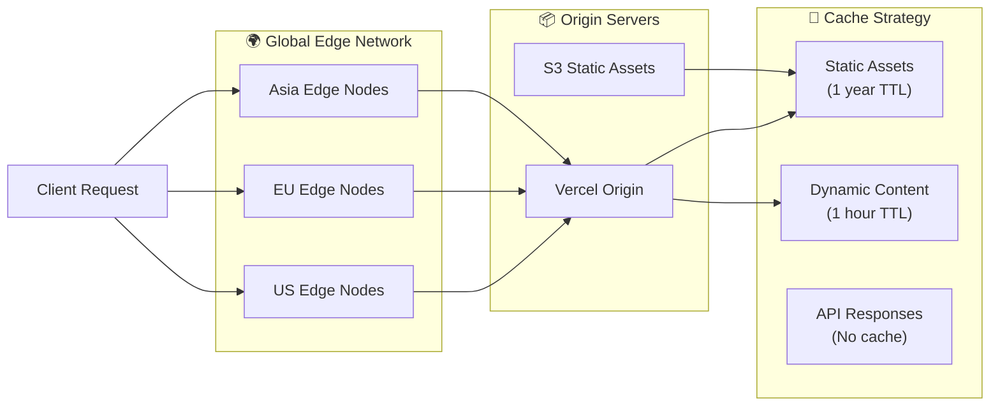
```mermaid
flowchart LR
    subgraph Global["🌍 Global Edge Network"]
        US["US Edge Nodes"]
        EU["EU Edge Nodes"]
        ASIA["Asia Edge Nodes"]
    end

    subgraph Origin["📦 Origin Servers"]
        Vercel["Vercel Origin"]
        S3Origin["S3 Static Assets"]
    end

    subgraph Cache["💾 Cache Strategy"]
        Static["Static Assets<br/>(1 year TTL)"]
        Dynamic["Dynamic Content<br/>(1 hour TTL)"]
        API["API Responses<br/>(No cache)"]
    end

    US --> Vercel
    EU --> Vercel
    ASIA --> Vercel
    Vercel --> Static
    Vercel --> Dynamic
    S3Origin --> Static

    Client["Client Request"] --> US
    Client --> EU
    Client --> ASIA
```

**Features**:
- Edge caching with intelligent invalidation
- DDoS protection
- SSL/TLS termination
- Geographic load balancing
- Automatic failover

### 3. Presentation Layer (Frontend)

**Purpose**: User interface and client-side logic

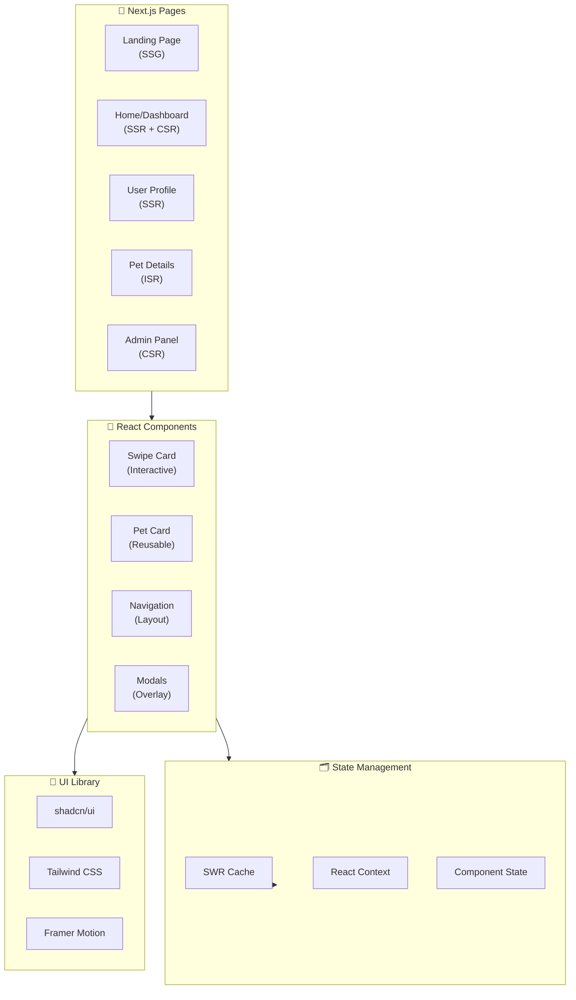
```mermaid
flowchart TB
    subgraph Pages["📄 Next.js Pages"]
        Landing["Landing Page<br/>(SSG)"]
        Home["Home/Dashboard<br/>(SSR + CSR)"]
        Profile["User Profile<br/>(SSR)"]
        Pets["Pet Details<br/>(ISR)"]
        Admin["Admin Panel<br/>(CSR)"]
    end

    subgraph Components["🧩 React Components"]
        SwipeCard["Swipe Card<br/>(Interactive)"]
        PetCard["Pet Card<br/>(Reusable)"]
        Navigation["Navigation<br/>(Layout)"]
        Modal["Modals<br/>(Overlay)"]
    end

    subgraph State["🗂️ State Management"]
        SWR["SWR Cache"]
        Context["React Context"]
        LocalState["Component State"]
    end

    subgraph UI["🎨 UI Library"]
        Shadcn["shadcn/ui"]
        Tailwind["Tailwind CSS"]
        Framer["Framer Motion"]
    end

    Pages --> Components
    Components --> State
    Components --> UI
    State --> SWR
```

**Key Features**:
- Server-Side Rendering (SSR) for SEO
- Static Site Generation (SSG) for landing pages
- Incremental Static Regeneration (ISR) for pet listings
- Client-Side Rendering (CSR) for interactive features
- Optimistic UI updates
- Skeleton loading states
- Error boundaries

**Technologies**:
- **Framework**: Next.js 14 (App Router)
- **UI Library**: React 18
- **Styling**: Tailwind CSS, shadcn/ui
- **Animation**: Framer Motion
- **Data Fetching**: SWR
- **Form Handling**: React Hook Form
- **Type Safety**: TypeScript 5.x

### 4. API Gateway Layer

**Purpose**: Request routing, load balancing, and security

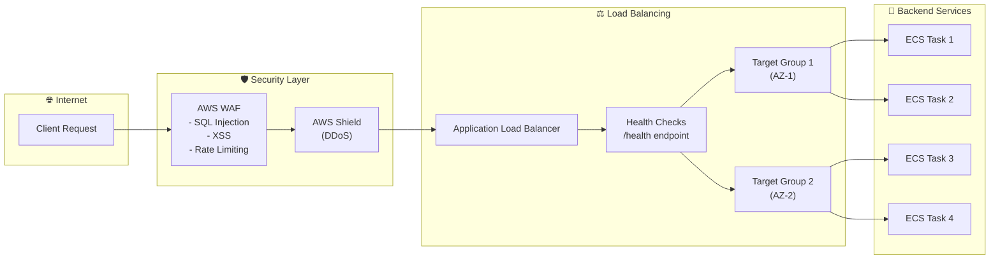
```mermaid
flowchart LR
    subgraph Internet["🌐 Internet"]
        Client["Client Request"]
    end

    subgraph Security["🛡️ Security Layer"]
        WAF["AWS WAF<br/>- SQL Injection<br/>- XSS<br/>- Rate Limiting"]
        Shield["AWS Shield<br/>(DDoS)"]
    end

    subgraph LoadBalancing["⚖️ Load Balancing"]
        ALB["Application Load Balancer"]
        HealthCheck["Health Checks<br/>/health endpoint"]
        TG1["Target Group 1<br/>(AZ-1)"]
        TG2["Target Group 2<br/>(AZ-2)"]
    end

    subgraph Backend["🔧 Backend Services"]
        ECS1["ECS Task 1"]
        ECS2["ECS Task 2"]
        ECS3["ECS Task 3"]
        ECS4["ECS Task 4"]
    end

    Client --> WAF
    WAF --> Shield
    Shield --> ALB
    ALB --> HealthCheck
    HealthCheck --> TG1
    HealthCheck --> TG2
    TG1 --> ECS1
    TG1 --> ECS2
    TG2 --> ECS3
    TG2 --> ECS4
```

**Features**:
- SSL/TLS termination
- Path-based routing
- Host-based routing
- Health checks with automatic failover
- Connection draining
- Sticky sessions
- Request/response logging

### 5. Application Layer (Backend)

**Purpose**: Business logic and data processing

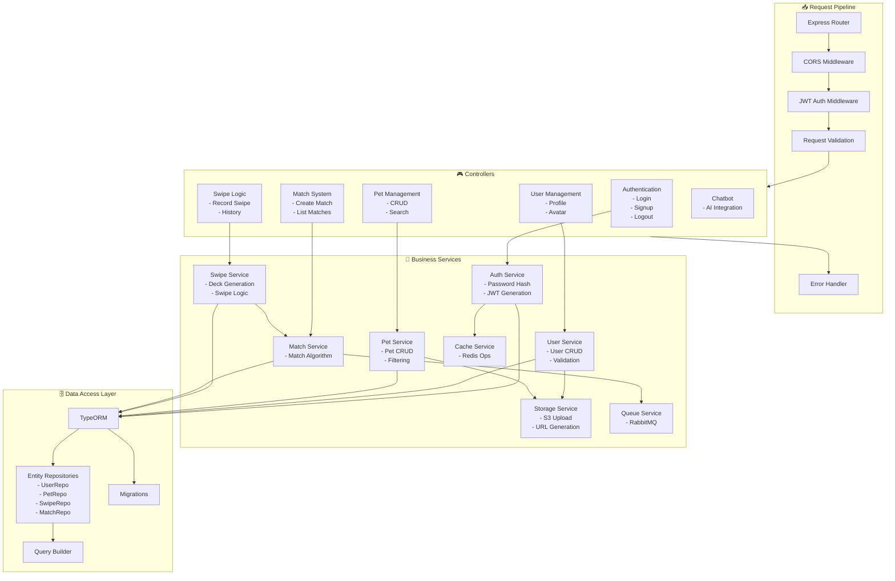
```mermaid
flowchart TB
    subgraph Request["📥 Request Pipeline"]
        Router["Express Router"]
        CorsMiddleware["CORS Middleware"]
        AuthMiddleware["JWT Auth Middleware"]
        ValidationMiddleware["Request Validation"]
        ErrorMiddleware["Error Handler"]
    end

    subgraph Controllers["🎮 Controllers"]
        AuthController["Authentication<br/>- Login<br/>- Signup<br/>- Logout"]
        UserController["User Management<br/>- Profile<br/>- Avatar"]
        PetController["Pet Management<br/>- CRUD<br/>- Search"]
        SwipeController["Swipe Logic<br/>- Record Swipe<br/>- History"]
        MatchController["Match System<br/>- Create Match<br/>- List Matches"]
        ChatController["Chatbot<br/>- AI Integration"]
    end

    subgraph Services["💼 Business Services"]
        AuthService["Auth Service<br/>- Password Hash<br/>- JWT Generation"]
        UserService["User Service<br/>- User CRUD<br/>- Validation"]
        PetService["Pet Service<br/>- Pet CRUD<br/>- Filtering"]
        SwipeService["Swipe Service<br/>- Deck Generation<br/>- Swipe Logic"]
        MatchService["Match Service<br/>- Match Algorithm"]
        StorageService["Storage Service<br/>- S3 Upload<br/>- URL Generation"]
        CacheService["Cache Service<br/>- Redis Ops"]
        QueueService["Queue Service<br/>- RabbitMQ"]
    end

    subgraph DataAccess["🗄️ Data Access Layer"]
        TypeORM["TypeORM"]
        Repositories["Entity Repositories<br/>- UserRepo<br/>- PetRepo<br/>- SwipeRepo<br/>- MatchRepo"]
        QueryBuilder["Query Builder"]
        Migrations["Migrations"]
    end

    Router --> CorsMiddleware
    CorsMiddleware --> AuthMiddleware
    AuthMiddleware --> ValidationMiddleware
    ValidationMiddleware --> Controllers
    Controllers --> ErrorMiddleware

    AuthController --> AuthService
    UserController --> UserService
    PetController --> PetService
    SwipeController --> SwipeService
    MatchController --> MatchService

    AuthService --> CacheService
    UserService --> StorageService
    PetService --> StorageService
    SwipeService --> MatchService
    MatchService --> QueueService

    AuthService --> TypeORM
    UserService --> TypeORM
    PetService --> TypeORM
    SwipeService --> TypeORM
    MatchService --> TypeORM

    TypeORM --> Repositories
    Repositories --> QueryBuilder
    TypeORM --> Migrations
```

**Key Components**:

#### Controllers
- Handle HTTP requests/responses
- Input validation
- Response formatting
- Error handling

#### Services
- Business logic implementation
- Transaction management
- Integration with external services
- Caching strategies

#### Data Access
- ORM abstraction (TypeORM)
- Database connection pooling
- Query optimization
- Migration management

**Technologies**:
- **Runtime**: Node.js 18+
- **Framework**: Express.js 4.x
- **ORM**: TypeORM 0.3.x
- **Validation**: class-validator, joi
- **Authentication**: jsonwebtoken, bcrypt
- **API Docs**: Swagger/OpenAPI 3.0

### 6. Data Layer

**Purpose**: Persistent data storage and retrieval

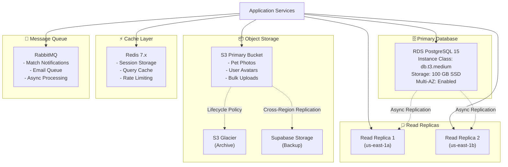
```mermaid
flowchart TB
    subgraph Primary["🗄️ Primary Database"]
        RDSPrimary["RDS PostgreSQL 15<br/>Instance Class: db.t3.medium<br/>Storage: 100 GB SSD<br/>Multi-AZ: Enabled"]
    end

    subgraph Replica["📖 Read Replicas"]
        RDSReplica1["Read Replica 1<br/>(us-east-1a)"]
        RDSReplica2["Read Replica 2<br/>(us-east-1b)"]
    end

    subgraph ObjectStorage["📦 Object Storage"]
        S3Main["S3 Primary Bucket<br/>- Pet Photos<br/>- User Avatars<br/>- Bulk Uploads"]
        S3Backup["S3 Glacier<br/>(Archive)"]
        Supabase["Supabase Storage<br/>(Backup)"]
    end

    subgraph Cache["⚡ Cache Layer"]
        Redis["Redis 7.x<br/>- Session Storage<br/>- Query Cache<br/>- Rate Limiting"]
    end

    subgraph Queue["📮 Message Queue"]
        RabbitMQ["RabbitMQ<br/>- Match Notifications<br/>- Email Queue<br/>- Async Processing"]
    end

    Application["Application Services"] --> RDSPrimary
    Application --> RDSReplica1
    Application --> RDSReplica2
    Application --> Redis
    Application --> S3Main
    Application --> RabbitMQ

    RDSPrimary -.->|Async Replication| RDSReplica1
    RDSPrimary -.->|Async Replication| RDSReplica2
    S3Main -.->|Lifecycle Policy| S3Backup
    S3Main -.->|Cross-Region Replication| Supabase
```

---

## Component Details

### Frontend Components

#### Swipe Interface
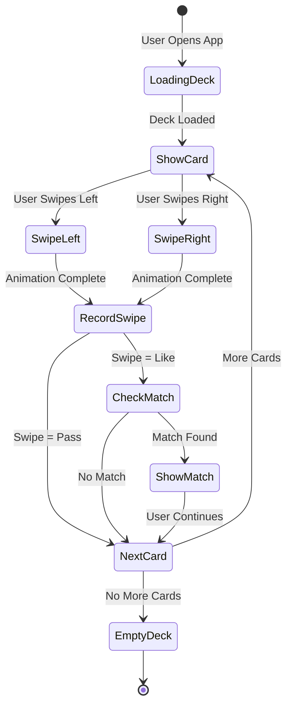
```mermaid
stateDiagram-v2
    [*] --> LoadingDeck: User Opens App
    LoadingDeck --> ShowCard: Deck Loaded
    ShowCard --> SwipeLeft: User Swipes Left
    ShowCard --> SwipeRight: User Swipes Right
    SwipeLeft --> RecordSwipe: Animation Complete
    SwipeRight --> RecordSwipe: Animation Complete
    RecordSwipe --> CheckMatch: Swipe = Like
    RecordSwipe --> NextCard: Swipe = Pass
    CheckMatch --> ShowMatch: Match Found
    CheckMatch --> NextCard: No Match
    ShowMatch --> NextCard: User Continues
    NextCard --> ShowCard: More Cards
    NextCard --> EmptyDeck: No More Cards
    EmptyDeck --> [*]
```

#### Authentication Flow
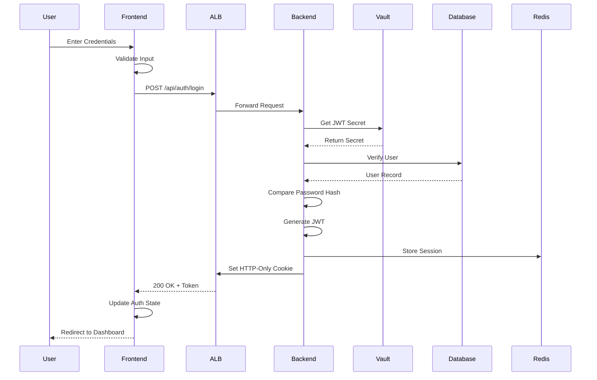
```mermaid
sequenceDiagram
    participant User
    participant Frontend
    participant ALB
    participant Backend
    participant Vault
    participant Database
    participant Redis

    User->>Frontend: Enter Credentials
    Frontend->>Frontend: Validate Input
    Frontend->>ALB: POST /api/auth/login
    ALB->>Backend: Forward Request
    Backend->>Vault: Get JWT Secret
    Vault-->>Backend: Return Secret
    Backend->>Database: Verify User
    Database-->>Backend: User Record
    Backend->>Backend: Compare Password Hash
    Backend->>Backend: Generate JWT
    Backend->>Redis: Store Session
    Backend->>ALB: Set HTTP-Only Cookie
    ALB-->>Frontend: 200 OK + Token
    Frontend->>Frontend: Update Auth State
    Frontend-->>User: Redirect to Dashboard
```

### Backend Services

#### Pet Matching Algorithm
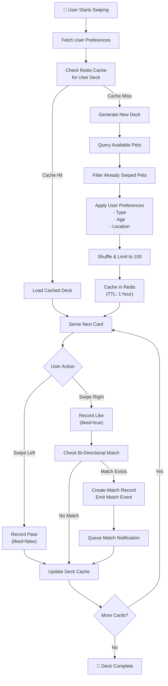
```mermaid
flowchart TB
    Start["🎯 User Starts Swiping"] --> FetchUser["Fetch User Preferences"]
    FetchUser --> CheckCache["Check Redis Cache<br/>for User Deck"]

    CheckCache -->|Cache Hit| LoadDeck["Load Cached Deck"]
    CheckCache -->|Cache Miss| GenerateDeck["Generate New Deck"]

    GenerateDeck --> QueryPets["Query Available Pets"]
    QueryPets --> FilterSwiped["Filter Already Swiped Pets"]
    FilterSwiped --> ApplyPreferences["Apply User Preferences<br/>- Type<br/>- Age<br/>- Location"]
    ApplyPreferences --> ShuffleDeck["Shuffle & Limit to 100"]
    ShuffleDeck --> CacheDeck["Cache in Redis<br/>(TTL: 1 hour)"]

    LoadDeck --> ServeCard["Serve Next Card"]
    CacheDeck --> ServeCard

    ServeCard --> UserAction{"User Action"}

    UserAction -->|Swipe Left| RecordPass["Record Pass<br/>(liked=false)"]
    UserAction -->|Swipe Right| RecordLike["Record Like<br/>(liked=true)"]

    RecordPass --> UpdateCache["Update Deck Cache"]
    RecordLike --> CheckBiMatch["Check Bi-Directional Match"]

    CheckBiMatch -->|Match Exists| CreateMatch["Create Match Record<br/>Emit Match Event"]
    CheckBiMatch -->|No Match| UpdateCache
    CreateMatch --> NotifyUser["Queue Match Notification"]
    NotifyUser --> UpdateCache

    UpdateCache --> MoreCards{"More Cards?"}
    MoreCards -->|Yes| ServeCard
    MoreCards -->|No| End["🏁 Deck Complete"]
```

#### File Upload Pipeline
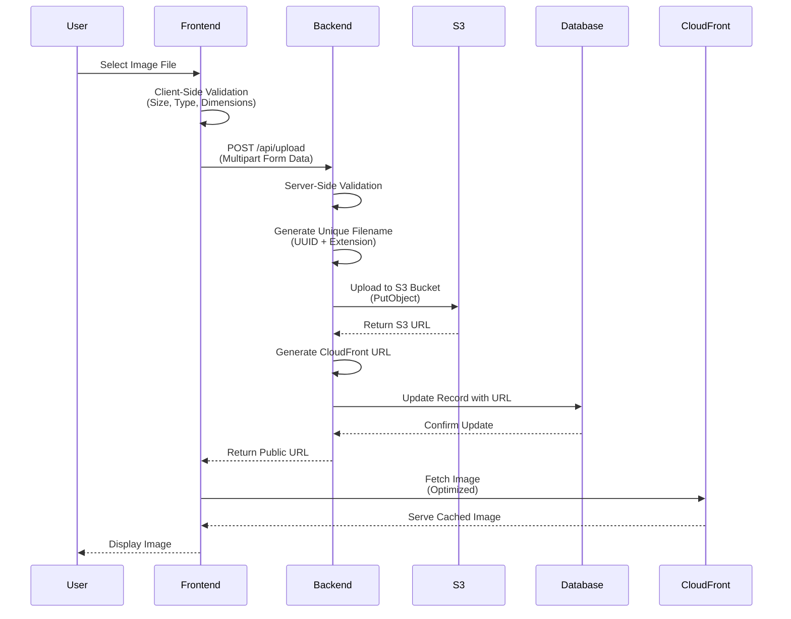
```mermaid
sequenceDiagram
    participant User
    participant Frontend
    participant Backend
    participant S3
    participant Database
    participant CloudFront

    User->>Frontend: Select Image File
    Frontend->>Frontend: Client-Side Validation<br/>(Size, Type, Dimensions)
    Frontend->>Backend: POST /api/upload<br/>(Multipart Form Data)
    Backend->>Backend: Server-Side Validation
    Backend->>Backend: Generate Unique Filename<br/>(UUID + Extension)
    Backend->>S3: Upload to S3 Bucket<br/>(PutObject)
    S3-->>Backend: Return S3 URL
    Backend->>Backend: Generate CloudFront URL
    Backend->>Database: Update Record with URL
    Database-->>Backend: Confirm Update
    Backend-->>Frontend: Return Public URL
    Frontend->>CloudFront: Fetch Image<br/>(Optimized)
    CloudFront-->>Frontend: Serve Cached Image
    Frontend-->>User: Display Image
```

---

## Data Architecture

### Database Schema

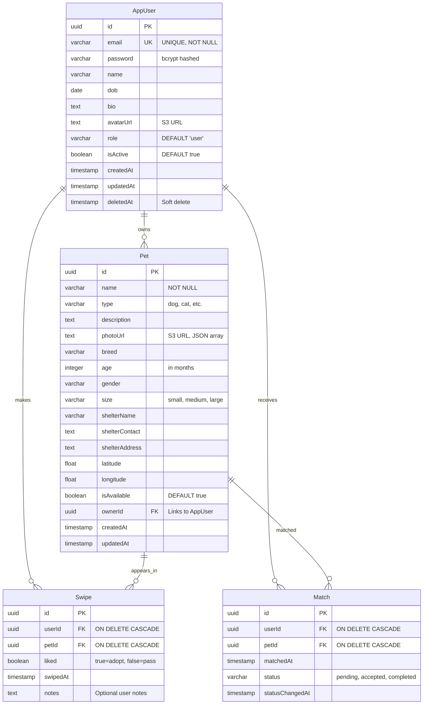
```mermaid
erDiagram
    AppUser ||--o{ Swipe : "makes"
    AppUser ||--o{ Match : "receives"
    AppUser ||--o{ Pet : "owns"
    AppUser {
        uuid id PK
        varchar email UK "UNIQUE, NOT NULL"
        varchar password "bcrypt hashed"
        varchar name
        date dob
        text bio
        text avatarUrl "S3 URL"
        varchar role "DEFAULT 'user'"
        boolean isActive "DEFAULT true"
        timestamp createdAt
        timestamp updatedAt
        timestamp deletedAt "Soft delete"
    }

    Pet ||--o{ Swipe : "appears_in"
    Pet ||--o{ Match : "matched"
    Pet {
        uuid id PK
        varchar name "NOT NULL"
        varchar type "dog, cat, etc."
        text description
        text photoUrl "S3 URL, JSON array"
        varchar breed
        integer age "in months"
        varchar gender
        varchar size "small, medium, large"
        varchar shelterName
        text shelterContact
        text shelterAddress
        float latitude
        float longitude
        boolean isAvailable "DEFAULT true"
        uuid ownerId FK "Links to AppUser"
        timestamp createdAt
        timestamp updatedAt
    }

    Swipe {
        uuid id PK
        uuid userId FK "ON DELETE CASCADE"
        uuid petId FK "ON DELETE CASCADE"
        boolean liked "true=adopt, false=pass"
        timestamp swipedAt
        text notes "Optional user notes"
    }

    Match {
        uuid id PK
        uuid userId FK "ON DELETE CASCADE"
        uuid petId FK "ON DELETE CASCADE"
        timestamp matchedAt
        varchar status "pending, accepted, completed"
        timestamp statusChangedAt
    }
```

### Database Indexes

```sql
-- Performance-critical indexes
CREATE INDEX idx_swipes_user_id ON swipe(user_id);
CREATE INDEX idx_swipes_pet_id ON swipe(pet_id);
CREATE INDEX idx_swipes_user_pet ON swipe(user_id, pet_id); -- Composite for uniqueness check
CREATE UNIQUE INDEX idx_swipes_unique_user_pet ON swipe(user_id, pet_id) WHERE deleted_at IS NULL;

CREATE INDEX idx_matches_user_id ON match(user_id);
CREATE INDEX idx_matches_pet_id ON match(pet_id);
CREATE INDEX idx_matches_status ON match(status);
CREATE INDEX idx_matches_created_at ON match(matched_at DESC);

CREATE INDEX idx_pets_type ON pet(type);
CREATE INDEX idx_pets_location ON pet USING GIST(ll_to_earth(latitude, longitude)); -- Geospatial
CREATE INDEX idx_pets_available ON pet(is_available) WHERE is_available = true;

CREATE INDEX idx_users_email ON app_user(email);
CREATE INDEX idx_users_active ON app_user(is_active) WHERE is_active = true;
```

### Data Access Patterns

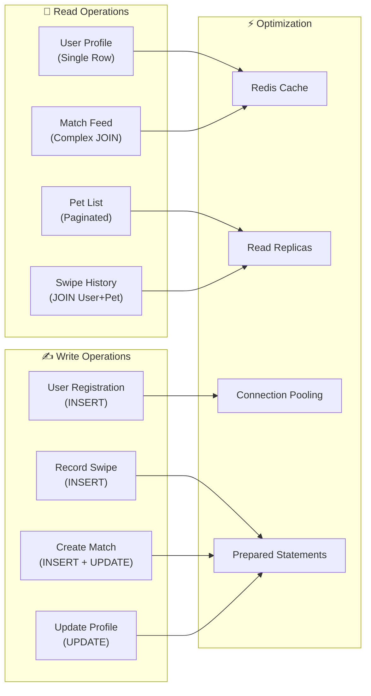
```mermaid
flowchart LR
    subgraph Reads["📖 Read Operations"]
        ReadPattern1["User Profile<br/>(Single Row)"]
        ReadPattern2["Pet List<br/>(Paginated)"]
        ReadPattern3["Swipe History<br/>(JOIN User+Pet)"]
        ReadPattern4["Match Feed<br/>(Complex JOIN)"]
    end

    subgraph Writes["✍️ Write Operations"]
        WritePattern1["User Registration<br/>(INSERT)"]
        WritePattern2["Record Swipe<br/>(INSERT)"]
        WritePattern3["Create Match<br/>(INSERT + UPDATE)"]
        WritePattern4["Update Profile<br/>(UPDATE)"]
    end

    subgraph Optimization["⚡ Optimization"]
        Cache["Redis Cache"]
        ReadReplica["Read Replicas"]
        ConnectionPool["Connection Pooling"]
        PreparedStmt["Prepared Statements"]
    end

    ReadPattern1 --> Cache
    ReadPattern2 --> ReadReplica
    ReadPattern3 --> ReadReplica
    ReadPattern4 --> Cache

    WritePattern1 --> ConnectionPool
    WritePattern2 --> PreparedStmt
    WritePattern3 --> PreparedStmt
    WritePattern4 --> PreparedStmt
```

---

## Security Architecture

### Defense in Depth

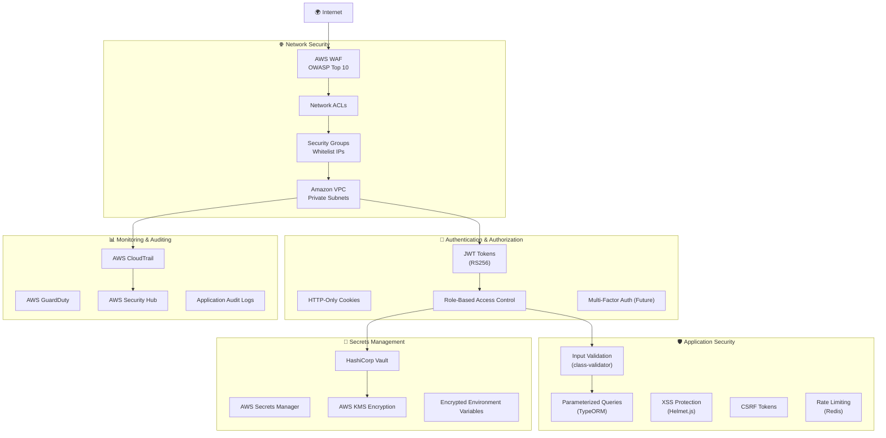
```mermaid
flowchart TB
    subgraph Layer1["🌐 Network Security"]
        VPC["Amazon VPC<br/>Private Subnets"]
        SecurityGroups["Security Groups<br/>Whitelist IPs"]
        NACL["Network ACLs"]
        WAF["AWS WAF<br/>OWASP Top 10"]
    end

    subgraph Layer2["🔐 Authentication & Authorization"]
        JWT["JWT Tokens<br/>(RS256)"]
        HTTPOnly["HTTP-Only Cookies"]
        RBAC["Role-Based Access Control"]
        MFA["Multi-Factor Auth (Future)"]
    end

    subgraph Layer3["🛡️ Application Security"]
        InputValidation["Input Validation<br/>(class-validator)"]
        SQLInjection["Parameterized Queries<br/>(TypeORM)"]
        XSS["XSS Protection<br/>(Helmet.js)"]
        CSRF["CSRF Tokens"]
        RateLimiting["Rate Limiting<br/>(Redis)"]
    end

    subgraph Layer4["🔑 Secrets Management"]
        Vault["HashiCorp Vault"]
        SecretsManager["AWS Secrets Manager"]
        KMS["AWS KMS Encryption"]
        EnvVars["Encrypted Environment Variables"]
    end

    subgraph Layer5["📊 Monitoring & Auditing"]
        CloudTrail["AWS CloudTrail"]
        GuardDuty["AWS GuardDuty"]
        SecurityHub["AWS Security Hub"]
        AuditLogs["Application Audit Logs"]
    end

    Internet["🌍 Internet"] --> WAF
    WAF --> NACL
    NACL --> SecurityGroups
    SecurityGroups --> VPC

    VPC --> JWT
    JWT --> RBAC
    RBAC --> InputValidation
    InputValidation --> SQLInjection

    RBAC --> Vault
    Vault --> KMS

    VPC --> CloudTrail
    CloudTrail --> SecurityHub
```

### Authentication Flow (Detailed)

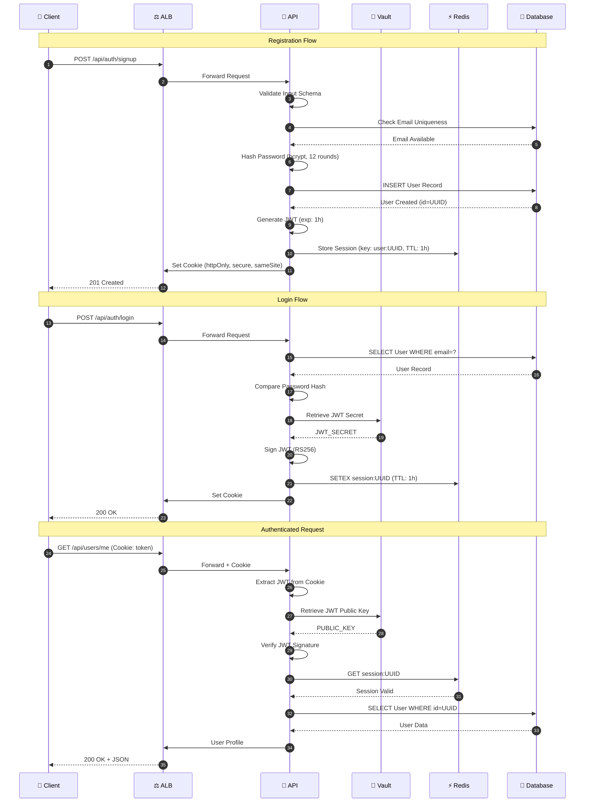
```mermaid
sequenceDiagram
    autonumber
    participant Client as 👤 Client
    participant ALB as ⚖️ ALB
    participant API as 🔧 API
    participant Vault as 🔐 Vault
    participant Redis as ⚡ Redis
    participant DB as 💾 Database

    Note over Client,DB: Registration Flow
    Client->>ALB: POST /api/auth/signup
    ALB->>API: Forward Request
    API->>API: Validate Input Schema
    API->>DB: Check Email Uniqueness
    DB-->>API: Email Available
    API->>API: Hash Password (bcrypt, 12 rounds)
    API->>DB: INSERT User Record
    DB-->>API: User Created (id=UUID)
    API->>API: Generate JWT (exp: 1h)
    API->>Redis: Store Session (key: user:UUID, TTL: 1h)
    API->>ALB: Set Cookie (httpOnly, secure, sameSite)
    ALB-->>Client: 201 Created

    Note over Client,DB: Login Flow
    Client->>ALB: POST /api/auth/login
    ALB->>API: Forward Request
    API->>DB: SELECT User WHERE email=?
    DB-->>API: User Record
    API->>API: Compare Password Hash
    API->>Vault: Retrieve JWT Secret
    Vault-->>API: JWT_SECRET
    API->>API: Sign JWT (RS256)
    API->>Redis: SETEX session:UUID (TTL: 1h)
    API->>ALB: Set Cookie
    ALB-->>Client: 200 OK

    Note over Client,DB: Authenticated Request
    Client->>ALB: GET /api/users/me (Cookie: token)
    ALB->>API: Forward + Cookie
    API->>API: Extract JWT from Cookie
    API->>Vault: Retrieve JWT Public Key
    Vault-->>API: PUBLIC_KEY
    API->>API: Verify JWT Signature
    API->>Redis: GET session:UUID
    Redis-->>API: Session Valid
    API->>DB: SELECT User WHERE id=UUID
    DB-->>API: User Data
    API->>ALB: User Profile
    ALB-->>Client: 200 OK + JSON
```

### Secrets Management Strategy

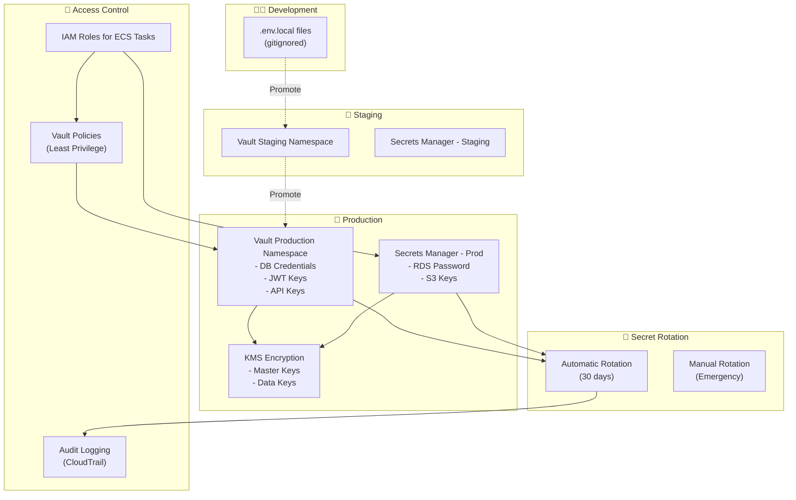
```mermaid
flowchart TB
    subgraph Development["👨‍💻 Development"]
        DevEnv[".env.local files<br/>(gitignored)"]
    end

    subgraph Staging["🧪 Staging"]
        VaultStaging["Vault Staging Namespace"]
        SecretsManagerStaging["Secrets Manager - Staging"]
    end

    subgraph Production["🚀 Production"]
        VaultProd["Vault Production Namespace<br/>- DB Credentials<br/>- JWT Keys<br/>- API Keys"]
        SecretsManagerProd["Secrets Manager - Prod<br/>- RDS Password<br/>- S3 Keys"]
        KMS["KMS Encryption<br/>- Master Keys<br/>- Data Keys"]
    end

    subgraph Rotation["🔄 Secret Rotation"]
        AutoRotation["Automatic Rotation<br/>(30 days)"]
        Manual["Manual Rotation<br/>(Emergency)"]
    end

    subgraph Access["🔑 Access Control"]
        IAMRoles["IAM Roles for ECS Tasks"]
        VaultPolicies["Vault Policies<br/>(Least Privilege)"]
        AuditLog["Audit Logging<br/>(CloudTrail)"]
    end

    DevEnv -.->|Promote| VaultStaging
    VaultStaging -.->|Promote| VaultProd
    VaultProd --> KMS
    SecretsManagerProd --> KMS

    VaultProd --> AutoRotation
    SecretsManagerProd --> AutoRotation
    AutoRotation --> AuditLog

    IAMRoles --> VaultPolicies
    VaultPolicies --> VaultProd
    IAMRoles --> SecretsManagerProd
```

---

## Deployment Architecture

### Production Deployment Strategies

PetSwipe implements **enterprise-grade deployment strategies** for zero-downtime releases:

#### 🔵🟢 Blue-Green Deployment
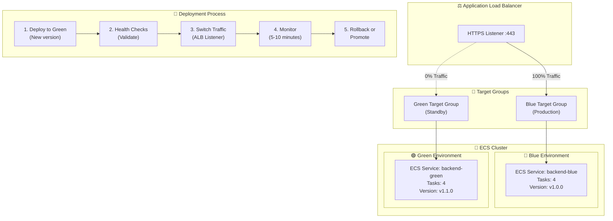
```mermaid
flowchart TB
    subgraph ALB["⚖️ Application Load Balancer"]
        Listener["HTTPS Listener :443"]
    end

    subgraph TargetGroups["🎯 Target Groups"]
        BlueTarget["Blue Target Group<br/>(Production)"]
        GreenTarget["Green Target Group<br/>(Standby)"]
    end

    subgraph ECS["🐳 ECS Cluster"]
        subgraph Blue["🔵 Blue Environment"]
            BlueService["ECS Service: backend-blue<br/>Tasks: 4<br/>Version: v1.0.0"]
        end
        
        subgraph Green["🟢 Green Environment"]
            GreenService["ECS Service: backend-green<br/>Tasks: 4<br/>Version: v1.1.0"]
        end
    end

    subgraph Deployment["🚀 Deployment Process"]
        Step1["1. Deploy to Green<br/>(New version)"]
        Step2["2. Health Checks<br/>(Validate)"]
        Step3["3. Switch Traffic<br/>(ALB Listener)"]
        Step4["4. Monitor<br/>(5-10 minutes)"]
        Step5["5. Rollback or<br/>Promote"]
    end

    Listener -->|100% Traffic| BlueTarget
    Listener -.->|0% Traffic| GreenTarget
    BlueTarget --> BlueService
    GreenTarget --> GreenService

    Step1 --> Step2 --> Step3 --> Step4 --> Step5
```

**Key Features**:
- **Zero-downtime**: Instant traffic switch between environments
- **Fast rollback**: < 30 seconds to revert
- **Full validation**: Test new version before production traffic
- **Database migrations**: Safe schema changes with backward compatibility

#### 🐤 Canary Deployment
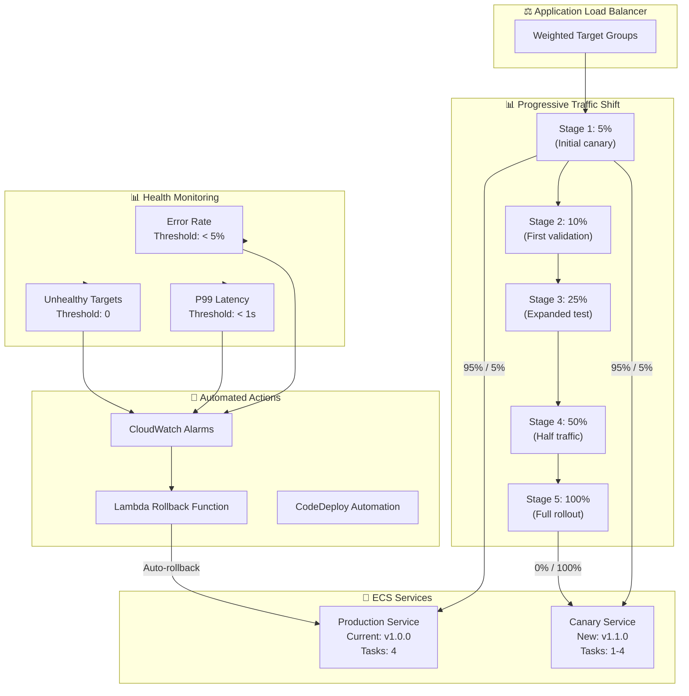
```mermaid
flowchart TB
    subgraph ALB["⚖️ Application Load Balancer"]
        Listener["Weighted Target Groups"]
    end

    subgraph Routing["📊 Progressive Traffic Shift"]
        Stage1["Stage 1: 5%<br/>(Initial canary)"]
        Stage2["Stage 2: 10%<br/>(First validation)"]
        Stage3["Stage 3: 25%<br/>(Expanded test)"]
        Stage4["Stage 4: 50%<br/>(Half traffic)"]
        Stage5["Stage 5: 100%<br/>(Full rollout)"]
    end

    subgraph ECS["🐳 ECS Services"]
        Production["Production Service<br/>Current: v1.0.0<br/>Tasks: 4"]
        Canary["Canary Service<br/>New: v1.1.0<br/>Tasks: 1-4"]
    end

    subgraph Monitoring["📊 Health Monitoring"]
        ErrorRate["Error Rate<br/>Threshold: < 5%"]
        Latency["P99 Latency<br/>Threshold: < 1s"]
        HealthChecks["Unhealthy Targets<br/>Threshold: 0"]
    end

    subgraph Automation["🤖 Automated Actions"]
        Lambda["Lambda Rollback Function"]
        CloudWatch["CloudWatch Alarms"]
        CodeDeploy["CodeDeploy Automation"]
    end

    Listener --> Stage1
    Stage1 --> Stage2
    Stage2 --> Stage3
    Stage3 --> Stage4
    Stage4 --> Stage5

    Stage1 -->|95% / 5%| Production
    Stage1 -->|95% / 5%| Canary
    Stage5 -->|0% / 100%| Canary

    Monitoring --> ErrorRate
    Monitoring --> Latency
    Monitoring --> HealthChecks

    ErrorRate --> CloudWatch
    Latency --> CloudWatch
    HealthChecks --> CloudWatch
    CloudWatch --> Lambda
    Lambda -->|Auto-rollback| Production
```

**Key Features**:
- **Progressive rollout**: Gradual traffic increase (5% → 10% → 25% → 50% → 100%)
- **Automated rollback**: Lambda function triggers on alarm breach
- **Real-time monitoring**: CloudWatch metrics and alarms
- **Risk mitigation**: Early detection with minimal user impact

**Deployment Strategy Selection**:
- **Blue-Green**: Major releases, database migrations, infrastructure changes
- **Canary**: Feature releases, bug fixes, performance improvements

📖 **[Full Deployment Guide](docs/DEPLOYMENT.md)** | 🚀 **[Quick Reference](docs/DEPLOYMENT_QUICK_REFERENCE.md)**

---

### AWS Multi-Region Architecture

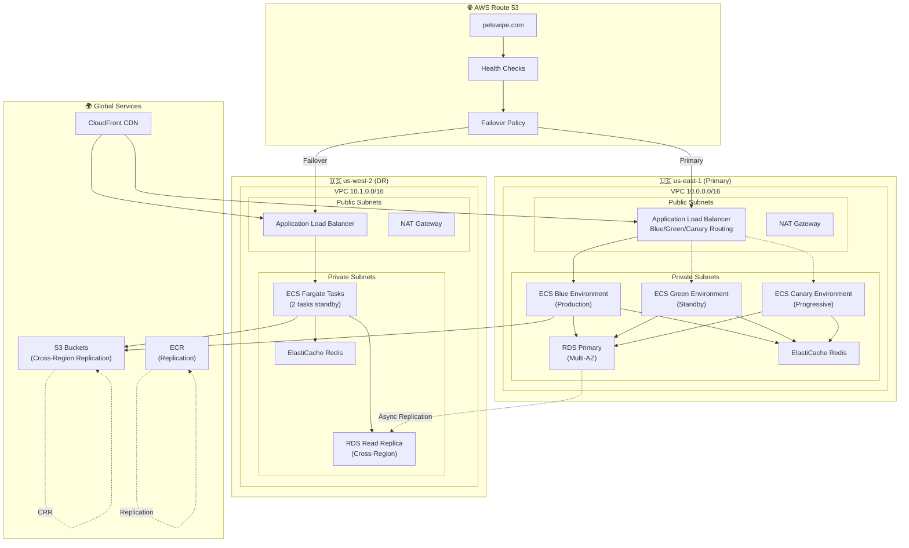
```mermaid
flowchart TB
    subgraph Route53["🌐 AWS Route 53"]
        DNS["petswipe.com"]
        HealthCheck["Health Checks"]
        Failover["Failover Policy"]
    end

    subgraph USEast1["🇺🇸 us-east-1 (Primary)"]
        subgraph VPC1["VPC 10.0.0.0/16"]
            subgraph PublicSubnet1["Public Subnets"]
                ALB1["Application Load Balancer<br/>Blue/Green/Canary Routing"]
                NAT1["NAT Gateway"]
            end
            subgraph PrivateSubnet1["Private Subnets"]
                ECSBlue["ECS Blue Environment<br/>(Production)"]
                ECSGreen["ECS Green Environment<br/>(Standby)"]
                ECSCanary["ECS Canary Environment<br/>(Progressive)"]
                RDS1Primary["RDS Primary<br/>(Multi-AZ)"]
                ElastiCache1["ElastiCache Redis"]
            end
        end
    end

    subgraph USWest2["🇺🇸 us-west-2 (DR)"]
        subgraph VPC2["VPC 10.1.0.0/16"]
            subgraph PublicSubnet2["Public Subnets"]
                ALB2["Application Load Balancer"]
                NAT2["NAT Gateway"]
            end
            subgraph PrivateSubnet2["Private Subnets"]
                ECS2["ECS Fargate Tasks<br/>(2 tasks standby)"]
                RDS2Replica["RDS Read Replica<br/>(Cross-Region)"]
                ElastiCache2["ElastiCache Redis"]
            end
        end
    end

    subgraph Global["🌍 Global Services"]
        S3["S3 Buckets<br/>(Cross-Region Replication)"]
        CloudFront["CloudFront CDN"]
        ECR["ECR<br/>(Replication)"]
    end

    DNS --> HealthCheck
    HealthCheck --> Failover
    Failover -->|Primary| ALB1
    Failover -->|Failover| ALB2

    CloudFront --> ALB1
    CloudFront --> ALB2

    ALB1 --> ECSBlue
    ALB1 -.-> ECSGreen
    ALB1 -.-> ECSCanary
    ALB2 --> ECS2

    ECSBlue --> RDS1Primary
    ECSGreen --> RDS1Primary
    ECSCanary --> RDS1Primary
    ECSBlue --> ElastiCache1
    ECSGreen --> ElastiCache1
    ECSCanary --> ElastiCache1
    ECSBlue --> S3

    ECS2 --> RDS2Replica
    ECS2 --> ElastiCache2
    ECS2 --> S3

    RDS1Primary -.->|Async Replication| RDS2Replica
    S3 -.->|CRR| S3
    ECR -.->|Replication| ECR
```

### Container Orchestration (ECS Fargate)

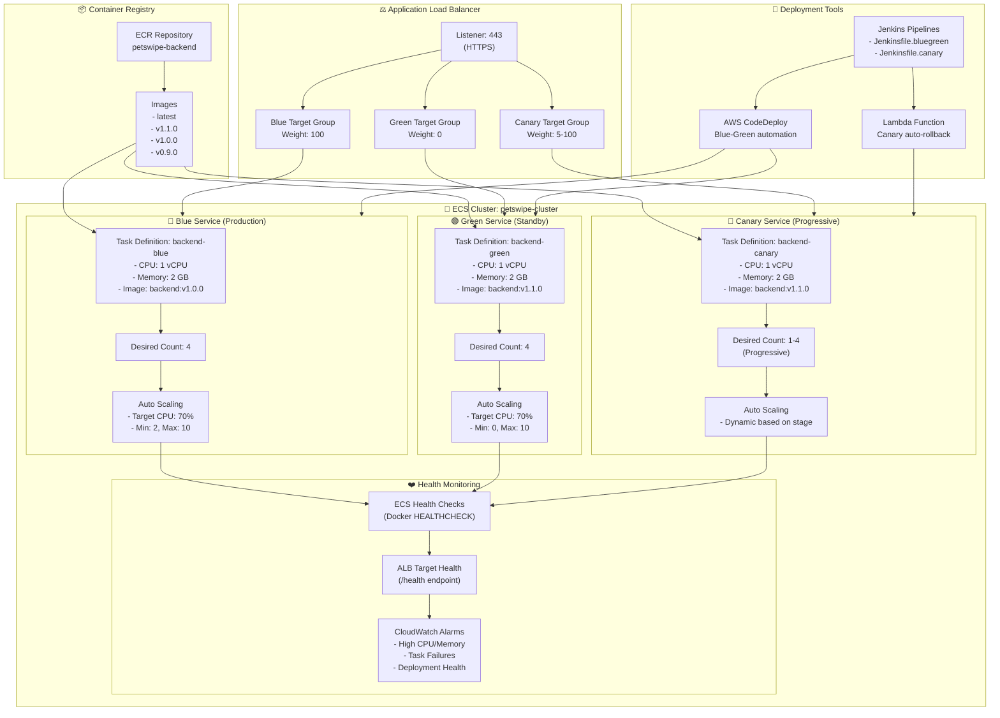
```mermaid
flowchart TB
    subgraph Cluster["🐳 ECS Cluster: petswipe-cluster"]
        subgraph BlueService["🔵 Blue Service (Production)"]
            BlueTaskDef["Task Definition: backend-blue<br/>- CPU: 1 vCPU<br/>- Memory: 2 GB<br/>- Image: backend:v1.0.0"]
            BlueCount["Desired Count: 4"]
            BlueScaling["Auto Scaling<br/>- Target CPU: 70%<br/>- Min: 2, Max: 10"]
        end

        subgraph GreenService["🟢 Green Service (Standby)"]
            GreenTaskDef["Task Definition: backend-green<br/>- CPU: 1 vCPU<br/>- Memory: 2 GB<br/>- Image: backend:v1.1.0"]
            GreenCount["Desired Count: 4"]
            GreenScaling["Auto Scaling<br/>- Target CPU: 70%<br/>- Min: 0, Max: 10"]
        end

        subgraph CanaryService["🐤 Canary Service (Progressive)"]
            CanaryTaskDef["Task Definition: backend-canary<br/>- CPU: 1 vCPU<br/>- Memory: 2 GB<br/>- Image: backend:v1.1.0"]
            CanaryCount["Desired Count: 1-4<br/>(Progressive)"]
            CanaryScaling["Auto Scaling<br/>- Dynamic based on stage"]
        end

        subgraph HealthChecks["❤️ Health Monitoring"]
            ECSHealth["ECS Health Checks<br/>(Docker HEALTHCHECK)"]
            ALBHealth["ALB Target Health<br/>(/health endpoint)"]
            CWAlarms["CloudWatch Alarms<br/>- High CPU/Memory<br/>- Task Failures<br/>- Deployment Health"]
        end
    end

    subgraph ALB["⚖️ Application Load Balancer"]
        Listener["Listener: 443<br/>(HTTPS)"]
        BlueTarget["Blue Target Group<br/>Weight: 100"]
        GreenTarget["Green Target Group<br/>Weight: 0"]
        CanaryTarget["Canary Target Group<br/>Weight: 5-100"]
    end

    subgraph Registry["📦 Container Registry"]
        ECR["ECR Repository<br/>petswipe-backend"]
        Images["Images<br/>- latest<br/>- v1.1.0<br/>- v1.0.0<br/>- v0.9.0"]
    end

    subgraph Deployment["🚀 Deployment Tools"]
        CodeDeploy["AWS CodeDeploy<br/>Blue-Green automation"]
        Lambda["Lambda Function<br/>Canary auto-rollback"]
        Jenkins["Jenkins Pipelines<br/>- Jenkinsfile.bluegreen<br/>- Jenkinsfile.canary"]
    end

    BlueTaskDef --> BlueCount
    BlueCount --> BlueScaling
    GreenTaskDef --> GreenCount
    GreenCount --> GreenScaling
    CanaryTaskDef --> CanaryCount
    CanaryCount --> CanaryScaling

    BlueScaling --> ECSHealth
    GreenScaling --> ECSHealth
    CanaryScaling --> ECSHealth

    ECSHealth --> ALBHealth
    ALBHealth --> CWAlarms

    Listener --> BlueTarget
    Listener --> GreenTarget
    Listener --> CanaryTarget
    
    BlueTarget --> BlueService
    GreenTarget --> GreenService
    CanaryTarget --> CanaryService

    ECR --> Images
    Images --> BlueTaskDef
    Images --> GreenTaskDef
    Images --> CanaryTaskDef

    CodeDeploy --> BlueService
    CodeDeploy --> GreenService
    Lambda --> CanaryService
    Jenkins --> CodeDeploy
    Jenkins --> Lambda
```

---

## Infrastructure as Code

### Terraform Module Structure

```mermaid
flowchart TB
    subgraph Root["📁 terraform/"]
        Main["main.tf<br/>Root module"]
        Provider["provider.tf<br/>AWS provider config"]
        Variables["variables.tf<br/>Input variables"]
        Outputs["outputs.tf<br/>Output values"]
        Backend["backend.tf<br/>S3 state backend"]
        BlueGreen["ecs-blue-green.tf<br/>Blue-Green deployment"]
        Canary["ecs-canary.tf<br/>Canary deployment"]
        Monitoring["monitoring.tf<br/>CloudWatch resources"]
    end

    subgraph Modules["📦 Core Modules"]
        VPC["module: vpc<br/>- Subnets<br/>- Route Tables<br/>- IGW, NAT"]
        RDS["module: rds<br/>- PostgreSQL<br/>- Multi-AZ<br/>- Backups"]
        ECS["module: ecs<br/>- Cluster<br/>- Base Configuration"]
        ALB["module: alb<br/>- Load Balancer<br/>- Target Groups<br/>- Listeners"]
        S3["module: s3<br/>- Buckets<br/>- Lifecycle<br/>- Replication"]
        IAM["module: iam<br/>- Roles<br/>- Policies<br/>- Task Execution"]
    end

    subgraph DeploymentModules["🚀 Deployment Modules"]
        BlueGreenModule["Blue-Green Resources<br/>- Blue ECS Service<br/>- Green ECS Service<br/>- Blue/Green Target Groups<br/>- CodeDeploy Application"]
        CanaryModule["Canary Resources<br/>- Canary ECS Service<br/>- Weighted Target Group<br/>- Lambda Rollback Function<br/>- CloudWatch Alarms<br/>- SNS Topics"]
    end

    subgraph MonitoringModule["📊 Monitoring Module"]
        Dashboards["CloudWatch Dashboards<br/>- Main Overview<br/>- Canary Specific"]
        Alarms["CloudWatch Alarms<br/>- Service Health<br/>- Deployment Health<br/>- Composite Alarms"]
        LogGroups["Log Groups<br/>- Application Logs<br/>- ECS Logs<br/>- ALB Access Logs"]
    end

    subgraph HashiCorp["🔐 HashiCorp Stack"]
        Consul["module: consul<br/>- Service Discovery<br/>- KV Store"]
        Vault["module: vault<br/>- Secrets Engine<br/>- Auth Methods"]
        Nomad["module: nomad<br/>- Job Scheduling<br/>- Allocation"]
    end

    subgraph State["🗄️ State Management"]
        S3Backend["S3 Bucket<br/>terraform-state"]
        DynamoDB["DynamoDB<br/>terraform-locks"]
        Encryption["KMS Encryption"]
    end

    Main --> Provider
    Main --> Modules
    Main --> BlueGreen
    Main --> Canary
    Main --> Monitoring
    Provider --> Backend
    Backend --> State

    Modules --> VPC
    Modules --> RDS
    Modules --> ECS
    Modules --> ALB
    Modules --> S3
    Modules --> IAM

    BlueGreen --> BlueGreenModule
    Canary --> CanaryModule
    Monitoring --> MonitoringModule

    Main --> HashiCorp
    HashiCorp --> Consul
    HashiCorp --> Vault
    HashiCorp --> Nomad

    S3Backend --> DynamoDB
    S3Backend --> Encryption
```

### Ansible Playbook Structure

```mermaid
flowchart LR
    subgraph Playbook["📄 ansible/playbook.yml"]
        Roles["Roles Execution Order"]
    end

    subgraph RolesList["🎭 Roles"]
        RDS["role: rds<br/>- Create RDS instance<br/>- Configure security groups<br/>- Wait for availability"]
        S3["role: s3<br/>- Create buckets<br/>- Set policies<br/>- Enable versioning"]
        ECR["role: ecr<br/>- Create repositories<br/>- Build Docker images<br/>- Push to ECR"]
        ALBRole["role: alb<br/>- Create ALB<br/>- Configure target groups<br/>- Set up listeners"]
        ECSRole["role: ecs<br/>- Create cluster<br/>- Register task definition<br/>- Deploy service"]
        Frontend["role: frontend<br/>- Build Next.js<br/>- Sync to S3<br/>- Invalidate CloudFront"]
    end

    subgraph Variables["📊 Variables"]
        GroupVars["group_vars/all.yml<br/>- AWS region<br/>- Project name<br/>- DB credentials"]
        Secrets["Ansible Vault<br/>- Encrypted secrets"]
    end

    Playbook --> Roles
    Roles --> RDS
    RDS --> S3
    S3 --> ECR
    ECR --> ALBRole
    ALBRole --> ECSRole
    ECSRole --> Frontend

    GroupVars --> Playbook
    Secrets --> Playbook
```

---

## Monitoring & Observability

### Observability Stack

```mermaid
flowchart TB
    subgraph Application["🔧 Application Layer"]
        Backend["Express.js API<br/>- Custom Metrics<br/>- Request Logs<br/>- Error Tracking"]
        Frontend["Next.js App<br/>- Web Vitals<br/>- Error Boundaries<br/>- Analytics"]
    end

    subgraph Collection["📊 Metrics Collection"]
        PrometheusExporter["Prometheus Exporters<br/>- /metrics endpoint<br/>- Node Exporter<br/>- cAdvisor"]
    end

    subgraph Storage["💾 Time Series Database"]
        Prometheus["Prometheus<br/>- Metrics Storage<br/>- Query Engine (PromQL)<br/>- Retention: 15d"]
    end

    subgraph Visualization["📈 Visualization"]
        Grafana["Grafana<br/>- Dashboards<br/>- Alerts<br/>- Annotations"]
        CloudWatch["AWS CloudWatch<br/>- ECS Metrics<br/>- RDS Metrics<br/>- Billing Alerts"]
    end

    subgraph Logging["📝 Logging"]
        AppLogs["Application Logs<br/>(Winston)"]
        CloudWatchLogs["CloudWatch Logs<br/>- Log Groups<br/>- Log Streams"]
        LogInsights["CloudWatch Insights<br/>(Query)"]
    end

    subgraph Tracing["🔍 Distributed Tracing"]
        XRay["AWS X-Ray<br/>- Request Tracing<br/>- Service Map<br/>- Latency Analysis"]
    end

    subgraph Alerting["🚨 Alerting"]
        PrometheusAlerts["Prometheus Alertmanager<br/>- Rule Evaluation<br/>- Deduplication"]
        SNS["AWS SNS<br/>- Email<br/>- Slack<br/>- PagerDuty"]
    end

    Backend --> PrometheusExporter
    Frontend --> PrometheusExporter
    PrometheusExporter --> Prometheus
    Prometheus --> Grafana
    Backend --> CloudWatch
    Frontend --> CloudWatch

    Backend --> AppLogs
    AppLogs --> CloudWatchLogs
    CloudWatchLogs --> LogInsights

    Backend --> XRay
    Frontend --> XRay

    Prometheus --> PrometheusAlerts
    CloudWatch --> SNS
    PrometheusAlerts --> SNS
```

### Key Metrics Dashboard

```mermaid
graph TB
    subgraph BusinessMetrics["📊 Business Metrics"]
        Swipes["Swipes per Minute"]
        Matches["Matches per Hour"]
        Signups["User Signups"]
        PetUploads["Pet Uploads"]
    end

    subgraph ApplicationMetrics["⚙️ Application Metrics"]
        RequestRate["Request Rate (req/s)"]
        ResponseTime["Response Time (p50, p95, p99)"]
        ErrorRate["Error Rate (%)"]
        ActiveUsers["Active Users"]
    end

    subgraph InfrastructureMetrics["🏗️ Infrastructure Metrics"]
        CPUUtilization["CPU Utilization (%)"]
        MemoryUsage["Memory Usage (GB)"]
        NetworkIO["Network I/O (MB/s)"]
        DiskIOPS["Disk IOPS"]
    end

    subgraph DatabaseMetrics["💾 Database Metrics"]
        DBConnections["DB Connections"]
        QueryLatency["Query Latency (ms)"]
        CacheHitRate["Cache Hit Rate (%)"]
        ReplicationLag["Replication Lag (s)"]
    end

    subgraph DeploymentMetrics["🚀 Deployment Metrics"]
        CanaryErrors["Canary Error Rate"]
        CanaryLatency["Canary P99 Latency"]
        UnhealthyTargets["Unhealthy Targets"]
        DeploymentStatus["Deployment Status"]
    end

    subgraph AlertThresholds["🚨 Alert Thresholds"]
        HighCPU["CPU > 80% for 5min"]
        HighError["Error Rate > 5%"]
        SlowResponse["p99 > 1s"]
        DBDown["DB Connection Failed"]
        CanaryFailed["Canary Error > 5%"]
        LatencyBreach["Canary Latency > 1s"]
    end
```

### Deployment Monitoring

```mermaid
flowchart TB
    subgraph Dashboards["📊 CloudWatch Dashboards"]
        MainDash["Main Dashboard<br/>- Overall system health<br/>- All services metrics<br/>- Infrastructure status"]
        CanaryDash["Canary Dashboard<br/>- Canary-specific metrics<br/>- Traffic split visualization<br/>- Rollout progress<br/>- Comparison with production"]
    end

    subgraph Alarms["🚨 CloudWatch Alarms"]
        ServiceAlarms["Service Health Alarms<br/>- High CPU (>80%)<br/>- High Memory (>80%)<br/>- Task failures"]
        DeploymentAlarms["Deployment Alarms<br/>- Canary error rate (>5%)<br/>- Canary latency (>1s)<br/>- Unhealthy targets"]
        CompositeAlarms["Composite Alarms<br/>- Deployment quality gate<br/>- Multiple metric correlation"]
    end

    subgraph Notifications["📢 Notifications"]
        SNSTopic["SNS Topics<br/>- deployment-alerts<br/>- canary-rollback"]
        Email["Email Alerts<br/>- DevOps team"]
        Slack["Slack Integration<br/>- #deployments channel"]
    end

    subgraph Automation["🤖 Automated Response"]
        LambdaRollback["Lambda Rollback Function<br/>- Triggered by alarms<br/>- Instant traffic revert<br/>- Notification sent"]
        CloudWatchEvents["CloudWatch Events<br/>- Deployment state changes<br/>- Service events"]
    end

    MainDash --> ServiceAlarms
    CanaryDash --> DeploymentAlarms
    
    ServiceAlarms --> CompositeAlarms
    DeploymentAlarms --> CompositeAlarms
    
    CompositeAlarms --> SNSTopic
    SNSTopic --> Email
    SNSTopic --> Slack
    SNSTopic --> LambdaRollback
    
    LambdaRollback --> CloudWatchEvents
    CloudWatchEvents --> SNSTopic
```

---

## CI/CD Pipeline

### Deployment Strategy Selection

PetSwipe supports **multiple deployment strategies** based on the type of release:

```mermaid
flowchart LR
    subgraph Decision["🎯 Deployment Decision"]
        GitCommit["Git Commit/Tag"]
        Strategy{"Release Type?"}
    end

    subgraph BlueGreen["🔵🟢 Blue-Green"]
        BGUseCase["Use Cases:<br/>- Major releases<br/>- Database migrations<br/>- Infrastructure changes<br/>- Urgent hotfixes"]
        BGPipeline["Jenkinsfile.bluegreen"]
    end

    subgraph Canary["🐤 Canary"]
        CanaryUseCase["Use Cases:<br/>- Feature releases<br/>- Bug fixes<br/>- Performance improvements<br/>- Gradual rollouts"]
        CanaryPipeline["Jenkinsfile.canary"]
    end

    subgraph CI["🧪 Continuous Integration"]
        CIUseCase["Use Cases:<br/>- Pull requests<br/>- Feature branches<br/>- Quality checks"]
        CIPipeline["Jenkinsfile.ci"]
    end

    GitCommit --> Strategy
    Strategy -->|Major/Breaking| BGPipeline
    Strategy -->|Feature/Fix| CanaryPipeline
    Strategy -->|PR/Test| CIPipeline

    BGPipeline --> BGUseCase
    CanaryPipeline --> CanaryUseCase
    CIPipeline --> CIUseCase
```

### GitHub Actions Workflow

```mermaid
flowchart LR
    subgraph Trigger["🎬 Triggers"]
        Push["Push to main"]
        PR["Pull Request"]
        Schedule["Scheduled (nightly)"]
    end

    subgraph LintTest["🧪 Lint & Test"]
        Checkout["Checkout Code"]
        InstallDeps["Install Dependencies<br/>(npm ci)"]
        Lint["ESLint & Prettier"]
        UnitTest["Unit Tests (Jest)"]
        E2ETest["E2E Tests (Playwright)"]
        SecurityScan["Security Scan<br/>(npm audit, Snyk)"]
    end

    subgraph Build["🏗️ Build"]
        BuildBackend["Build Backend<br/>(TypeScript)"]
        BuildFrontend["Build Frontend<br/>(Next.js)"]
        DockerBuildBE["Docker Build Backend"]
        DockerBuildFE["Docker Build Frontend"]
    end

    subgraph Push["📦 Push Images"]
        LoginECR["Login to ECR"]
        LoginGHCR["Login to GHCR"]
        PushECR["Push to ECR<br/>(production)"]
        PushGHCR["Push to GHCR<br/>(backup)"]
    end

    subgraph Deploy["🚀 Deploy"]
        SelectStrategy["Select Strategy<br/>(Blue-Green/Canary)"]
        DeployBackend["Deploy Backend<br/>(Automated)"]
        DeployVercel["Deploy to Vercel<br/>(Frontend)"]
        RunMigrations["Run DB Migrations"]
        SmokeTest["Smoke Tests"]
    end

    subgraph Notify["📢 Notify"]
        Slack["Slack Notification"]
        Email["Email (on failure)"]
    end

    Trigger --> Checkout
    Checkout --> InstallDeps
    InstallDeps --> Lint
    Lint --> UnitTest
    UnitTest --> E2ETest
    E2ETest --> SecurityScan

    SecurityScan --> BuildBackend
    SecurityScan --> BuildFrontend
    BuildBackend --> DockerBuildBE
    BuildFrontend --> DockerBuildFE

    DockerBuildBE --> LoginECR
    DockerBuildFE --> LoginECR
    LoginECR --> LoginGHCR
    LoginGHCR --> PushECR
    LoginGHCR --> PushGHCR

    PushECR --> SelectStrategy
    SelectStrategy --> DeployBackend
    PushGHCR --> DeployVercel
    DeployBackend --> RunMigrations
    DeployVercel --> SmokeTest

    SmokeTest --> Notify
```

### Jenkins Deployment Pipelines

#### Blue-Green Deployment Pipeline (Jenkinsfile.bluegreen)

```mermaid
flowchart TB
    subgraph Preparation["📋 Preparation"]
        Init["Initialize<br/>- Environment setup<br/>- Tool checks"]
        BuildImage["Build Docker Image<br/>- Tag: v{VERSION}"]
        PushImage["Push to ECR/GHCR"]
    end

    subgraph GreenDeploy["🟢 Green Deployment"]
        UpdateGreen["Update Green Service<br/>- New task definition<br/>- New image tag"]
        WaitGreen["Wait for Healthy<br/>- Health checks pass<br/>- Timeout: 10 min"]
        TestGreen["Validation Tests<br/>- Smoke tests<br/>- Integration tests"]
    end

    subgraph TrafficSwitch["🔄 Traffic Switch"]
        Approval["Manual Approval<br/>(Optional)"]
        SwitchALB["Switch ALB Listener<br/>- Blue: 0%<br/>- Green: 100%"]
        Monitor["Monitor Metrics<br/>- 5-10 minutes<br/>- Error rates<br/>- Latency"]
    end

    subgraph Finalize["✅ Finalize"]
        Decision{"Success?"}
        Promote["Promote Green → Blue<br/>- Update labels<br/>- Scale down old blue"]
        Rollback["Rollback<br/>- Switch to Blue<br/>- < 30 seconds"]
        Cleanup["Cleanup<br/>- Old task definitions<br/>- Unused images"]
    end

    Init --> BuildImage
    BuildImage --> PushImage
    PushImage --> UpdateGreen
    UpdateGreen --> WaitGreen
    WaitGreen --> TestGreen
    TestGreen --> Approval
    Approval --> SwitchALB
    SwitchALB --> Monitor
    Monitor --> Decision
    Decision -->|Success| Promote
    Decision -->|Failure| Rollback
    Promote --> Cleanup
```

#### Canary Deployment Pipeline (Jenkinsfile.canary)

```mermaid
flowchart TB
    subgraph Preparation["📋 Preparation"]
        Init["Initialize<br/>- Environment setup<br/>- Tool checks"]
        BuildImage["Build Docker Image<br/>- Tag: v{VERSION}"]
        PushImage["Push to ECR/GHCR"]
    end

    subgraph CanaryDeploy["🐤 Canary Deployment"]
        DeployCanary["Deploy Canary Service<br/>- 1 task initially"]
        WaitCanary["Wait for Healthy<br/>- Health checks pass"]
    end

    subgraph ProgressiveRollout["📊 Progressive Rollout"]
        Stage5["Stage 1: 5%<br/>- Monitor: 5 min"]
        Stage10["Stage 2: 10%<br/>- Monitor: 5 min"]
        Stage25["Stage 3: 25%<br/>- Monitor: 10 min"]
        Stage50["Stage 4: 50%<br/>- Monitor: 10 min"]
        Stage100["Stage 5: 100%<br/>- Full rollout"]
    end

    subgraph Monitoring["📊 Continuous Monitoring"]
        Metrics["CloudWatch Metrics<br/>- Error rate < 5%<br/>- P99 latency < 1s<br/>- Unhealthy targets = 0"]
        Alarms["CloudWatch Alarms<br/>- Auto-trigger on breach"]
        Lambda["Lambda Rollback<br/>- Automated recovery"]
    end

    subgraph Finalize["✅ Finalize"]
        Decision{"All Stages Pass?"}
        Complete["Complete Rollout<br/>- Update production<br/>- Scale down old version"]
        AutoRollback["Auto-Rollback<br/>- Revert to production<br/>- Lambda triggered"]
    end

    Init --> BuildImage
    BuildImage --> PushImage
    PushImage --> DeployCanary
    DeployCanary --> WaitCanary
    WaitCanary --> Stage5

    Stage5 --> Metrics
    Metrics --> Stage10
    Stage10 --> Metrics
    Metrics --> Stage25
    Stage25 --> Metrics
    Metrics --> Stage50
    Stage50 --> Metrics
    Metrics --> Stage100

    Metrics --> Alarms
    Alarms --> Lambda
    Lambda --> AutoRollback

    Stage100 --> Decision
    Decision -->|Success| Complete
    Decision -->|Failure| AutoRollback
```

#### CI Pipeline (Jenkinsfile.ci)

```mermaid
flowchart TB
    subgraph Preflight["🚀 Preflight"]
        Checkout["Checkout Code"]
        Setup["Setup Environment<br/>- Node.js<br/>- Docker<br/>- Tools"]
    end

    subgraph Quality["🧪 Quality Checks"]
        Lint["Lint & Format<br/>- ESLint<br/>- Prettier"]
        Security["Security Scan<br/>- npm audit<br/>- Semgrep<br/>- License check"]
    end

    subgraph Testing["🧪 Testing Matrix"]
        BackendTest["Backend Tests<br/>- Node 18, 20<br/>- Jest"]
        FrontendTest["Frontend Tests<br/>- React Testing Library"]
        E2ETest["E2E Tests<br/>- Playwright<br/>- Chrome/Firefox/WebKit"]
    end

    subgraph Build["🏗️ Build & Package"]
        BuildCode["Build Code<br/>- TypeScript<br/>- Next.js"]
        DockerBuild["Docker Build<br/>- Backend<br/>- Frontend"]
        ImageScan["Image Scan<br/>- Trivy vulnerability scan"]
    end

    subgraph Deploy["🚀 Deploy (Optional)"]
        PushGHCR["Push to GHCR<br/>- Backup registry"]
        DeployDev["Deploy to Dev<br/>- Development environment"]
    end

    Checkout --> Setup
    Setup --> Lint
    Lint --> Security
    Security --> BackendTest
    Security --> FrontendTest
    Security --> E2ETest

    BackendTest --> BuildCode
    FrontendTest --> BuildCode
    E2ETest --> BuildCode

    BuildCode --> DockerBuild
    DockerBuild --> ImageScan
    ImageScan --> PushGHCR
    PushGHCR --> DeployDev
```

---

## Scalability & Performance

### Horizontal Scaling Strategy

```mermaid
flowchart TB
    subgraph Metrics["📊 Scaling Metrics"]
        CPU["Average CPU > 70%"]
        Memory["Memory > 80%"]
        RequestRate["Request Rate > 1000 req/s"]
        QueueDepth["Queue Depth > 100"]
    end

    subgraph ScalingPolicy["⚖️ Auto Scaling Policy"]
        Target["Target Tracking<br/>- Target CPU: 70%<br/>- Cooldown: 300s"]
        StepScaling["Step Scaling<br/>- +2 tasks if CPU > 80%<br/>- +4 tasks if CPU > 90%"]
    end

    subgraph Scaling["📈 Scaling Actions"]
        ScaleOut["Scale Out<br/>- Add ECS tasks<br/>- Update target group"]
        ScaleIn["Scale In<br/>- Remove tasks<br/>- Drain connections"]
    end

    subgraph Limits["🚧 Limits"]
        Min["Minimum: 2 tasks"]
        Max["Maximum: 20 tasks"]
        RateLimit["Rate Limiting<br/>- 100 req/min per IP"]
    end

    Metrics --> ScalingPolicy
    ScalingPolicy --> Scaling

    CPU --> Target
    Memory --> StepScaling
    RequestRate --> StepScaling

    Scaling --> ScaleOut
    Scaling --> ScaleIn

    ScaleOut --> Max
    ScaleIn --> Min
    ScaleOut --> RateLimit
```

### Caching Strategy

```mermaid
flowchart LR
    subgraph L1["L1: Browser Cache"]
        ServiceWorker["Service Worker<br/>(Static Assets)"]
        LocalStorage["LocalStorage<br/>(User Preferences)"]
    end

    subgraph L2["L2: CDN Cache"]
        CloudFrontCache["CloudFront<br/>- Images: 1 year<br/>- Static: 1 month<br/>- HTML: 1 hour"]
    end

    subgraph L3["L3: Application Cache"]
        RedisCache["Redis<br/>- User Sessions<br/>- Pet Deck<br/>- Query Results"]
        MemCache["In-Memory Cache<br/>(Node.js LRU)"]
    end

    subgraph L4["L4: Database Cache"]
        QueryCache["PostgreSQL Query Cache"]
        SharedBuffers["Shared Buffers<br/>(2 GB)"]
    end

    subgraph Invalidation["🔄 Cache Invalidation"]
        TTL["Time-Based (TTL)"]
        EventBased["Event-Based<br/>(On Update)"]
        Manual["Manual Purge"]
    end

    Request["Client Request"] --> ServiceWorker
    ServiceWorker --> CloudFrontCache
    CloudFrontCache --> RedisCache
    RedisCache --> MemCache
    MemCache --> QueryCache
    QueryCache --> Database["Database"]

    Invalidation --> TTL
    Invalidation --> EventBased
    Invalidation --> Manual
```

---

## Disaster Recovery

### Backup & Recovery Strategy

```mermaid
flowchart TB
    subgraph Backups["💾 Backup Strategy"]
        RDSBackup["RDS Automated Backups<br/>- Daily snapshots<br/>- Retention: 30 days<br/>- Point-in-time recovery"]
        S3Versioning["S3 Versioning<br/>- Enabled on all buckets<br/>- Lifecycle to Glacier"]
        ECRBackup["ECR Images<br/>- Replicated to GHCR<br/>- Tagged releases"]
        ConfigBackup["Configuration Backups<br/>- Terraform state<br/>- Vault snapshots"]
    end

    subgraph RPO_RTO["⏱️ RPO & RTO"]
        RPO["Recovery Point Objective<br/>RPO: 15 minutes"]
        RTO["Recovery Time Objective<br/>RTO: 1 hour"]
    end

    subgraph DRPlan["🚨 DR Plan"]
        Detection["Incident Detection<br/>- CloudWatch Alarms<br/>- PagerDuty"]
        Failover["Failover Process<br/>1. Route53 health check fails<br/>2. Auto-failover to DR region<br/>3. Promote RDS replica"]
        Recovery["Recovery Steps<br/>1. Restore from snapshot<br/>2. Redeploy services<br/>3. Verify data integrity"]
    end

    subgraph Testing["🧪 DR Testing"]
        Monthly["Monthly DR Drills"]
        Quarterly["Quarterly Full Failover"]
        Runbook["DR Runbook Documentation"]
    end

    Backups --> RPO_RTO
    RPO_RTO --> DRPlan
    DRPlan --> Testing
```

### High Availability Architecture

```mermaid
flowchart TB
    subgraph Region1["🌎 Primary Region (us-east-1)"]
        subgraph AZ1["Availability Zone 1a"]
            ECS1["ECS Tasks (2)"]
            RDS1["RDS Primary"]
        end
        subgraph AZ2["Availability Zone 1b"]
            ECS2["ECS Tasks (2)"]
            RDS2["RDS Standby<br/>(Sync Replication)"]
        end
        ALB1["Multi-AZ ALB"]
    end

    subgraph Region2["🌎 DR Region (us-west-2)"]
        subgraph AZ3["Availability Zone 2a"]
            ECS3["ECS Tasks (Standby)"]
            RDS3["RDS Read Replica<br/>(Async Replication)"]
        end
        ALB2["ALB (Standby)"]
    end

    subgraph DNS["🌐 DNS Failover"]
        Route53["Route 53<br/>- Primary: us-east-1<br/>- Secondary: us-west-2<br/>- Health Check: 30s"]
    end

    Users["👥 Users"] --> Route53
    Route53 --> ALB1
    Route53 -.->|Failover| ALB2

    ALB1 --> ECS1
    ALB1 --> ECS2
    ALB2 --> ECS3

    ECS1 --> RDS1
    ECS2 --> RDS1
    RDS1 -.->|Sync| RDS2
    RDS1 -.->|Async| RDS3
```

---

## Appendix

### Technology Stack Summary

| Category | Technology | Version | Purpose |
|----------|-----------|---------|---------|
| **Frontend** | Next.js | 14.x | React framework |
| | React | 18.x | UI library |
| | TypeScript | 5.x | Type safety |
| | Tailwind CSS | 3.x | Styling |
| | shadcn/ui | Latest | Component library |
| | Framer Motion | 11.x | Animations |
| | SWR | 2.x | Data fetching |
| **Backend** | Node.js | 18+ LTS | Runtime |
| | Express.js | 4.x | Web framework |
| | TypeScript | 5.x | Type safety |
| | TypeORM | 0.3.x | ORM |
| | PostgreSQL | 15.x | Database |
| | Redis | 7.x | Caching |
| | RabbitMQ | 3.x | Message queue |
| **Cloud** | AWS ECS | Fargate | Container orchestration |
| | AWS RDS | PostgreSQL 15 | Managed database |
| | AWS S3 | - | Object storage |
| | AWS ALB | - | Load balancing |
| | AWS ECR | - | Container registry |
| | AWS CloudWatch | - | Monitoring |
| **IaC** | Terraform | 1.5+ | Infrastructure provisioning |
| | Ansible | 2.10+ | Configuration management |
| | HashiCorp Vault | 1.13+ | Secrets management |
| | HashiCorp Consul | 1.15+ | Service discovery |
| | HashiCorp Nomad | 1.5+ | Workload orchestration |
| **CI/CD** | GitHub Actions | - | Primary CI/CD |
| | Jenkins | 2.x | Secondary CI/CD |
| | Docker | 24.x | Containerization |
| **Monitoring** | Prometheus | 2.x | Metrics collection |
| | Grafana | 10.x | Visualization |
| | AWS X-Ray | - | Distributed tracing |
| **Security** | JWT | - | Authentication |
| | AWS KMS | - | Encryption |
| | AWS WAF | - | Web application firewall |

### Architecture Decision Records (ADRs)

#### ADR-001: Why ECS Fargate over EKS?
**Decision**: Use ECS Fargate for container orchestration instead of EKS (Kubernetes)

**Rationale**:
- Lower operational overhead (no control plane management)
- Simpler for teams without Kubernetes expertise
- Better AWS integration (ALB, CloudWatch, IAM)
- Cost-effective for our workload size
- Faster cold starts compared to EC2-based solutions

**Consequences**:
- Less portable than Kubernetes
- Limited advanced orchestration features
- Locked into AWS ecosystem

#### ADR-002: PostgreSQL over NoSQL
**Decision**: Use PostgreSQL as primary database instead of DynamoDB or MongoDB

**Rationale**:
- Strong ACID guarantees for user data
- Complex relational queries (user-pet-swipe-match)
- Rich ecosystem and tooling (TypeORM, pg_stat_statements)
- Better for reporting and analytics
- Cost-effective at our scale

**Consequences**:
- Requires careful schema design
- Manual scaling of read replicas
- More complex than managed NoSQL

#### ADR-003: Terraform + Ansible over CloudFormation
**Decision**: Use Terraform for infrastructure and Ansible for configuration

**Rationale**:
- Multi-cloud capability (future-proofing)
- Better module ecosystem
- Declarative infrastructure as code
- Ansible complements with procedural configuration
- Team expertise

**Consequences**:
- Two tools to manage (IaC + CM)
- State management complexity
- Less tight AWS integration than CloudFormation

---

## Glossary

- **ALB**: Application Load Balancer
- **CDN**: Content Delivery Network
- **CSR**: Client-Side Rendering
- **DR**: Disaster Recovery
- **ECS**: Elastic Container Service
- **IAM**: Identity and Access Management
- **ISR**: Incremental Static Regeneration
- **JWT**: JSON Web Token
- **KMS**: Key Management Service
- **ORM**: Object-Relational Mapping
- **RDS**: Relational Database Service
- **RPO**: Recovery Point Objective
- **RTO**: Recovery Time Objective
- **S3**: Simple Storage Service
- **SSG**: Static Site Generation
- **SSR**: Server-Side Rendering
- **TTL**: Time To Live
- **VPC**: Virtual Private Cloud
- **WAF**: Web Application Firewall

---

**Document Version**: 1.0.0
**Last Updated**: 2025-01-08
**Maintained By**: Son Nguyen

---

*This document is a living artifact and will be updated as the architecture evolves.*
