# PetSwipe Architecture Documentation

Comprehensive architectural overview of the PetSwipe pet adoption platform

## Table of Contents

1. [Executive Summary](#executive-summary)
2. [System Overview](#system-overview)
3. [Architecture Layers](#architecture-layers)
4. [Component Details](#component-details)
5. [Data Architecture](#data-architecture)
6. [Security Architecture](#security-architecture)
7. [Deployment Architecture](#deployment-architecture)
8. [Infrastructure as Code](#infrastructure-as-code)
9. [Monitoring & Observability](#monitoring--observability)
10. [CI/CD Pipeline](#cicd-pipeline)
11. [Scalability & Performance](#scalability--performance)
12. [Disaster Recovery](#disaster-recovery)

---

## Executive Summary

PetSwipe is a production-grade, cloud-native full-stack application built on modern microservices principles. The architecture leverages AWS cloud services, containerization, Infrastructure as Code (IaC), and comprehensive DevOps practices to deliver a scalable, secure, and maintainable pet adoption platform.

### Key Architecture Decisions

- **Cloud-Native**: Built on AWS with multi-region capability
- **Containerized**: Docker containers orchestrated via ECS Fargate
- **API-First**: RESTful API with OpenAPI/Swagger documentation
- **Type-Safe**: TypeScript throughout frontend and backend
- **Infrastructure as Code**: Terraform + Ansible for reproducible deployments
- **Zero-Trust Security**: JWT authentication, secrets management via Vault
- **Observable**: Prometheus + Grafana + CloudWatch for full-stack monitoring

---

## System Overview

### High-Level Architecture


### Component Architecture


---

## Architecture Layers

### 1. Client Layer

**Purpose**: User interface and interaction

**Components**:
- Modern web browsers (Chrome, Firefox, Safari, Edge)
- Mobile browsers (iOS Safari, Chrome Mobile)
- Progressive Web App (PWA) capabilities

**Technologies**:
- HTML5, CSS3, JavaScript ES2022+
- Service Workers for offline support
- LocalStorage for client-side state

### 2. Edge/CDN Layer

**Purpose**: Global content delivery and edge computing

```mermaid
flowchart LR
    subgraph Global["🌍 Global Edge Network"]
        US["US Edge Nodes"]
        EU["EU Edge Nodes"]
        ASIA["Asia Edge Nodes"]
    end

    subgraph Origin["📦 Origin Servers"]
        Vercel["Vercel Origin"]
        S3Origin["S3 Static Assets"]
    end

    subgraph Cache["💾 Cache Strategy"]
        Static["Static Assets<br/>(1 year TTL)"]
        Dynamic["Dynamic Content<br/>(1 hour TTL)"]
        API["API Responses<br/>(No cache)"]
    end

    US --> Vercel
    EU --> Vercel
    ASIA --> Vercel
    Vercel --> Static
    Vercel --> Dynamic
    S3Origin --> Static

    Client["Client Request"] --> US
    Client --> EU
    Client --> ASIA
```



**Features**:
- Edge caching with intelligent invalidation
- DDoS protection
- SSL/TLS termination
- Geographic load balancing
- Automatic failover

### 3. Presentation Layer (Frontend)

**Purpose**: User interface and client-side logic

```mermaid
flowchart TB
    subgraph Pages["📄 Next.js Pages"]
        Landing["Landing Page<br/>(SSG)"]
        Home["Home/Dashboard<br/>(SSR + CSR)"]
        Profile["User Profile<br/>(SSR)"]
        Pets["Pet Details<br/>(ISR)"]
        Admin["Admin Panel<br/>(CSR)"]
    end

    subgraph Components["🧩 React Components"]
        SwipeCard["Swipe Card<br/>(Interactive)"]
        PetCard["Pet Card<br/>(Reusable)"]
        Navigation["Navigation<br/>(Layout)"]
        Modal["Modals<br/>(Overlay)"]
    end

    subgraph State["🗂️ State Management"]
        SWR["SWR Cache"]
        Context["React Context"]
        LocalState["Component State"]
    end

    subgraph UI["🎨 UI Library"]
        Shadcn["shadcn/ui"]
        Tailwind["Tailwind CSS"]
        Framer["Framer Motion"]
    end

    Pages --> Components
    Components --> State
    Components --> UI
    State --> SWR
```



**Key Features**:
- Server-Side Rendering (SSR) for SEO
- Static Site Generation (SSG) for landing pages
- Incremental Static Regeneration (ISR) for pet listings
- Client-Side Rendering (CSR) for interactive features
- Optimistic UI updates
- Skeleton loading states
- Error boundaries

**Technologies**:
- **Framework**: Next.js 14 (App Router)
- **UI Library**: React 18
- **Styling**: Tailwind CSS, shadcn/ui
- **Animation**: Framer Motion
- **Data Fetching**: SWR
- **Form Handling**: React Hook Form
- **Type Safety**: TypeScript 5.x

### 4. API Gateway Layer

**Purpose**: Request routing, load balancing, and security

```mermaid
flowchart LR
    subgraph Internet["🌐 Internet"]
        Client["Client Request"]
    end

    subgraph Security["🛡️ Security Layer"]
        WAF["AWS WAF<br/>- SQL Injection<br/>- XSS<br/>- Rate Limiting"]
        Shield["AWS Shield<br/>(DDoS)"]
    end

    subgraph LoadBalancing["⚖️ Load Balancing"]
        ALB["Application Load Balancer"]
        HealthCheck["Health Checks<br/>/health endpoint"]
        TG1["Target Group 1<br/>(AZ-1)"]
        TG2["Target Group 2<br/>(AZ-2)"]
    end

    subgraph Backend["🔧 Backend Services"]
        ECS1["ECS Task 1"]
        ECS2["ECS Task 2"]
        ECS3["ECS Task 3"]
        ECS4["ECS Task 4"]
    end

    Client --> WAF
    WAF --> Shield
    Shield --> ALB
    ALB --> HealthCheck
    HealthCheck --> TG1
    HealthCheck --> TG2
    TG1 --> ECS1
    TG1 --> ECS2
    TG2 --> ECS3
    TG2 --> ECS4
```



**Features**:
- SSL/TLS termination
- Path-based routing
- Host-based routing
- Health checks with automatic failover
- Connection draining
- Sticky sessions
- Request/response logging

### 5. Application Layer (Backend)

**Purpose**: Business logic and data processing


**Key Components**:

#### Controllers
- Handle HTTP requests/responses
- Input validation
- Response formatting
- Error handling

#### Services
- Business logic implementation
- Transaction management
- Integration with external services
- Caching strategies

#### Data Access
- ORM abstraction (TypeORM)
- Database connection pooling
- Query optimization
- Migration management

**Technologies**:
- **Runtime**: Node.js 18+
- **Framework**: Express.js 4.x
- **ORM**: TypeORM 0.3.x
- **Validation**: class-validator, joi
- **Authentication**: jsonwebtoken, bcrypt
- **API Docs**: Swagger/OpenAPI 3.0

### 6. Data Layer

**Purpose**: Persistent data storage and retrieval


---

## Component Details

### Frontend Components

#### Swipe Interface


#### Authentication Flow


### Backend Services

#### Pet Matching Algorithm

```mermaid
flowchart TB
    Start["🎯 User Starts Swiping"] --> FetchUser["Fetch User Preferences"]
    FetchUser --> CheckCache["Check Redis Cache<br/>for User Deck"]

    CheckCache -->|Cache Hit| LoadDeck["Load Cached Deck"]
    CheckCache -->|Cache Miss| GenerateDeck["Generate New Deck"]

    GenerateDeck --> QueryPets["Query Available Pets"]
    QueryPets --> FilterSwiped["Filter Already Swiped Pets"]
    FilterSwiped --> ApplyPreferences["Apply User Preferences<br/>- Type<br/>- Age<br/>- Location"]
    ApplyPreferences --> ShuffleDeck["Shuffle & Limit to 100"]
    ShuffleDeck --> CacheDeck["Cache in Redis<br/>(TTL: 1 hour)"]

    LoadDeck --> ServeCard["Serve Next Card"]
    CacheDeck --> ServeCard

    ServeCard --> UserAction{"User Action"}

    UserAction -->|Swipe Left| RecordPass["Record Pass<br/>(liked=false)"]
    UserAction -->|Swipe Right| RecordLike["Record Like<br/>(liked=true)"]

    RecordPass --> UpdateCache["Update Deck Cache"]
    RecordLike --> CheckBiMatch["Check Bi-Directional Match"]

    CheckBiMatch -->|Match Exists| CreateMatch["Create Match Record<br/>Emit Match Event"]
    CheckBiMatch -->|No Match| UpdateCache
    CreateMatch --> NotifyUser["Queue Match Notification"]
    NotifyUser --> UpdateCache

    UpdateCache --> MoreCards{"More Cards?"}
    MoreCards -->|Yes| ServeCard
    MoreCards -->|No| End["🏁 Deck Complete"]
```


#### File Upload Pipeline


---

## Data Architecture

### Database Schema


### Database Indexes

```sql
-- Performance-critical indexes
CREATE INDEX idx_swipes_user_id ON swipe(user_id);
CREATE INDEX idx_swipes_pet_id ON swipe(pet_id);
CREATE INDEX idx_swipes_user_pet ON swipe(user_id, pet_id); -- Composite for uniqueness check
CREATE UNIQUE INDEX idx_swipes_unique_user_pet ON swipe(user_id, pet_id) WHERE deleted_at IS NULL;

CREATE INDEX idx_matches_user_id ON match(user_id);
CREATE INDEX idx_matches_pet_id ON match(pet_id);
CREATE INDEX idx_matches_status ON match(status);
CREATE INDEX idx_matches_created_at ON match(matched_at DESC);

CREATE INDEX idx_pets_type ON pet(type);
CREATE INDEX idx_pets_location ON pet USING GIST(ll_to_earth(latitude, longitude)); -- Geospatial
CREATE INDEX idx_pets_available ON pet(is_available) WHERE is_available = true;

CREATE INDEX idx_users_email ON app_user(email);
CREATE INDEX idx_users_active ON app_user(is_active) WHERE is_active = true;
```

### Data Access Patterns

```mermaid
flowchart LR
    subgraph Reads["📖 Read Operations"]
        ReadPattern1["User Profile<br/>(Single Row)"]
        ReadPattern2["Pet List<br/>(Paginated)"]
        ReadPattern3["Swipe History<br/>(JOIN User+Pet)"]
        ReadPattern4["Match Feed<br/>(Complex JOIN)"]
    end

    subgraph Writes["✍️ Write Operations"]
        WritePattern1["User Registration<br/>(INSERT)"]
        WritePattern2["Record Swipe<br/>(INSERT)"]
        WritePattern3["Create Match<br/>(INSERT + UPDATE)"]
        WritePattern4["Update Profile<br/>(UPDATE)"]
    end

    subgraph Optimization["⚡ Optimization"]
        Cache["Redis Cache"]
        ReadReplica["Read Replicas"]
        ConnectionPool["Connection Pooling"]
        PreparedStmt["Prepared Statements"]
    end

    ReadPattern1 --> Cache
    ReadPattern2 --> ReadReplica
    ReadPattern3 --> ReadReplica
    ReadPattern4 --> Cache

    WritePattern1 --> ConnectionPool
    WritePattern2 --> PreparedStmt
    WritePattern3 --> PreparedStmt
    WritePattern4 --> PreparedStmt
```



---

## Security Architecture

### Defense in Depth


### Authentication Flow (Detailed)


### Secrets Management Strategy

```mermaid
flowchart TB
    subgraph Development["👨‍💻 Development"]
        DevEnv[".env.local files<br/>(gitignored)"]
    end

    subgraph Staging["🧪 Staging"]
        VaultStaging["Vault Staging Namespace"]
        SecretsManagerStaging["Secrets Manager - Staging"]
    end

    subgraph Production["🚀 Production"]
        VaultProd["Vault Production Namespace<br/>- DB Credentials<br/>- JWT Keys<br/>- API Keys"]
        SecretsManagerProd["Secrets Manager - Prod<br/>- RDS Password<br/>- S3 Keys"]
        KMS["KMS Encryption<br/>- Master Keys<br/>- Data Keys"]
    end

    subgraph Rotation["🔄 Secret Rotation"]
        AutoRotation["Automatic Rotation<br/>(30 days)"]
        Manual["Manual Rotation<br/>(Emergency)"]
    end

    subgraph Access["🔑 Access Control"]
        IAMRoles["IAM Roles for ECS Tasks"]
        VaultPolicies["Vault Policies<br/>(Least Privilege)"]
        AuditLog["Audit Logging<br/>(CloudTrail)"]
    end

    DevEnv -.->|Promote| VaultStaging
    VaultStaging -.->|Promote| VaultProd
    VaultProd --> KMS
    SecretsManagerProd --> KMS

    VaultProd --> AutoRotation
    SecretsManagerProd --> AutoRotation
    AutoRotation --> AuditLog

    IAMRoles --> VaultPolicies
    VaultPolicies --> VaultProd
    IAMRoles --> SecretsManagerProd
```



---

## Deployment Architecture

### AWS Multi-Region Architecture

```mermaid
flowchart TB
    subgraph Route53["🌐 AWS Route 53"]
        DNS["petswipe.com"]
        HealthCheck["Health Checks"]
        Failover["Failover Policy"]
    end

    subgraph USEast1["🇺🇸 us-east-1 (Primary)"]
        subgraph VPC1["VPC 10.0.0.0/16"]
            subgraph PublicSubnet1["Public Subnets"]
                ALB1["Application Load Balancer"]
                NAT1["NAT Gateway"]
            end
            subgraph PrivateSubnet1["Private Subnets"]
                ECS1["ECS Fargate Tasks<br/>(4 tasks across 2 AZs)"]
                RDS1Primary["RDS Primary<br/>(Multi-AZ)"]
                ElastiCache1["ElastiCache Redis"]
            end
        end
    end

    subgraph USWest2["🇺🇸 us-west-2 (DR)"]
        subgraph VPC2["VPC 10.1.0.0/16"]
            subgraph PublicSubnet2["Public Subnets"]
                ALB2["Application Load Balancer"]
                NAT2["NAT Gateway"]
            end
            subgraph PrivateSubnet2["Private Subnets"]
                ECS2["ECS Fargate Tasks<br/>(2 tasks standby)"]
                RDS2Replica["RDS Read Replica<br/>(Cross-Region)"]
                ElastiCache2["ElastiCache Redis"]
            end
        end
    end

    subgraph Global["🌍 Global Services"]
        S3["S3 Buckets<br/>(Cross-Region Replication)"]
        CloudFront["CloudFront CDN"]
        ECR["ECR<br/>(Replication)"]
    end

    DNS --> HealthCheck
    HealthCheck --> Failover
    Failover -->|Primary| ALB1
    Failover -->|Failover| ALB2

    CloudFront --> ALB1
    CloudFront --> ALB2

    ALB1 --> ECS1
    ALB2 --> ECS2

    ECS1 --> RDS1Primary
    ECS1 --> ElastiCache1
    ECS1 --> S3

    ECS2 --> RDS2Replica
    ECS2 --> ElastiCache2
    ECS2 --> S3

    RDS1Primary -.->|Async Replication| RDS2Replica
    S3 -.->|CRR| S3
    ECR -.->|Replication| ECR
```



### Container Orchestration (ECS Fargate)

```mermaid
flowchart TB
    subgraph Cluster["🐳 ECS Cluster: petswipe-cluster"]
        subgraph ServiceBackend["🔧 Service: backend-service"]
            TaskDef["Task Definition<br/>- CPU: 1 vCPU<br/>- Memory: 2 GB<br/>- Container: backend"]
            DesiredCount["Desired Count: 4"]
            Scaling["Auto Scaling<br/>- Target CPU: 70%<br/>- Min: 2, Max: 10"]
        end

        subgraph Tasks["📦 Running Tasks"]
            Task1["Task 1<br/>(us-east-1a)<br/>10.0.1.10"]
            Task2["Task 2<br/>(us-east-1a)<br/>10.0.1.11"]
            Task3["Task 3<br/>(us-east-1b)<br/>10.0.2.10"]
            Task4["Task 4<br/>(us-east-1b)<br/>10.0.2.11"]
        end

        subgraph HealthChecks["❤️ Health Monitoring"]
            ECSHealth["ECS Health Checks<br/>(Docker HEALTHCHECK)"]
            ALBHealth["ALB Target Health<br/>(/health endpoint)"]
            CWAlarms["CloudWatch Alarms<br/>- High CPU<br/>- High Memory<br/>- Task Failures"]
        end
    end

    subgraph ALB["⚖️ Application Load Balancer"]
        Listener["Listener: 443<br/>(HTTPS)"]
        TargetGroup["Target Group<br/>Protocol: HTTP<br/>Port: 5001"]
    end

    subgraph Registry["📦 Container Registry"]
        ECR["ECR Repository<br/>petswipe-backend"]
        Images["Images<br/>- latest<br/>- v1.0.0<br/>- v0.9.0"]
    end

    TaskDef --> DesiredCount
    DesiredCount --> Scaling
    Scaling --> Tasks

    Task1 --> ECSHealth
    Task2 --> ECSHealth
    Task3 --> ECSHealth
    Task4 --> ECSHealth

    ECSHealth --> ALBHealth
    ALBHealth --> CWAlarms

    Listener --> TargetGroup
    TargetGroup --> Task1
    TargetGroup --> Task2
    TargetGroup --> Task3
    TargetGroup --> Task4

    ECR --> Images
    Images --> TaskDef
```



---

## Infrastructure as Code

### Terraform Module Structure

```mermaid
flowchart TB
    subgraph Root["📁 terraform/"]
        Main["main.tf<br/>Root module"]
        Provider["provider.tf<br/>AWS provider config"]
        Variables["variables.tf<br/>Input variables"]
        Outputs["outputs.tf<br/>Output values"]
        Backend["backend.tf<br/>S3 state backend"]
    end

    subgraph Modules["📦 Modules"]
        VPC["module: vpc<br/>- Subnets<br/>- Route Tables<br/>- IGW, NAT"]
        RDS["module: rds<br/>- PostgreSQL<br/>- Multi-AZ<br/>- Backups"]
        ECS["module: ecs<br/>- Cluster<br/>- Service<br/>- Task Definition"]
        ALB["module: alb<br/>- Load Balancer<br/>- Target Group<br/>- Listeners"]
        S3["module: s3<br/>- Buckets<br/>- Lifecycle<br/>- Replication"]
        IAM["module: iam<br/>- Roles<br/>- Policies<br/>- Instance Profiles"]
        CloudWatch["module: monitoring<br/>- Log Groups<br/>- Alarms<br/>- Dashboards"]
    end

    subgraph HashiCorp["🔐 HashiCorp Stack"]
        Consul["module: consul<br/>- Service Discovery<br/>- KV Store"]
        Vault["module: vault<br/>- Secrets Engine<br/>- Auth Methods"]
        Nomad["module: nomad<br/>- Job Scheduling<br/>- Allocation"]
    end

    subgraph State["🗄️ State Management"]
        S3Backend["S3 Bucket<br/>terraform-state"]
        DynamoDB["DynamoDB<br/>terraform-locks"]
        Encryption["KMS Encryption"]
    end

    Main --> Provider
    Main --> Modules
    Provider --> Backend
    Backend --> State

    Modules --> VPC
    Modules --> RDS
    Modules --> ECS
    Modules --> ALB
    Modules --> S3
    Modules --> IAM
    Modules --> CloudWatch

    Main --> HashiCorp
    HashiCorp --> Consul
    HashiCorp --> Vault
    HashiCorp --> Nomad

    S3Backend --> DynamoDB
    S3Backend --> Encryption
```



### Ansible Playbook Structure

```mermaid
flowchart LR
    subgraph Playbook["📄 ansible/playbook.yml"]
        Roles["Roles Execution Order"]
    end

    subgraph RolesList["🎭 Roles"]
        RDS["role: rds<br/>- Create RDS instance<br/>- Configure security groups<br/>- Wait for availability"]
        S3["role: s3<br/>- Create buckets<br/>- Set policies<br/>- Enable versioning"]
        ECR["role: ecr<br/>- Create repositories<br/>- Build Docker images<br/>- Push to ECR"]
        ALBRole["role: alb<br/>- Create ALB<br/>- Configure target groups<br/>- Set up listeners"]
        ECSRole["role: ecs<br/>- Create cluster<br/>- Register task definition<br/>- Deploy service"]
        Frontend["role: frontend<br/>- Build Next.js<br/>- Sync to S3<br/>- Invalidate CloudFront"]
    end

    subgraph Variables["📊 Variables"]
        GroupVars["group_vars/all.yml<br/>- AWS region<br/>- Project name<br/>- DB credentials"]
        Secrets["Ansible Vault<br/>- Encrypted secrets"]
    end

    Playbook --> Roles
    Roles --> RDS
    RDS --> S3
    S3 --> ECR
    ECR --> ALBRole
    ALBRole --> ECSRole
    ECSRole --> Frontend

    GroupVars --> Playbook
    Secrets --> Playbook
```



---

## Monitoring & Observability

### Observability Stack

```mermaid
flowchart TB
    subgraph Application["🔧 Application Layer"]
        Backend["Express.js API<br/>- Custom Metrics<br/>- Request Logs<br/>- Error Tracking"]
        Frontend["Next.js App<br/>- Web Vitals<br/>- Error Boundaries<br/>- Analytics"]
    end

    subgraph Collection["📊 Metrics Collection"]
        PrometheusExporter["Prometheus Exporters<br/>- /metrics endpoint<br/>- Node Exporter<br/>- cAdvisor"]
    end

    subgraph Storage["💾 Time Series Database"]
        Prometheus["Prometheus<br/>- Metrics Storage<br/>- Query Engine (PromQL)<br/>- Retention: 15d"]
    end

    subgraph Visualization["📈 Visualization"]
        Grafana["Grafana<br/>- Dashboards<br/>- Alerts<br/>- Annotations"]
        CloudWatch["AWS CloudWatch<br/>- ECS Metrics<br/>- RDS Metrics<br/>- Billing Alerts"]
    end

    subgraph Logging["📝 Logging"]
        AppLogs["Application Logs<br/>(Winston)"]
        CloudWatchLogs["CloudWatch Logs<br/>- Log Groups<br/>- Log Streams"]
        LogInsights["CloudWatch Insights<br/>(Query)"]
    end

    subgraph Tracing["🔍 Distributed Tracing"]
        XRay["AWS X-Ray<br/>- Request Tracing<br/>- Service Map<br/>- Latency Analysis"]
    end

    subgraph Alerting["🚨 Alerting"]
        PrometheusAlerts["Prometheus Alertmanager<br/>- Rule Evaluation<br/>- Deduplication"]
        SNS["AWS SNS<br/>- Email<br/>- Slack<br/>- PagerDuty"]
    end

    Backend --> PrometheusExporter
    Frontend --> PrometheusExporter
    PrometheusExporter --> Prometheus
    Prometheus --> Grafana
    Backend --> CloudWatch
    Frontend --> CloudWatch

    Backend --> AppLogs
    AppLogs --> CloudWatchLogs
    CloudWatchLogs --> LogInsights

    Backend --> XRay
    Frontend --> XRay

    Prometheus --> PrometheusAlerts
    CloudWatch --> SNS
    PrometheusAlerts --> SNS
```

### Key Metrics Dashboard

```mermaid
graph TB
    subgraph BusinessMetrics["📊 Business Metrics"]
        Swipes["Swipes per Minute"]
        Matches["Matches per Hour"]
        Signups["User Signups"]
        PetUploads["Pet Uploads"]
    end

    subgraph ApplicationMetrics["⚙️ Application Metrics"]
        RequestRate["Request Rate (req/s)"]
        ResponseTime["Response Time (p50, p95, p99)"]
        ErrorRate["Error Rate (%)"]
        ActiveUsers["Active Users"]
    end

    subgraph InfrastructureMetrics["🏗️ Infrastructure Metrics"]
        CPUUtilization["CPU Utilization (%)"]
        MemoryUsage["Memory Usage (GB)"]
        NetworkIO["Network I/O (MB/s)"]
        DiskIOPS["Disk IOPS"]
    end

    subgraph DatabaseMetrics["💾 Database Metrics"]
        DBConnections["DB Connections"]
        QueryLatency["Query Latency (ms)"]
        CacheHitRate["Cache Hit Rate (%)"]
        ReplicationLag["Replication Lag (s)"]
    end

    subgraph AlertThresholds["🚨 Alert Thresholds"]
        HighCPU["CPU > 80% for 5min"]
        HighError["Error Rate > 5%"]
        SlowResponse["p99 > 1s"]
        DBDown["DB Connection Failed"]
    end
```

---

## CI/CD Pipeline

### GitHub Actions Workflow

```mermaid
flowchart LR
    subgraph Trigger["🎬 Triggers"]
        Push["Push to main"]
        PR["Pull Request"]
        Schedule["Scheduled (nightly)"]
    end

    subgraph LintTest["🧪 Lint & Test"]
        Checkout["Checkout Code"]
        InstallDeps["Install Dependencies<br/>(npm ci)"]
        Lint["ESLint & Prettier"]
        UnitTest["Unit Tests (Jest)"]
        E2ETest["E2E Tests (Playwright)"]
        SecurityScan["Security Scan<br/>(npm audit, Snyk)"]
    end

    subgraph Build["🏗️ Build"]
        BuildBackend["Build Backend<br/>(TypeScript)"]
        BuildFrontend["Build Frontend<br/>(Next.js)"]
        DockerBuildBE["Docker Build Backend"]
        DockerBuildFE["Docker Build Frontend"]
    end

    subgraph Push["📦 Push Images"]
        LoginECR["Login to ECR"]
        LoginGHCR["Login to GHCR"]
        PushECR["Push to ECR<br/>(production)"]
        PushGHCR["Push to GHCR<br/>(backup)"]
    end

    subgraph Deploy["🚀 Deploy"]
        UpdateECS["Update ECS Service<br/>(Force New Deployment)"]
        DeployVercel["Deploy to Vercel<br/>(Frontend)"]
        RunMigrations["Run DB Migrations"]
        SmokeTest["Smoke Tests"]
    end

    subgraph Notify["📢 Notify"]
        Slack["Slack Notification"]
        Email["Email (on failure)"]
    end

    Trigger --> Checkout
    Checkout --> InstallDeps
    InstallDeps --> Lint
    Lint --> UnitTest
    UnitTest --> E2ETest
    E2ETest --> SecurityScan

    SecurityScan --> BuildBackend
    SecurityScan --> BuildFrontend
    BuildBackend --> DockerBuildBE
    BuildFrontend --> DockerBuildFE

    DockerBuildBE --> LoginECR
    DockerBuildFE --> LoginECR
    LoginECR --> LoginGHCR
    LoginGHCR --> PushECR
    LoginGHCR --> PushGHCR

    PushECR --> UpdateECS
    PushGHCR --> DeployVercel
    UpdateECS --> RunMigrations
    DeployVercel --> SmokeTest

    SmokeTest --> Notify
```

### Jenkins Pipeline

```mermaid
flowchart TB
    subgraph Jenkinsfile["📄 Jenkinsfile.ci"]
        Stages["Pipeline Stages"]
    end

    subgraph Execution["⚙️ Execution Flow"]
        Preflight["Preflight Setup<br/>- Node.js version<br/>- Tool checks"]
        LintFormat["Lint & Format<br/>- ESLint<br/>- Prettier"]
        Security["Security & License<br/>- npm audit<br/>- Semgrep<br/>- License checker"]
        TestMatrix["Test Matrix<br/>- Node 18, 20<br/>- Backend Jest<br/>- Frontend Jest"]
        E2EMatrix["E2E Matrix<br/>- Chromium<br/>- Firefox<br/>- WebKit"]
        BuildStage["Build Stage<br/>- Backend build<br/>- Frontend build"]
        DockerStage["Docker Stage<br/>- Build images<br/>- Push to GHCR"]
        ImageScan["Image Scan<br/>- Trivy scan"]
        PerfTest["Performance Test<br/>- Artillery load test"]
        InfraDeploy["Infra Deploy<br/>- Run deploy.sh"]
        VercelDeploy["Vercel Deploy<br/>- Frontend deployment"]
    end

    subgraph Parallel["🔀 Parallel Execution"]
        BackendTest["Backend Tests<br/>(Node 18, 20)"]
        FrontendTest["Frontend Tests"]
        E2EChrome["Playwright<br/>(Chromium)"]
        E2EFirefox["Playwright<br/>(Firefox)"]
        E2EWebKit["Playwright<br/>(WebKit)"]
    end

    Jenkinsfile --> Stages
    Stages --> Preflight
    Preflight --> LintFormat
    LintFormat --> Security
    Security --> TestMatrix

    TestMatrix --> BackendTest
    TestMatrix --> FrontendTest
    TestMatrix --> E2EChrome
    TestMatrix --> E2EFirefox
    TestMatrix --> E2EWebKit

    BackendTest --> BuildStage
    FrontendTest --> BuildStage
    E2EChrome --> BuildStage
    E2EFirefox --> BuildStage
    E2EWebKit --> BuildStage

    BuildStage --> DockerStage
    DockerStage --> ImageScan
    ImageScan --> PerfTest
    PerfTest --> InfraDeploy
    InfraDeploy --> VercelDeploy
```

---

## Scalability & Performance

### Horizontal Scaling Strategy

```mermaid
flowchart TB
    subgraph Metrics["📊 Scaling Metrics"]
        CPU["Average CPU > 70%"]
        Memory["Memory > 80%"]
        RequestRate["Request Rate > 1000 req/s"]
        QueueDepth["Queue Depth > 100"]
    end

    subgraph ScalingPolicy["⚖️ Auto Scaling Policy"]
        Target["Target Tracking<br/>- Target CPU: 70%<br/>- Cooldown: 300s"]
        StepScaling["Step Scaling<br/>- +2 tasks if CPU > 80%<br/>- +4 tasks if CPU > 90%"]
    end

    subgraph Scaling["📈 Scaling Actions"]
        ScaleOut["Scale Out<br/>- Add ECS tasks<br/>- Update target group"]
        ScaleIn["Scale In<br/>- Remove tasks<br/>- Drain connections"]
    end

    subgraph Limits["🚧 Limits"]
        Min["Minimum: 2 tasks"]
        Max["Maximum: 20 tasks"]
        RateLimit["Rate Limiting<br/>- 100 req/min per IP"]
    end

    Metrics --> ScalingPolicy
    ScalingPolicy --> Scaling

    CPU --> Target
    Memory --> StepScaling
    RequestRate --> StepScaling

    Scaling --> ScaleOut
    Scaling --> ScaleIn

    ScaleOut --> Max
    ScaleIn --> Min
    ScaleOut --> RateLimit
```

### Caching Strategy

```mermaid
flowchart LR
    subgraph L1["L1: Browser Cache"]
        ServiceWorker["Service Worker<br/>(Static Assets)"]
        LocalStorage["LocalStorage<br/>(User Preferences)"]
    end

    subgraph L2["L2: CDN Cache"]
        CloudFrontCache["CloudFront<br/>- Images: 1 year<br/>- Static: 1 month<br/>- HTML: 1 hour"]
    end

    subgraph L3["L3: Application Cache"]
        RedisCache["Redis<br/>- User Sessions<br/>- Pet Deck<br/>- Query Results"]
        MemCache["In-Memory Cache<br/>(Node.js LRU)"]
    end

    subgraph L4["L4: Database Cache"]
        QueryCache["PostgreSQL Query Cache"]
        SharedBuffers["Shared Buffers<br/>(2 GB)"]
    end

    subgraph Invalidation["🔄 Cache Invalidation"]
        TTL["Time-Based (TTL)"]
        EventBased["Event-Based<br/>(On Update)"]
        Manual["Manual Purge"]
    end

    Request["Client Request"] --> ServiceWorker
    ServiceWorker --> CloudFrontCache
    CloudFrontCache --> RedisCache
    RedisCache --> MemCache
    MemCache --> QueryCache
    QueryCache --> Database["Database"]

    Invalidation --> TTL
    Invalidation --> EventBased
    Invalidation --> Manual
```

---

## Disaster Recovery

### Backup & Recovery Strategy

```mermaid
flowchart TB
    subgraph Backups["💾 Backup Strategy"]
        RDSBackup["RDS Automated Backups<br/>- Daily snapshots<br/>- Retention: 30 days<br/>- Point-in-time recovery"]
        S3Versioning["S3 Versioning<br/>- Enabled on all buckets<br/>- Lifecycle to Glacier"]
        ECRBackup["ECR Images<br/>- Replicated to GHCR<br/>- Tagged releases"]
        ConfigBackup["Configuration Backups<br/>- Terraform state<br/>- Vault snapshots"]
    end

    subgraph RPO_RTO["⏱️ RPO & RTO"]
        RPO["Recovery Point Objective<br/>RPO: 15 minutes"]
        RTO["Recovery Time Objective<br/>RTO: 1 hour"]
    end

    subgraph DRPlan["🚨 DR Plan"]
        Detection["Incident Detection<br/>- CloudWatch Alarms<br/>- PagerDuty"]
        Failover["Failover Process<br/>1. Route53 health check fails<br/>2. Auto-failover to DR region<br/>3. Promote RDS replica"]
        Recovery["Recovery Steps<br/>1. Restore from snapshot<br/>2. Redeploy services<br/>3. Verify data integrity"]
    end

    subgraph Testing["🧪 DR Testing"]
        Monthly["Monthly DR Drills"]
        Quarterly["Quarterly Full Failover"]
        Runbook["DR Runbook Documentation"]
    end

    Backups --> RPO_RTO
    RPO_RTO --> DRPlan
    DRPlan --> Testing
```

### High Availability Architecture

```mermaid
flowchart TB
    subgraph Region1["🌎 Primary Region (us-east-1)"]
        subgraph AZ1["Availability Zone 1a"]
            ECS1["ECS Tasks (2)"]
            RDS1["RDS Primary"]
        end
        subgraph AZ2["Availability Zone 1b"]
            ECS2["ECS Tasks (2)"]
            RDS2["RDS Standby<br/>(Sync Replication)"]
        end
        ALB1["Multi-AZ ALB"]
    end

    subgraph Region2["🌎 DR Region (us-west-2)"]
        subgraph AZ3["Availability Zone 2a"]
            ECS3["ECS Tasks (Standby)"]
            RDS3["RDS Read Replica<br/>(Async Replication)"]
        end
        ALB2["ALB (Standby)"]
    end

    subgraph DNS["🌐 DNS Failover"]
        Route53["Route 53<br/>- Primary: us-east-1<br/>- Secondary: us-west-2<br/>- Health Check: 30s"]
    end

    Users["👥 Users"] --> Route53
    Route53 --> ALB1
    Route53 -.->|Failover| ALB2

    ALB1 --> ECS1
    ALB1 --> ECS2
    ALB2 --> ECS3

    ECS1 --> RDS1
    ECS2 --> RDS1
    RDS1 -.->|Sync| RDS2
    RDS1 -.->|Async| RDS3
```

---

## Appendix

### Technology Stack Summary

| Category | Technology | Version | Purpose |
|----------|-----------|---------|---------|
| **Frontend** | Next.js | 14.x | React framework |
| | React | 18.x | UI library |
| | TypeScript | 5.x | Type safety |
| | Tailwind CSS | 3.x | Styling |
| | shadcn/ui | Latest | Component library |
| | Framer Motion | 11.x | Animations |
| | SWR | 2.x | Data fetching |
| **Backend** | Node.js | 18+ LTS | Runtime |
| | Express.js | 4.x | Web framework |
| | TypeScript | 5.x | Type safety |
| | TypeORM | 0.3.x | ORM |
| | PostgreSQL | 15.x | Database |
| | Redis | 7.x | Caching |
| | RabbitMQ | 3.x | Message queue |
| **Cloud** | AWS ECS | Fargate | Container orchestration |
| | AWS RDS | PostgreSQL 15 | Managed database |
| | AWS S3 | - | Object storage |
| | AWS ALB | - | Load balancing |
| | AWS ECR | - | Container registry |
| | AWS CloudWatch | - | Monitoring |
| **IaC** | Terraform | 1.5+ | Infrastructure provisioning |
| | Ansible | 2.10+ | Configuration management |
| | HashiCorp Vault | 1.13+ | Secrets management |
| | HashiCorp Consul | 1.15+ | Service discovery |
| | HashiCorp Nomad | 1.5+ | Workload orchestration |
| **CI/CD** | GitHub Actions | - | Primary CI/CD |
| | Jenkins | 2.x | Secondary CI/CD |
| | Docker | 24.x | Containerization |
| **Monitoring** | Prometheus | 2.x | Metrics collection |
| | Grafana | 10.x | Visualization |
| | AWS X-Ray | - | Distributed tracing |
| **Security** | JWT | - | Authentication |
| | AWS KMS | - | Encryption |
| | AWS WAF | - | Web application firewall |

### Architecture Decision Records (ADRs)

#### ADR-001: Why ECS Fargate over EKS?
**Decision**: Use ECS Fargate for container orchestration instead of EKS (Kubernetes)

**Rationale**:
- Lower operational overhead (no control plane management)
- Simpler for teams without Kubernetes expertise
- Better AWS integration (ALB, CloudWatch, IAM)
- Cost-effective for our workload size
- Faster cold starts compared to EC2-based solutions

**Consequences**:
- Less portable than Kubernetes
- Limited advanced orchestration features
- Locked into AWS ecosystem

#### ADR-002: PostgreSQL over NoSQL
**Decision**: Use PostgreSQL as primary database instead of DynamoDB or MongoDB

**Rationale**:
- Strong ACID guarantees for user data
- Complex relational queries (user-pet-swipe-match)
- Rich ecosystem and tooling (TypeORM, pg_stat_statements)
- Better for reporting and analytics
- Cost-effective at our scale

**Consequences**:
- Requires careful schema design
- Manual scaling of read replicas
- More complex than managed NoSQL

#### ADR-003: Terraform + Ansible over CloudFormation
**Decision**: Use Terraform for infrastructure and Ansible for configuration

**Rationale**:
- Multi-cloud capability (future-proofing)
- Better module ecosystem
- Declarative infrastructure as code
- Ansible complements with procedural configuration
- Team expertise

**Consequences**:
- Two tools to manage (IaC + CM)
- State management complexity
- Less tight AWS integration than CloudFormation

---

## Glossary

- **ALB**: Application Load Balancer
- **CDN**: Content Delivery Network
- **CSR**: Client-Side Rendering
- **DR**: Disaster Recovery
- **ECS**: Elastic Container Service
- **IAM**: Identity and Access Management
- **ISR**: Incremental Static Regeneration
- **JWT**: JSON Web Token
- **KMS**: Key Management Service
- **ORM**: Object-Relational Mapping
- **RDS**: Relational Database Service
- **RPO**: Recovery Point Objective
- **RTO**: Recovery Time Objective
- **S3**: Simple Storage Service
- **SSG**: Static Site Generation
- **SSR**: Server-Side Rendering
- **TTL**: Time To Live
- **VPC**: Virtual Private Cloud
- **WAF**: Web Application Firewall

---

**Document Version**: 1.0.0
**Last Updated**: 2025-01-08
**Maintained By**: Son Nguyen

---

*This document is a living artifact and will be updated as the architecture evolves.*
