# DevOps & CI/CD Documentation

This document describes the advanced DevOps and CI/CD features implemented for the PetSwipe application, making it fully production-ready.

## Table of Contents

- [Overview](#overview)
- [GitOps with ArgoCD](#gitops-with-argocd)
- [Service Mesh (AWS App Mesh)](#service-mesh-aws-app-mesh)
- [Advanced Auto-Scaling](#advanced-auto-scaling)
- [Infrastructure Testing](#infrastructure-testing)
- [Policy as Code (OPA)](#policy-as-code-opa)
- [Secret Rotation](#secret-rotation)
- [SLO/SLA Tracking](#slosla-tracking)
- [PagerDuty Integration](#pagerduty-integration)
- [Load Testing](#load-testing)
- [Feature Flags](#feature-flags)
- [Backup & Disaster Recovery](#backup--disaster-recovery)
- [CDN & Edge Caching](#cdn--edge-caching)
- [Database Migrations](#database-migrations)
- [Usage Examples](#usage-examples)

## Overview

The PetSwipe infrastructure has been enhanced with enterprise-grade DevOps practices and tools, including:

- **GitOps**: Automated deployments with ArgoCD
- **Service Mesh**: Advanced traffic management with AWS App Mesh
- **Predictive Auto-Scaling**: ML-based capacity planning
- **Policy Enforcement**: OPA-based governance
- **SLO/SLA Tracking**: Error budget management
- **Automated Testing**: Infrastructure, load, and chaos testing
- **Progressive Delivery**: Feature flags with AWS AppConfig
- **Automated DR**: Backup and recovery testing

## GitOps with ArgoCD

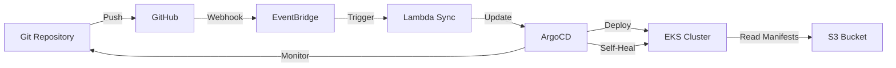

### Features

- Declarative Git-based deployment automation
- Automatic sync from Git repository
- Self-healing deployments
- Rollback capabilities
- Multi-environment support

### Configuration

ArgoCD is deployed on an EKS cluster and monitors your Git repository for changes:

```bash
# View ArgoCD configuration
terraform output argocd_config_parameter

# Trigger manual sync
aws events put-events --entries \
  "Source=custom.secretrotation,DetailType='Manual Secret Rotation Requested'"
```

### Architecture

- **EKS Cluster**: Dedicated cluster for GitOps operations
- **Lambda Integration**: Automated sync triggers
- **S3 Manifests**: Application manifests stored in S3
- **EventBridge**: Event-driven sync automation

## Service Mesh (AWS App Mesh)

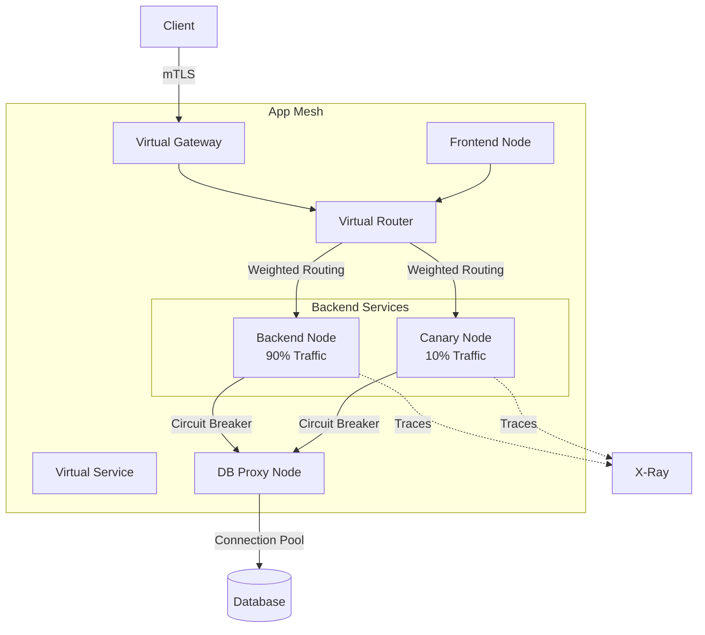

### Features

- Advanced traffic routing (weighted, header-based)
- Circuit breaking and outlier detection
- Automatic retries with exponential backoff
- End-to-end encryption (mTLS)
- Distributed tracing integration
- Canary deployments (90/10 traffic split)

### Virtual Nodes

- **Backend**: Main application service
- **Backend Canary**: Canary deployment target
- **Frontend**: User-facing service
- **Database Proxy**: Connection pooling

### Usage

```bash
# View App Mesh configuration
terraform output appmesh_mesh_id

# Monitor service mesh metrics
aws cloudwatch get-dashboard \
  --dashboard-name petswipe-production-sre
```

## Advanced Auto-Scaling

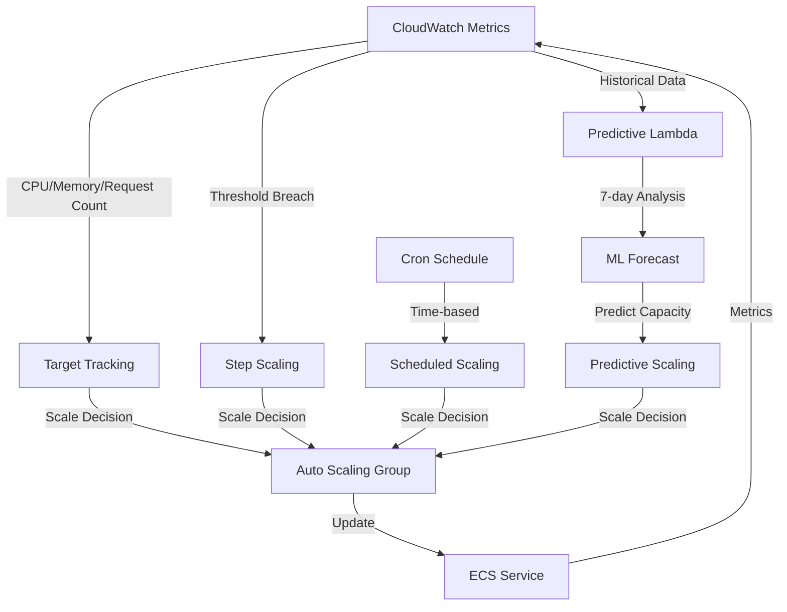

### Scaling Types

1. **Target Tracking**: CPU, memory, request count
2. **Step Scaling**: Aggressive scale-out, conservative scale-in
3. **Scheduled Scaling**: Business hours, weekend patterns
4. **Predictive Scaling**: ML-based capacity forecasting

### Predictive Scaling

Lambda function analyzes historical metrics every 15 minutes:

- 7-day historical data
- Time-of-day patterns
- Day-of-week patterns
- Automatic capacity adjustments

```bash
# View auto-scaling policies
aws application-autoscaling describe-scaling-policies \
  --service-namespace ecs
```

## Infrastructure Testing

### Terratest Framework

Automated infrastructure validation with Go:

```bash
# Run infrastructure tests
make infra-test

# Or directly
cd tests/terraform && go test -v -timeout 30m
```

### Test Coverage

- RDS instance creation and encryption
- ECS cluster deployment
- S3 bucket configuration
- KMS key rotation
- CloudWatch log groups
- Auto-scaling configuration
- Security compliance
- High availability setup

## Policy as Code (OPA)

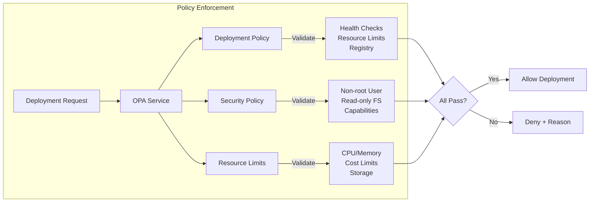

### Policy Enforcement

Three policy categories:

1. **Deployment Policies** (`policies/deployment.rego`)
   - Health check requirements
   - Resource limits validation
   - Replica count enforcement
   - Approved registries
   - Image tag restrictions

2. **Security Policies** (`policies/security.rego`)
   - Non-root user enforcement
   - Read-only filesystems
   - Capability restrictions
   - Secret management
   - Network policies

3. **Resource Limits** (`policies/resource-limits.rego`)
   - CPU/memory limits
   - Cost optimization
   - Storage quotas

### Usage

```bash
# Validate policies locally
make policy-validate

# View OPA service
terraform output opa_service_url
```

## Secret Rotation

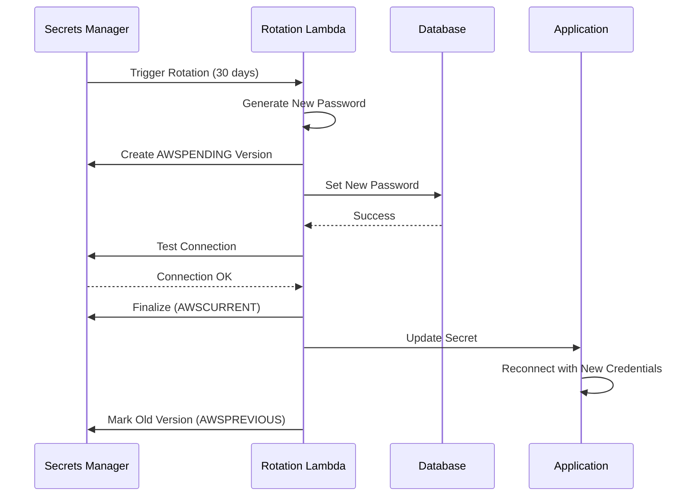

### Automated Rotation

- **Database Credentials**: 30-day automatic rotation
- **API Keys**: 90-day rotation
- **JWT Secrets**: 90-day rotation

### Manual Rotation

```bash
# Rotate database credentials
make rotate-secrets ENV=production

# Or using AWS CLI
aws secretsmanager rotate-secret \
  --secret-id petswipe-production-db-credentials
```

### Features

- Zero-downtime rotation
- Automated password generation
- Secrets Manager integration
- CloudWatch alarms for failures
- SNS notifications

## SLO/SLA Tracking

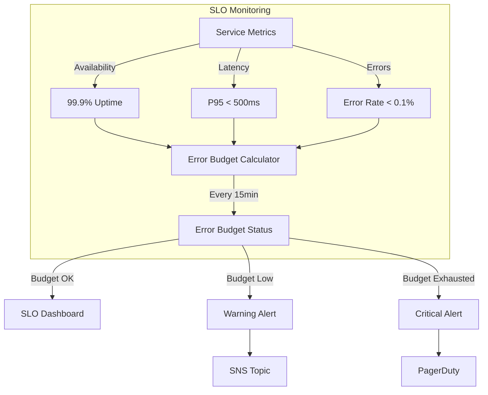

### Service Level Objectives

| Metric | Target | Measurement Window |
|--------|--------|-------------------|
| Availability | 99.9% | 30 days |
| P50 Latency | 200ms | 24 hours |
| P95 Latency | 500ms | 24 hours |
| P99 Latency | 1000ms | 24 hours |
| Error Rate | <0.1% | 1 hour |

### Error Budget

Automatically calculated every 15 minutes:

```bash
# Check error budget status
make error-budget

# View SLO dashboard
make slo-status
```

### Alerting

- SLO breach notifications
- Error budget consumption warnings
- Composite alarms for deployment health

## PagerDuty Integration

### Critical Alerts

Automatically escalated to PagerDuty:

- All service instances down
- Database unavailable
- Sustained high CPU (95%+ for 25 minutes)
- SLO breaches

### Configuration

Set PagerDuty integration key in variables:

```hcl
variable "pagerduty_integration_key" {
  description = "PagerDuty integration key"
  type        = string
  sensitive   = true
}
```

## Load Testing

### K6 Test Scenarios

Comprehensive load testing with k6:

1. **Smoke Test** (1m): Verify basic functionality
2. **Load Test** (9m): Normal load simulation
3. **Stress Test** (16m): Above-normal load
4. **Spike Test** (2m): Sudden traffic spike
5. **Soak Test** (30m): Sustained load

### Running Tests

```bash
# Run all test scenarios
make load-test

# Or with custom configuration
k6 run scripts/load-test.js \
  --env BASE_URL=https://api.petswipe.com \
  --env API_KEY=your-api-key
```

### Thresholds

- P95 latency < 500ms
- P99 latency < 1000ms
- Error rate < 1%
- Check success rate > 95%

## Feature Flags

### AWS AppConfig Integration

Progressive feature rollout with AppConfig:

```bash
# List all feature flags
make ff-list

# Enable a feature
make ff-enable

# Disable a feature
make ff-disable
```

### Deployment Strategies

1. **Gradual Rollout**: 20% traffic every 6 minutes over 30 minutes
2. **Immediate**: Instant deployment
3. **Canary**: 10% initial traffic, 60-minute rollout

### Analytics

Lambda function tracks feature flag usage every 5 minutes:

- Usage metrics
- Performance impact
- Error correlation

## Backup & Disaster Recovery

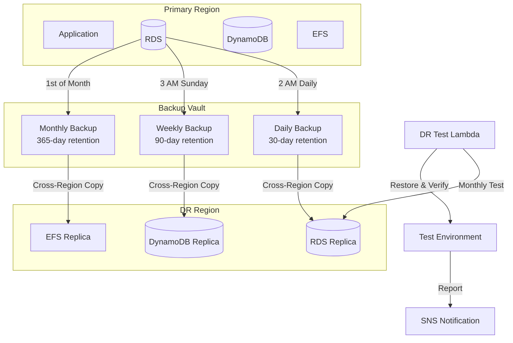

### Backup Schedule

- **Daily**: 2 AM, 30-day retention
- **Weekly**: Sunday 3 AM, 90-day retention
- **Monthly**: 1st of month, 365-day retention

### Automated DR Testing

Monthly automated disaster recovery drills:

```bash
# Run DR test
make dr-test

# View DR test results
aws lambda invoke \
  --function-name petswipe-production-dr-test \
  /tmp/dr-output.json
```

### Cross-Region Replication

Backups automatically replicated to DR region for:

- RDS databases
- DynamoDB tables
- EFS file systems

## CDN & Edge Caching

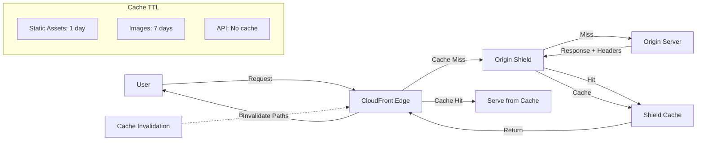

### CloudFront Configuration

- **Origin Shield**: Enabled for better cache hit ratio
- **HTTP/3**: Latest protocol support
- **Brotli Compression**: Better compression than gzip
- **Security Headers**: Comprehensive security policy

### Cache Policies

1. **Static Assets**: 1-day default, 1-year max
2. **API Endpoints**: No caching by default
3. **Images**: 7-day default, 1-year max

### Cache Invalidation

```bash
# Invalidate specific paths
make invalidate-cache

# Or manually
aws lambda invoke \
  --function-name petswipe-production-cache-invalidation \
  --payload '{"paths":["/api/*"]}' \
  /tmp/invalidation.json
```

## Database Migrations

### Migration Management

Automated database schema migrations with versioning:

```bash
# Run migrations
make db-migrate ENV=production

# Rollback last migration
make db-rollback ENV=production

# Check migration status
make db-status ENV=production
```

### Features

- Transaction-based migrations
- Automatic backups before production migrations
- Checksum verification
- Execution time tracking
- Success/failure recording
- Rollback support

## Usage Examples

### Deploying to Production

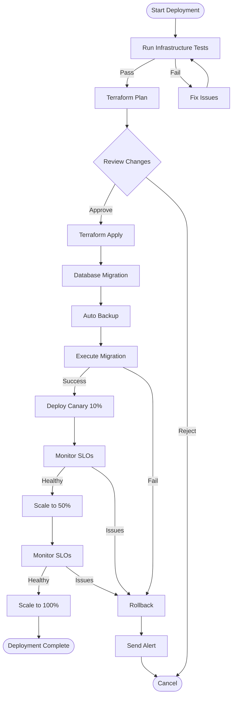

```bash
# 1. Run infrastructure tests
make infra-test

# 2. Plan Terraform changes
make tf-plan ENV=production

# 3. Apply infrastructure
make tf-apply ENV=production

# 4. Run database migrations
make db-migrate ENV=production

# 5. Deploy with canary
make deploy-canary ENV=production
```

### Monitoring & Troubleshooting

```bash
# Check SLO status
make slo-status ENV=production

# View error budget
make error-budget ENV=production

# Run security scan
make security-scan

# Generate cost report
make cost-report ENV=production
```

### Feature Rollout

```bash
# List current flags
make ff-list ENV=production

# Enable new feature
make ff-enable ENV=production

# Monitor impact
make slo-status ENV=production

# Rollback if needed
make ff-disable ENV=production
```

## Cost Optimization

The infrastructure includes several cost optimization features:

- Scheduled scaling for business hours/weekends
- Spot instances support
- S3 lifecycle policies
- CloudWatch log retention policies
- Reserved capacity recommendations
- Cost allocation tags

```bash
# View cost estimate
make cost-estimate ENV=production

# Generate cost report
make cost-report ENV=production
```

## Security

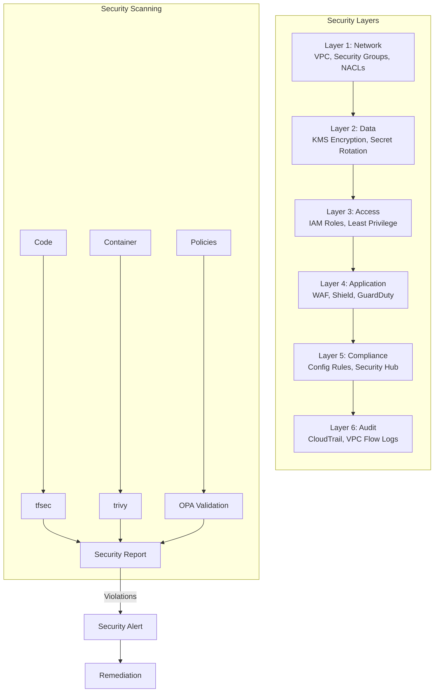

### Security Layers

1. **Network**: VPC, security groups, NACLs
2. **Data**: KMS encryption, secrets rotation
3. **Access**: IAM roles, least privilege
4. **Application**: WAF, Shield, GuardDuty
5. **Compliance**: Config rules, Security Hub
6. **Audit**: CloudTrail, VPC Flow Logs

### Security Scanning

```bash
# Run comprehensive security scan
make security-scan

# Components:
# - tfsec (Terraform security)
# - trivy (Container security)
# - OPA policies (Governance)
```

## Monitoring Stack

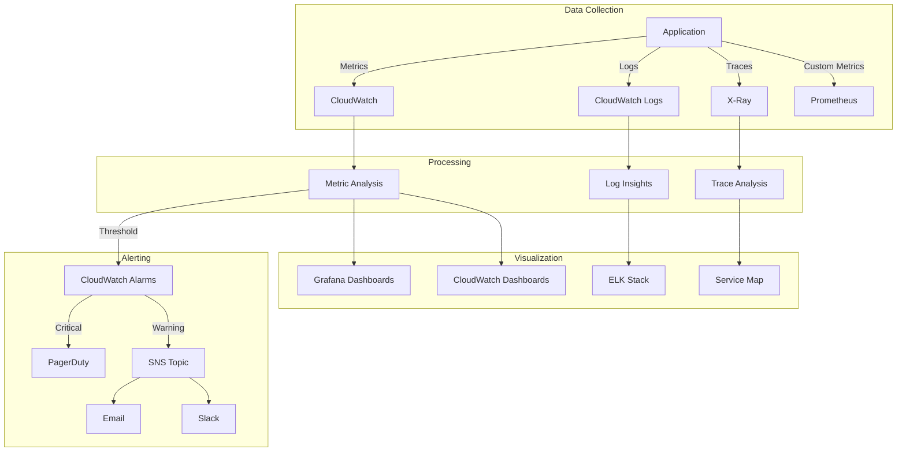

- **Metrics**: CloudWatch, Prometheus
- **Logs**: CloudWatch Logs, ELK stack
- **Traces**: X-Ray, OpenTelemetry
- **Dashboards**: Grafana, CloudWatch Dashboards
- **Alerts**: SNS, PagerDuty
- **APM**: Custom application metrics

## Support & Troubleshooting

### Common Issues

1. **Deployment Failures**: Check CloudWatch logs and EventBridge events
2. **SLO Breaches**: Review error budget and scaling policies
3. **Failed Migrations**: Check migration logs and restore from backup
4. **Cache Issues**: Invalidate CloudFront distribution

### Getting Help

```bash
# View comprehensive help
make help

# View specific Terraform outputs
cd terraform && terraform output

# Check AWS resources
aws ecs describe-services --cluster petswipe-production-cluster
```

## Contributing

When adding new infrastructure:

1. Write Terratest tests
2. Define OPA policies
3. Update SLO dashboards
4. Document in this file
5. Add Makefile targets
6. Update cost estimates

## License

MIT License - See LICENSE file for details.
