# PetSwipe Monitoring & Observability

> [!TIP]
> Comprehensive monitoring, observability, and alerting system for PetSwipe

This directory contains the monitoring and observability configuration for the PetSwipe application using Prometheus, Grafana, and AWS CloudWatch.

## 📊 Table of Contents

1. [Architecture Overview](#-architecture-overview)
2. [Quick Start](#-quick-start)
3. [Monitoring Stack](#-monitoring-stack)
4. [Directory Structure](#-directory-structure)
5. [Configuration](#-configuration)
6. [Metrics & KPIs](#-metrics--kpis)
7. [Dashboards](#-dashboards)
8. [Alerting](#-alerting)
9. [Log Aggregation](#-log-aggregation)
10. [Distributed Tracing](#-distributed-tracing)
11. [Customization](#-customization)
12. [Troubleshooting](#-troubleshooting)
13. [Health Checks](#-health-checks)
14. [Performance Monitoring](#-performance-monitoring)
15. [Data Persistence](#-data-persistence)

---

## 🏛️ Architecture Overview

### Observability Stack Architecture


### Data Flow

```mermaid
sequenceDiagram
    participant App as 🔧 Application
    participant Exporter as 📊 Metrics Exporter
    participant Prom as 📥 Prometheus
    participant AM as 🚨 AlertManager
    participant Grafana as 📈 Grafana
    participant SNS as 📧 AWS SNS
    participant CW as ☁️ CloudWatch

    App->>Exporter: Increment counter<br/>(http_requests_total)
    App->>CW: Send logs & metrics

    loop Every 15s
        Prom->>Exporter: Scrape /metrics
        Exporter-->>Prom: Return metrics<br/>(Prometheus format)
    end

    Prom->>Prom: Store in TSDB
    Prom->>AM: Evaluate alert rules
    AM->>AM: Check thresholds

    alt Alert Triggered
        AM->>SNS: Send notification
        SNS-->>User: Email/Slack alert
    end

    User->>Grafana: View Dashboard
    Grafana->>Prom: PromQL query
    Prom-->>Grafana: Time series data
    Grafana-->>User: Render charts

    User->>CW: View CloudWatch
    CW-->>User: AWS metrics & logs
```



## 🚀 Quick Start

### Starting the Monitoring Stack

```bash
# Start all services including monitoring
docker-compose up -d

# Check service status
docker-compose ps

# View logs
docker-compose logs -f prometheus grafana
```

### Accessing the Monitoring Tools

- **Prometheus**: http://localhost:9090
  - Metrics collection and querying interface
  - PromQL query language for custom metrics
  - Targets: http://localhost:9090/targets
  - Alerts: http://localhost:9090/alerts

- **Grafana**: http://localhost:3001
  - Default credentials: `admin/admin` (configurable via `GRAFANA_PASSWORD` env var)
  - Pre-configured dashboards for application monitoring
  - Data sources auto-provisioned

- **AWS CloudWatch**: AWS Console → CloudWatch
  - Log groups: `/aws/ecs/petswipe-backend`
  - Metrics: ECS, RDS, ALB metrics
  - Alarms: Critical system alerts

## 📋 Monitoring Stack

### Service Targets


### Metrics Collection

The Prometheus configuration scrapes metrics from:

| Service | Endpoint | Port | Metrics Path | Interval | Timeout |
|---------|----------|------|--------------|----------|---------|
| Backend API | `backend:5001` | 5001 | `/metrics` | 15s | 10s |
| Frontend | `frontend:3000` | 3000 | `/metrics` | 15s | 10s |
| PostgreSQL | `postgres-exporter:9187` | 9187 | `/metrics` | 30s | 10s |
| Redis | `redis-exporter:9121` | 9121 | `/metrics` | 30s | 10s |
| Node Exporter | `node-exporter:9100` | 9100 | `/metrics` | 15s | 10s |
| Grafana | `grafana:3000` | 3000 | `/metrics` | 60s | 10s |
| Prometheus | `localhost:9090` | 9090 | `/metrics` | 60s | 10s |

## 📁 Directory Structure

```
monitoring/
├── Monitoring.md              # This documentation
├── prometheus/
│   └── prometheus.yml         # Prometheus configuration
└── grafana/
    └── provisioning/
        ├── datasources/
        │   └── prometheus.yml # Auto-configured Prometheus datasource
        └── dashboards/
            ├── dashboard.yml  # Dashboard provider config
            └── petswipe-dashboard.json # Pre-built dashboard
```

## 🔧 Configuration

### Prometheus Configuration

The Prometheus configuration (`prometheus/prometheus.yml`) includes:
- 15-second scrape intervals
- Service discovery for all application components
- Configurable timeout and retry settings

### Grafana Configuration

Grafana is automatically provisioned with:
- Prometheus datasource connection
- Default PetSwipe application dashboard
- Persistent data storage

## 📈 Metrics & KPIs

### Metric Categories

```mermaid
mindmap
  root((📊 Metrics))
    Business KPIs
      User Signups
      Swipes per Minute
      Matches Created
      Adoption Rate
      Pet Uploads
    Application Metrics
      Request Rate
      Response Time
      Error Rate
      Throughput
      Active Connections
    Infrastructure Metrics
      CPU Usage
      Memory Usage
      Disk I/O
      Network I/O
      Container Count
    Database Metrics
      Query Latency
      Connection Pool
      Cache Hit Rate
      Replication Lag
      Deadlocks
    Security Metrics
      Failed Logins
      JWT Validation
      Rate Limit Hits
      WAF Blocks
```



### Key Performance Indicators (KPIs)

```mermaid
flowchart TB
    subgraph Business["💼 Business KPIs"]
        Swipes["Swipes per Minute<br/>Target: > 100"]
        Matches["Matches per Hour<br/>Target: > 50"]
        Signups["Daily Signups<br/>Target: > 20"]
        Adoption["Adoption Rate<br/>Target: > 15%"]
    end

    subgraph Golden["🌟 Golden Signals"]
        Latency["Latency<br/>p95 < 500ms"]
        Traffic["Traffic<br/>1000+ req/min"]
        Errors["Error Rate<br/>< 1%"]
        Saturation["Saturation<br/>CPU < 70%"]
    end

    subgraph SLO["🎯 Service Level Objectives"]
        Availability["Availability<br/>99.9% uptime"]
        ResponseTime["Response Time<br/>p99 < 1s"]
        ErrorBudget["Error Budget<br/>0.1% monthly"]
    end
```



### Available Metrics

#### Application Metrics (Custom)

```prometheus
# HTTP Metrics
http_requests_total{method, path, status}
http_request_duration_seconds{method, path}
http_request_size_bytes{method, path}
http_response_size_bytes{method, path}

# Business Metrics
swipes_total{liked, pet_type}
matches_created_total
user_signups_total
pet_uploads_total
sessions_active

# Authentication Metrics
auth_login_attempts_total{status}
auth_token_validations_total{result}
auth_password_resets_total

# Database Metrics
db_queries_total{operation, table}
db_query_duration_seconds{operation, table}
db_connection_pool_size{state}
db_transactions_total{status}

# Cache Metrics
cache_hits_total{cache_type}
cache_misses_total{cache_type}
cache_evictions_total{cache_type}
cache_size_bytes{cache_type}
```

#### Infrastructure Metrics (Automatic)

```prometheus
# System Metrics (Node Exporter)
node_cpu_seconds_total{mode}
node_memory_MemAvailable_bytes
node_disk_read_bytes_total
node_disk_written_bytes_total
node_network_receive_bytes_total
node_network_transmit_bytes_total

# Container Metrics (cAdvisor)
container_cpu_usage_seconds_total{container}
container_memory_usage_bytes{container}
container_network_receive_bytes_total{container}
container_fs_usage_bytes{container}

# PostgreSQL Metrics
pg_up
pg_stat_database_tup_fetched{datname}
pg_stat_database_tup_inserted{datname}
pg_stat_database_conflicts{datname}
pg_locks_count{datname, mode}
pg_replication_lag_seconds

# Redis Metrics
redis_up
redis_connected_clients
redis_used_memory_bytes
redis_keyspace_hits_total
redis_keyspace_misses_total
redis_evicted_keys_total
```

#### AWS CloudWatch Metrics

```
# ECS Metrics
ECSServiceAverageCPUUtilization
ECSServiceAverageMemoryUtilization
TargetResponseTime
HTTPCode_Target_4XX_Count
HTTPCode_Target_5XX_Count

# RDS Metrics
DatabaseConnections
ReadLatency
WriteLatency
FreeableMemory
CPUUtilization
ReplicationLag

# ALB Metrics
ActiveConnectionCount
ProcessedBytes
RequestCount
TargetResponseTime
HTTPCode_ELB_5XX_Count
```

## 📊 Dashboards

### Dashboard Overview

```mermaid
flowchart TB
    subgraph Dashboards["📈 Grafana Dashboards"]
        Overview["System Overview<br/>- Service Health<br/>- Request Rate<br/>- Error Rate<br/>- Response Time"]
        Business["Business Metrics<br/>- Swipes<br/>- Matches<br/>- Signups<br/>- Adoptions"]
        Infrastructure["Infrastructure<br/>- CPU, Memory<br/>- Network I/O<br/>- Disk Usage"]
        Database["Database Dashboard<br/>- Query Performance<br/>- Connections<br/>- Replication"]
        Application["Application Dashboard<br/>- API Endpoints<br/>- Auth Metrics<br/>- Cache Performance"]
    end

    subgraph Panels["📊 Panel Types"]
        Timeseries["Time Series<br/>(Line Charts)"]
        Gauge["Gauge<br/>(Current Value)"]
        Stat["Stat<br/>(Single Number)"]
        Table["Table<br/>(Detailed Data)"]
        Heatmap["Heatmap<br/>(Distribution)"]
    end

    Dashboards --> Panels
```



### Pre-configured Dashboards

#### 1. System Overview Dashboard
- **Service Health**: Uptime, Health Check Status
- **Request Metrics**: Requests per second, Total requests
- **Performance**: Response time percentiles (p50, p95, p99)
- **Errors**: Error rate, 4xx/5xx counts by endpoint

#### 2. Business Metrics Dashboard
- **User Activity**: Active users, New signups
- **Pet Adoption**: Swipes per minute, Matches created
- **Engagement**: Session duration, Return rate
- **Conversion**: Swipe-to-match rate, Adoption funnel

#### 3. Infrastructure Dashboard
- **Compute**: CPU utilization, Memory usage
- **Storage**: Disk I/O, Disk space
- **Network**: Inbound/Outbound traffic, Packet loss
- **Containers**: Task count, Health status

#### 4. Database Dashboard
- **Performance**: Query latency, Slow queries
- **Connections**: Active connections, Connection pool
- **Replication**: Replication lag, Replica health
- **Cache**: Cache hit ratio, Buffer pool usage

## 🚨 Alerting

### Alert Architecture

```mermaid
flowchart LR
    subgraph Metrics["📊 Metrics Source"]
        Prometheus["Prometheus<br/>Rule Evaluation"]
        CloudWatch["CloudWatch<br/>Alarm Evaluation"]
    end

    subgraph AlertManager["🚨 Alert Manager"]
        Routing["Alert Routing<br/>- Severity<br/>- Team<br/>- Service"]
        Grouping["Alert Grouping<br/>- Deduplication<br/>- Batching"]
        Silencing["Silencing<br/>- Maintenance Windows"]
    end

    subgraph Channels["📢 Notification Channels"]
        Email["Email<br/>(SES)"]
        Slack["Slack<br/>(Webhooks)"]
        PagerDuty["PagerDuty<br/>(Critical)"]
        SNS["AWS SNS<br/>(All Alerts)"]
    end

    Prometheus --> Routing
    CloudWatch --> Routing
    Routing --> Grouping
    Grouping --> Silencing
    Silencing --> Email
    Silencing --> Slack
    Silencing --> PagerDuty
    Silencing --> SNS
```



### Alert Severity Levels

```mermaid
flowchart TB
    subgraph Critical["🔴 Critical (P0)"]
        CriticalAlerts["- Service Down<br/>- Database Unavailable<br/>- Error Rate > 10%<br/>- Data Loss Risk"]
        CriticalAction["Response: Immediate<br/>Notification: PagerDuty + SMS"]
    end

    subgraph High["🟠 High (P1)"]
        HighAlerts["- High CPU (> 90%)<br/>- High Memory (> 90%)<br/>- Error Rate > 5%<br/>- Latency > 2s"]
        HighAction["Response: 15 minutes<br/>Notification: Slack + Email"]
    end

    subgraph Medium["🟡 Medium (P2)"]
        MediumAlerts["- CPU > 80%<br/>- Memory > 80%<br/>- Disk > 80%<br/>- Error Rate > 2%"]
        MediumAction["Response: 1 hour<br/>Notification: Slack"]
    end

    subgraph Low["🟢 Low (P3)"]
        LowAlerts["- CPU > 70%<br/>- Slow Queries<br/>- Cache Miss Rate High"]
        LowAction["Response: Next business day<br/>Notification: Email"]
    end
```



### Alert Rules

```yaml
# Example Prometheus Alert Rules
groups:
  - name: application_alerts
    interval: 30s
    rules:
      # High Error Rate
      - alert: HighErrorRate
        expr: |
          rate(http_requests_total{status=~"5.."}[5m])
          / rate(http_requests_total[5m]) > 0.05
        for: 5m
        labels:
          severity: critical
          team: backend
        annotations:
          summary: "High error rate detected"
          description: "Error rate is {{ $value | humanizePercentage }}"

      # High Response Time
      - alert: HighResponseTime
        expr: |
          histogram_quantile(0.99,
            rate(http_request_duration_seconds_bucket[5m])
          ) > 1
        for: 10m
        labels:
          severity: warning
          team: backend
        annotations:
          summary: "High response time (p99 > 1s)"

      # Database Connection Pool Exhausted
      - alert: DatabaseConnectionPoolExhausted
        expr: |
          db_connection_pool_size{state="idle"} < 2
        for: 5m
        labels:
          severity: critical
          team: database
        annotations:
          summary: "Database connection pool nearly exhausted"

      # High Memory Usage
      - alert: HighMemoryUsage
        expr: |
          (1 - (node_memory_MemAvailable_bytes
          / node_memory_MemTotal_bytes)) > 0.90
        for: 5m
        labels:
          severity: critical
          team: infrastructure
        annotations:
          summary: "High memory usage (> 90%)"
```

## 📝 Log Aggregation

### Logging Architecture

```mermaid
flowchart TB
    subgraph Application["🔧 Application Layer"]
        Backend["Backend Logs<br/>(Winston)"]
        Frontend["Frontend Logs<br/>(Console)"]
        AccessLogs["Access Logs<br/>(Morgan)"]
    end

    subgraph Processing["⚙️ Log Processing"]
        Structured["Structured Logging<br/>(JSON Format)"]
        Correlation["Correlation IDs<br/>(Request Tracing)"]
        Sanitization["PII Sanitization"]
    end

    subgraph Storage["💾 Log Storage"]
        CloudWatchLogs["CloudWatch Logs<br/>- Log Groups<br/>- Log Streams<br/>- Retention: 30d"]
        S3Archive["S3 Archive<br/>(Long-term Storage)"]
    end

    subgraph Analysis["🔍 Log Analysis"]
        LogInsights["CloudWatch Insights<br/>(SQL-like Queries)"]
        Athena["Amazon Athena<br/>(S3 Query)"]
    end

    subgraph Alerts["🚨 Log-based Alerts"]
        ErrorPatterns["Error Pattern Detection"]
        AnomalyDetection["Anomaly Detection"]
    end

    Backend --> Structured
    Frontend --> Structured
    AccessLogs --> Structured
    Structured --> Correlation
    Correlation --> Sanitization
    Sanitization --> CloudWatchLogs
    CloudWatchLogs --> S3Archive
    CloudWatchLogs --> LogInsights
    S3Archive --> Athena
    LogInsights --> ErrorPatterns
    LogInsights --> AnomalyDetection
```



### Log Levels


## 🔍 Distributed Tracing

### Tracing Architecture


### Service Map


## 🛠️ Customization

### Adding Custom Dashboards

1. Create JSON dashboard file in `grafana/provisioning/dashboards/`
2. Restart Grafana service: `docker-compose restart grafana`

### Modifying Scrape Targets

1. Edit `prometheus/prometheus.yml`
2. Reload Prometheus config: `docker-compose restart prometheus`

### Environment Variables

- `GRAFANA_PASSWORD`: Set custom Grafana admin password (default: `admin`)
- `PROMETHEUS_RETENTION`: Data retention period (default: `15d`)
- `SCRAPE_INTERVAL`: Metrics scrape interval (default: `15s`)

## 🔍 Troubleshooting

### Common Issues

1. **Services not appearing in Prometheus targets**
   - Verify service names match docker-compose service names
   - Check that services are running: `docker-compose ps`

2. **Grafana dashboard not loading**
   - Check Prometheus datasource connection in Grafana settings
   - Verify Prometheus is accessible at `http://prometheus:9090`

3. **Permission issues with volumes**
   ```bash
   # Fix volume permissions
   docker-compose down
   docker volume rm $(docker volume ls -q | grep -E "(prometheus|grafana)")
   docker-compose up -d
   ```

### Logs

```bash
# Check service logs
docker-compose logs prometheus
docker-compose logs grafana

# Follow logs in real-time
docker-compose logs -f prometheus grafana
```

## 🚦 Health Checks

Access these endpoints to verify monitoring health:

- Prometheus health: http://localhost:9090/-/healthy
- Prometheus targets: http://localhost:9090/targets
- Grafana health: http://localhost:3001/api/health

## 📈 Performance Monitoring

### Response Time Tracking


### SLA/SLO Monitoring

```mermaid
flowchart TB
    subgraph SLI["📊 Service Level Indicators"]
        Availability["Availability<br/>(Uptime %)"]
        Latency["Latency<br/>(Response Time)"]
        Throughput["Throughput<br/>(Requests/sec)"]
        ErrorRate["Error Rate<br/>(%)"]
    end

    subgraph SLO["🎯 Service Level Objectives"]
        AvailabilitySLO["99.9% Uptime<br/>(43.2 min downtime/month)"]
        LatencySLO["p95 < 500ms<br/>p99 < 1s"]
        ErrorRateSLO["< 1% Error Rate"]
    end

    subgraph ErrorBudget["💰 Error Budget"]
        MonthlyBudget["Monthly Budget<br/>43.2 minutes"]
        BudgetUsed["Budget Used"]
        BudgetRemaining["Budget Remaining"]
        BurnRate["Burn Rate"]
    end

    SLI --> SLO
    SLO --> ErrorBudget
    BudgetUsed --> BurnRate
    BurnRate -.->|Alert if high| PagerDuty["🚨 PagerDuty"]
```



## 🔄 Data Persistence

### Volume Management

```mermaid
flowchart LR
    subgraph Docker["🐳 Docker Volumes"]
        PrometheusVol["prometheus-data<br/>- TSDB Storage<br/>- Retention: 15d<br/>- Size: ~10GB"]
        GrafanaVol["grafana-data<br/>- Dashboards<br/>- Users<br/>- Settings"]
        GrafanaProvisioning["grafana-provisioning<br/>- Auto-config<br/>- Datasources<br/>- Dashboards"]
    end

    subgraph Backup["💾 Backup Strategy"]
        VolBackup["Volume Snapshots<br/>(Daily)"]
        S3Backup["S3 Backup<br/>(Weekly)"]
    end

    subgraph Restore["🔄 Restore Process"]
        VolRestore["1. Stop containers"]
        DataRestore["2. Restore volume"]
        StartContainers["3. Start containers"]
    end

    PrometheusVol --> VolBackup
    GrafanaVol --> VolBackup
    VolBackup --> S3Backup

    S3Backup -.->|Disaster Recovery| VolRestore
    VolRestore --> DataRestore
    DataRestore --> StartContainers
```



Both Prometheus metrics and Grafana configurations are persisted using Docker volumes:
- `prometheus-data`: Stores time-series metrics data (15 day retention)
- `grafana-data`: Stores dashboards, users, and settings
- Backup schedule: Daily volume snapshots, weekly S3 backups
