# 🐾 PetSwipe - Swipe to Adopt

**PetSwipe** is on a mission to help shelter animals find loving homes. This swipe-to-adopt platform connects prospective pet parents with adoptable animals in need. With PetSwipe, users can effortlessly browse pets, swipe right to adopt or left to pass, and manage their profiles with ease. They can also view their matches and keep track of their swipe history — making the journey to adoption simpler, faster, and more heartwarming 🐰.

<p align="center">
  <a href="https://petswipe.vercel.app" target="_blank">
    
  </a>
</p>

> [!NOTE]
> Inspired by Tinder UX, but for pets to find their loving humans! 🐶🐱

                                             
               
                 
     
---

## 📋 Table of Contents

1. [About PetSwipe](#-about-petswipe)
2. [Live App](#-live-app)
3. [Features](#-features)
4. [Tech Stack & Architecture](#-tech-stack--architecture)
5. [User Interface](#-user-interface)
6. [Database Schema](#-database-schema-typeorm-entities)
7. [Getting Started](#-getting-started)
   - [Backend Setup](#-backend-setup)
   - [Frontend Setup](#-frontend-setup)
8. [API Reference](#-api-reference)
   - [Authentication](#authentication)
   - [Matches](#matches)
   - [Pets](#pets)
   - [Swipes](#swipes)
   - [Users](#users)
   - [Swagger UI](#swagger-ui)
9. [AWS Deployment](#-aws-deployment)
   - [Production-Ready Deployment Strategies](#production-ready-deployment-strategies)
   - [Infrastructure Stack](#infrastructure-stack)
   - [Terraform](#terraform)
   - [Vault, Consul, Nomad](#vault-consul-nomad)
   - [Ansible](#ansible)
10. [Agentic AI Integration](#-agentic-ai-integration)
11. [Scripts & Utilities](#-scripts--utilities)
    - [Docker](#docker)
12. [Testing](#-testing)
    - [Playwright](#playwright)
    - [Jest](#jest)
    - [Chai & Mocha](#chai--mocha)
13. [GitHub Actions CI/CD](#-github-actions)
14. [Command Line Interface](#-command-line-interface)
15. [Monitoring & Observability](#-monitoring--observability)
16. [Contributing](#-contributing)
17. [License](#-license)
18. [Author](#-author)

---

## 🐾 About PetSwipe

PetSwipe is a full-stack application that allows users to swipe through pets available for adoption. The app is designed to be user-friendly and visually appealing, with a focus on providing a seamless experience for both users and shelter staff.

The app is built using modern technologies, including **TypeScript**, **Next.js**, **Express**, and **PostgreSQL**. It leverages the power of **AWS** for storage and deployment, ensuring scalability and reliability.

The app is also designed to be modular and easy to extend, with a focus on clean code and best practices. It includes features such as user authentication, a swipe interface, personalized pet decks, and admin tools for managing pets and users.

And most importantly, it is built with the goal of helping shelter animals find their forever homes. By providing a fun and engaging way for users to browse pets, PetSwipe aims to increase adoption rates and raise awareness about the importance of pet adoption. 🐾

I hope you enjoy using PetSwipe as much as I enjoyed building it! 🐱

> [!TIP]
> Please spread the word about PetSwipe to your friends and family, and help us find loving homes for as many pets as possible! 🏠❤️

---

## 🌐 Live App

**[PetSwipe](https://petswipe.vercel.app)** is live on Vercel! You can now try it out and see how it works.

> [!TIP]
> Link not working? Copy and paste this URL into your browser: [https://petswipe.vercel.app](https://petswipe.vercel.app).

Also, checkout the backend API at **[PetSwipe API](https://petswipe-backend-api.vercel.app/)**. You can use tools like Postman or Swagger UI to explore the API endpoints.

> [!IMPORTANT] > **Note**: Currently, most of the data is seeded with dummy data. We hope the app will be used by more real users and pet adoption shelters in the future. If you are a shelter or a pet adoption organization, please reach out to us to get **all** your data integrated into the app in seconds! Or you can also use the in-app manual add pet features to further enrich our pets database (only works for authenticated users).

---

## 🚀 Features

PetSwipe is a full-stack application with the following features:

- **User Authentication**:
  - Login, signup, password reset functionalities are all implemented
  - **JWT-based authentication**, where tokens are stored in **HTTP-only cookies** for security
- **Swipe Interface**:
  - Swipe left/right or press arrow keys/buttons to navigate through the deck of pets cards
  - For each card, users can view pet details, photos, and decide to adopt or pass
  - Each user is randomly assigned a sample selection of pet cards (around 90-110 cards) to review. As the app gathers more real, user-added pet data, it will improve in matching users with the most relevant pets.
- **Personalized Deck**:
  - Deck is generated based on user preferences and past swipes
  - Users will only see pets that they haven't swiped on before, and pets that are most relevant to them
- **History**: View all swipes & liked (adopted) pets
- **Adoption Planner**:
  - Dedicated shortlist decision page with compatibility and readiness scoring for liked pets
  - Includes paginated pet comparison, home-fit guidance, budget/time estimates, checklist-driven prep, shelter questions, and suggested outreach notes
- **Preference Insights**:
  - Dedicated analytics page based on real swipe history
  - Includes swipe activity charts, decision split, pet-type affinity, shelter momentum, and recommendation blocks that feed back into the planner flow
- **Pets Map**:
  - Map page for shelter discovery and geographic browsing
  - Geocoding now runs through a same-origin proxy with normalized queries, hit/miss caching, in-flight deduplication, lower concurrency, and client-side cache reuse to reduce slow repeated lookups
- **Chatbot**:
  - A simple chatbot to answer common questions about the app and pets (e.g. breeds, adoption process, pet care tips, etc.)
  - Powered by **Google AI** and **Retrieval-Augmented Generation (RAG)** for personalized responses
- **Admin Tools**:
  - Bulk upload pets via CSV
  - Export pets data
  - Photo uploads to S3
  - Manual match assignment
  - and more!
- **Responsive UI**: Built with **Tailwind CSS** and **shadcn/ui**
  - Fully responsive design for mobile and desktop
  - Light and dark mode support
  - Accessible design for all users
  - Mobile-specific navbar layout with compact quick actions and a dedicated menu panel instead of a squeezed desktop toolbar
- **Real-time Animations**:
  - Framer Motion for smooth transitions and animations
  - Swipe animations for a more engaging experience
  - Loading spinners and skeleton screens for better UX
- **Analytics**: Countups of swipes, matches, adoptions, etc. all are available to admins

---

## 🏛 Tech Stack & Architecture

PetSwipe is built using a modern tech stack, ensuring scalability, maintainability, and performance. The architecture is designed to be modular and easy to extend.

| Layer                   | Technology                                                                                |
| ----------------------- | ----------------------------------------------------------------------------------------- |
| **Frontend**            | Next.js, React, TypeScript, Tailwind CSS, shadcn/ui, Framer Motion, SWR                   |
| **Backend & API**       | Node.js, Express, TypeScript, TypeORM, PostgreSQL, OpenAPI (via Swagger), RabbitMQ, Redis |
| **Data & Storage**      | AWS RDS (PostgreSQL), AWS S3                                                              |
| **Security & Auth**     | JSON Web Tokens, bcryptjs, cookie-parser                                                  |
| **DevOps & Deployment** | Docker, Kubernetes, AWS ECR & ECS (Fargate), Vercel, GitHub Actions                       |
| **Infrastructure**      | Terraform, Kubernetes manifests, Consul, Vault, Nomad, AWS IAM, AWS CloudWatch, AWS ALB   |
| **AI**                  | Google AI, Retrieval-Augmented Generation (RAG)                                           |
| **Testing**             | Playwright (frontend), Jest (backend)                                                     |

### High-Level System Architecture

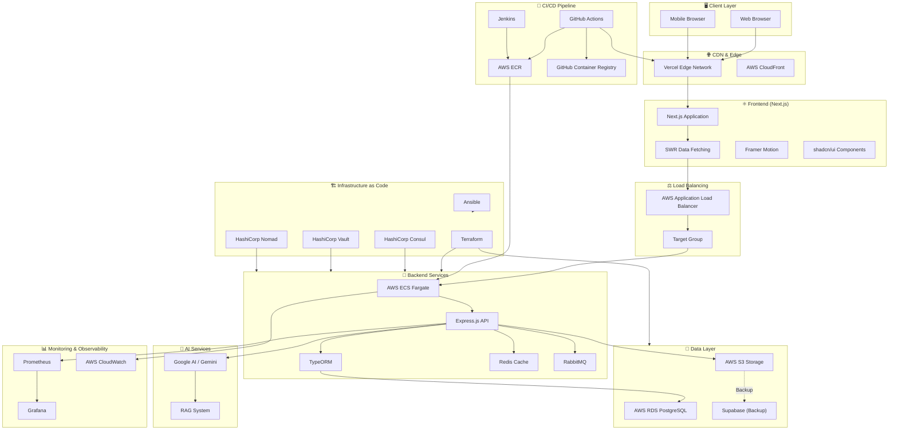
```mermaid
flowchart TB
    subgraph Client["🖥️ Client Layer"]
        Browser["Web Browser"]
        Mobile["Mobile Browser"]
    end

    subgraph CDN["🌐 CDN & Edge"]
        Vercel["Vercel Edge Network"]
        CloudFront["AWS CloudFront"]
    end

    subgraph Frontend["⚛️ Frontend (Next.js)"]
        NextApp["Next.js Application"]
        SWR["SWR Data Fetching"]
        Framer["Framer Motion"]
        Shadcn["shadcn/ui Components"]
    end

    subgraph LoadBalancing["⚖️ Load Balancing"]
        ALB["AWS Application Load Balancer"]
        TG["Target Group"]
    end

    subgraph Backend["🔧 Backend Services"]
        ECS["AWS ECS Fargate"]
        Express["Express.js API"]
        TypeORM["TypeORM"]
        Redis["Redis Cache"]
        RabbitMQ["RabbitMQ"]
    end

    subgraph Data["💾 Data Layer"]
        RDS["AWS RDS PostgreSQL"]
        S3["AWS S3 Storage"]
        Supabase["Supabase (Backup)"]
    end

    subgraph AI["🤖 AI Services"]
        GoogleAI["Google AI / Gemini"]
        RAG["RAG System"]
    end

    subgraph Monitoring["📊 Monitoring & Observability"]
        Prometheus["Prometheus"]
        Grafana["Grafana"]
        CloudWatch["AWS CloudWatch"]
    end

    subgraph Infrastructure["🏗️ Infrastructure as Code"]
        Terraform["Terraform"]
        Consul["HashiCorp Consul"]
        Vault["HashiCorp Vault"]
        Nomad["HashiCorp Nomad"]
        Ansible["Ansible"]
    end

    subgraph CICD["🚀 CI/CD Pipeline"]
        GHA["GitHub Actions"]
        Jenkins["Jenkins"]
        ECR["AWS ECR"]
        GHCR["GitHub Container Registry"]
    end

    Browser --> Vercel
    Mobile --> Vercel
    Vercel --> NextApp
    NextApp --> SWR
    SWR --> ALB
    ALB --> TG
    TG --> ECS
    ECS --> Express
    Express --> TypeORM
    Express --> Redis
    Express --> RabbitMQ
    TypeORM --> RDS
    Express --> S3
    Express --> GoogleAI
    GoogleAI --> RAG

    Express --> Prometheus
    Prometheus --> Grafana
    ECS --> CloudWatch

    GHA --> ECR
    GHA --> GHCR
    GHA --> Vercel
    Jenkins --> ECR
    ECR --> ECS

    Terraform --> Backend
    Terraform --> Data
    Consul --> Backend
    Vault --> Backend
    Nomad --> Backend
    Ansible --> Infrastructure

    S3 -.Backup.-> Supabase
```

### Infrastructure & Deployment Flow

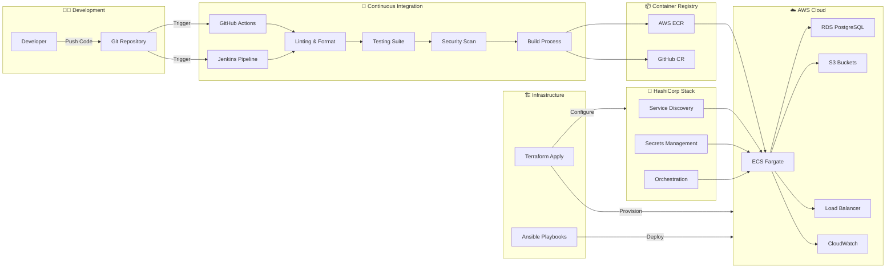
```mermaid
flowchart LR
    subgraph Development["👨‍💻 Development"]
        Dev["Developer"]
        Git["Git Repository"]
    end

    subgraph CI["🔄 Continuous Integration"]
        GHA["GitHub Actions"]
        Jenkins["Jenkins Pipeline"]
        Lint["Linting & Format"]
        Test["Testing Suite"]
        Build["Build Process"]
        Security["Security Scan"]
    end

    subgraph Registry["📦 Container Registry"]
        ECR["AWS ECR"]
        GHCR["GitHub CR"]
    end

    subgraph IaC["🏗️ Infrastructure"]
        TF["Terraform Apply"]
        Ansible["Ansible Playbooks"]
    end

    subgraph AWS["☁️ AWS Cloud"]
        ECS["ECS Fargate"]
        RDS["RDS PostgreSQL"]
        S3["S3 Buckets"]
        ALB["Load Balancer"]
        CW["CloudWatch"]
    end

    subgraph HashiStack["🔐 HashiCorp Stack"]
        Consul["Service Discovery"]
        Vault["Secrets Management"]
        Nomad["Orchestration"]
    end

    Dev -->|Push Code| Git
    Git -->|Trigger| GHA
    Git -->|Trigger| Jenkins
    GHA --> Lint
    Lint --> Test
    Test --> Security
    Security --> Build
    Build --> ECR
    Build --> GHCR

    Jenkins --> Lint

    ECR --> ECS
    TF -->|Provision| AWS
    TF -->|Configure| HashiStack
    Ansible -->|Deploy| AWS

    Consul --> ECS
    Vault --> ECS
    Nomad --> ECS

    ECS --> ALB
    ECS --> RDS
    ECS --> S3
    ECS --> CW
```

### Data Flow & Entity Relationships

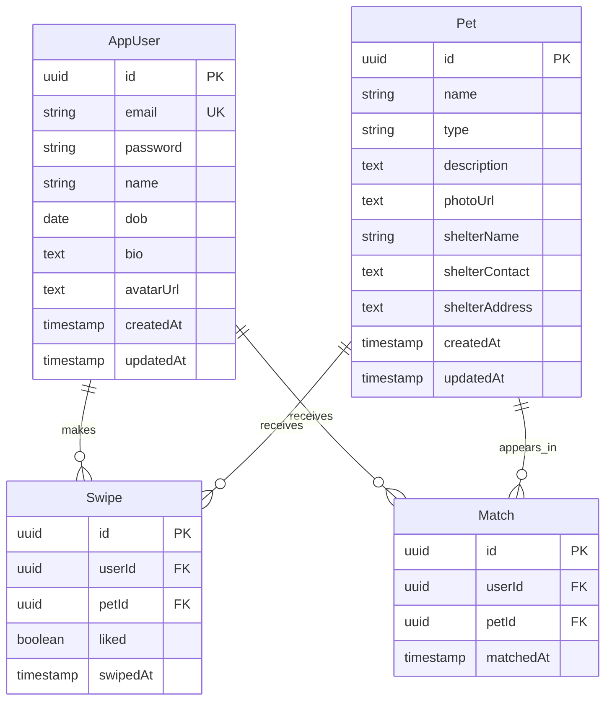
```mermaid
erDiagram
    AppUser ||--o{ Swipe : makes
    AppUser ||--o{ Match : receives
    AppUser {
        uuid id PK
        string email UK
        string password
        string name
        date dob
        text bio
        text avatarUrl
        timestamp createdAt
        timestamp updatedAt
    }

    Pet ||--o{ Swipe : receives
    Pet ||--o{ Match : appears_in
    Pet {
        uuid id PK
        string name
        string type
        text description
        text photoUrl
        string shelterName
        text shelterContact
        text shelterAddress
        timestamp createdAt
        timestamp updatedAt
    }

    Swipe {
        uuid id PK
        uuid userId FK
        uuid petId FK
        boolean liked
        timestamp swipedAt
    }

    Match {
        uuid id PK
        uuid userId FK
        uuid petId FK
        timestamp matchedAt
    }
```

### Authentication & Security Flow

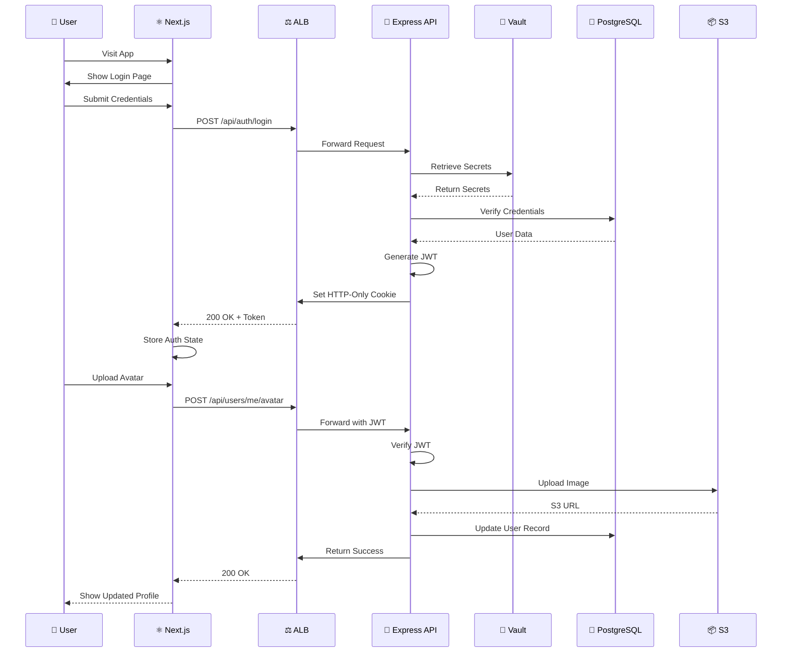
```mermaid
sequenceDiagram
    participant User as 👤 User
    participant Frontend as ⚛️ Next.js
    participant ALB as ⚖️ ALB
    participant Backend as 🔧 Express API
    participant Vault as 🔐 Vault
    participant DB as 💾 PostgreSQL
    participant S3 as 📦 S3

    User->>Frontend: Visit App
    Frontend->>User: Show Login Page
    User->>Frontend: Submit Credentials
    Frontend->>ALB: POST /api/auth/login
    ALB->>Backend: Forward Request
    Backend->>Vault: Retrieve Secrets
    Vault-->>Backend: Return Secrets
    Backend->>DB: Verify Credentials
    DB-->>Backend: User Data
    Backend->>Backend: Generate JWT
    Backend->>ALB: Set HTTP-Only Cookie
    ALB-->>Frontend: 200 OK + Token
    Frontend->>Frontend: Store Auth State

    User->>Frontend: Upload Avatar
    Frontend->>ALB: POST /api/users/me/avatar
    ALB->>Backend: Forward with JWT
    Backend->>Backend: Verify JWT
    Backend->>S3: Upload Image
    S3-->>Backend: S3 URL
    Backend->>DB: Update User Record
    Backend->>ALB: Return Success
    ALB-->>Frontend: 200 OK
    Frontend-->>User: Show Updated Profile
```

---

## 🏗 User Interface

### Current UX Highlights

- **Navigation**:
  - Desktop navigation uses icon-first actions for map, pets, insights, and planner with tooltips
  - Mobile navigation uses a dedicated compact header and a full action panel instead of squeezing the desktop toolbar into small widths
- **Adoption Planner**:
  - Compare liked pets in paginated groups of four
  - Compatibility and readiness gauges, home-fit guidance, transition planning, checklist-driven prep, and action-oriented outreach support
- **Preference Insights**:
  - Responsive chart-based analytics with swipe trends, decision split, type affinity, and shelter momentum
  - Shared chart styling now uses solid tooltips, dark-mode-safe text colors, and mobile-safe sizing
- **Pets Map**:
  - Cache-first shelter geocoding pipeline with deduped requests and safer fallbacks for better performance
  - Query, pet, and miss caches reduce repeated address lookups when users paginate around the map

### Landing Page

<p align="center">
  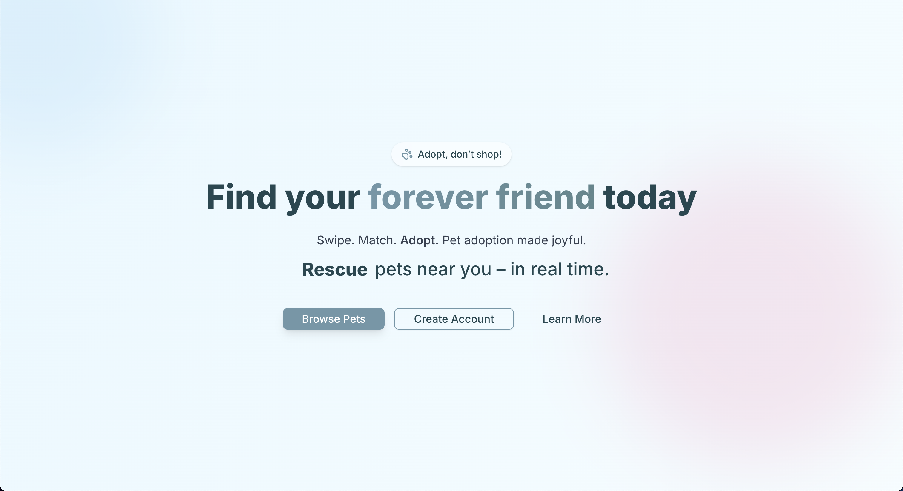
</p>

### Home Page

<p align="center">
  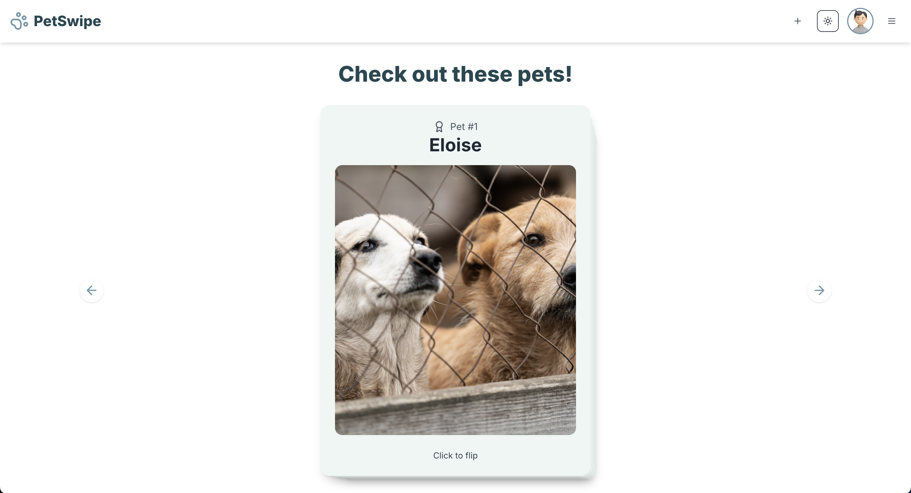
</p>

<p align="center">
  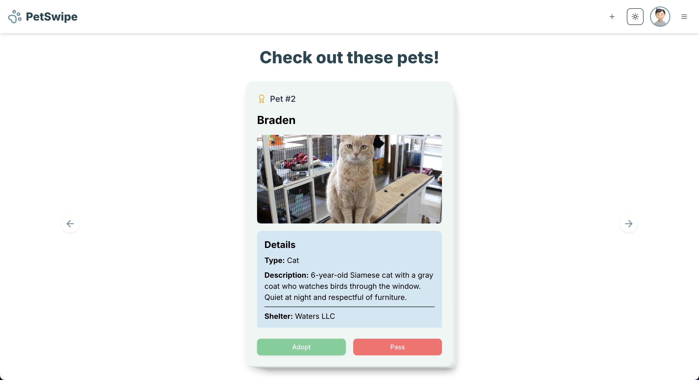
</p>

#### Home Page Overview

<p align="center">
  
</p>

### All Swipes

<p align="center">
  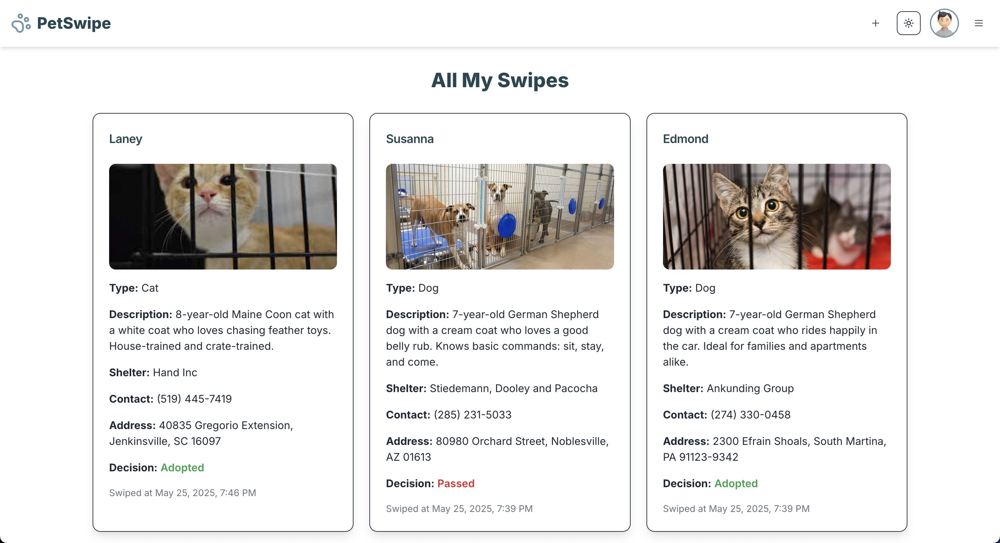
</p>

### Adopted Pets

<p align="center">
  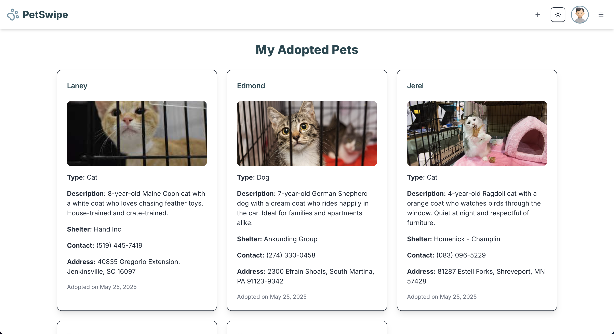
</p>

### Pet Details

<p align="center">
  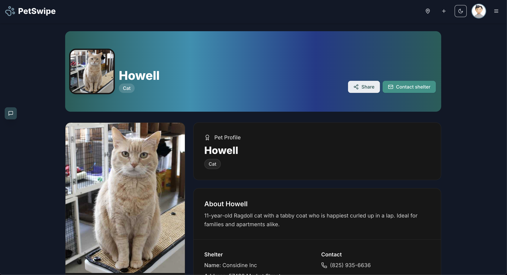
</p>

### My Pets

<p align="center">
  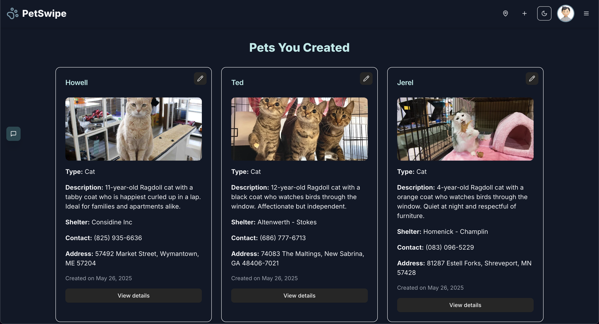
</p>

### Pets Map

<p align="center">
  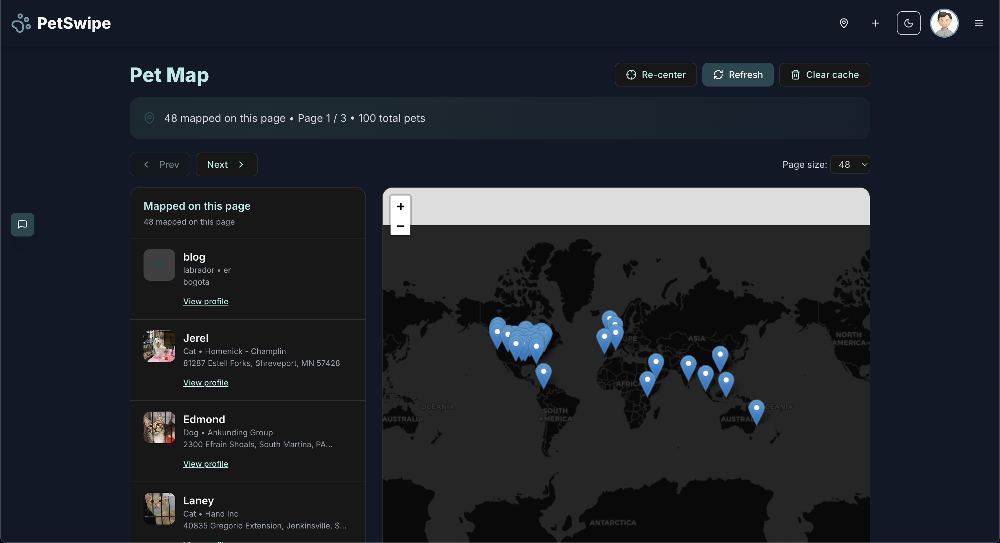
</p>

### Preference Insights

<p align="center">
  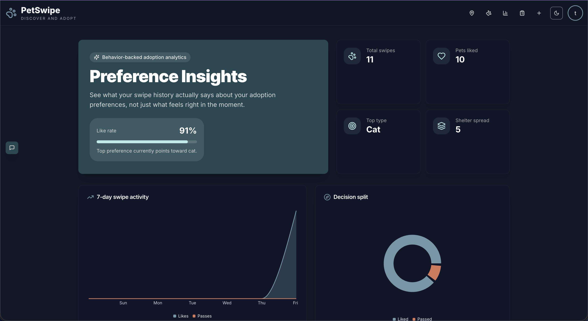
</p>

### Adoption Planner

<p align="center">
  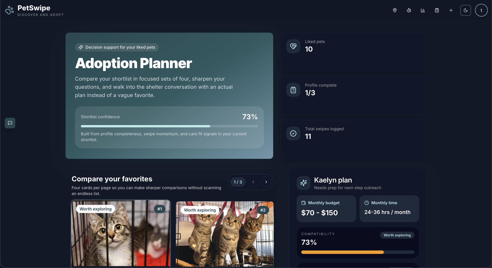
</p>

### Bulk Upload Pets

<p align="center">
  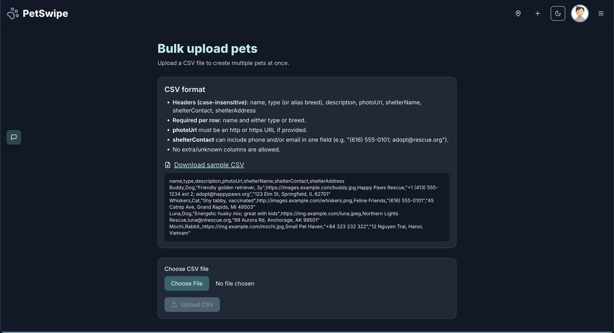
</p>

### Chatbot

<p align="center">
  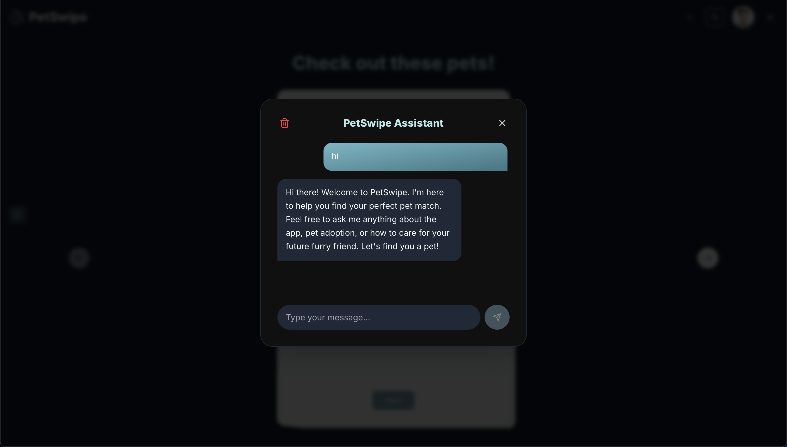
</p>

### Profile

<p align="center">
  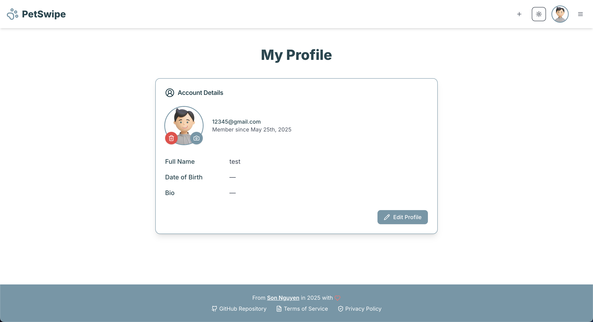
</p>

### Login & Signup

<p align="center">
  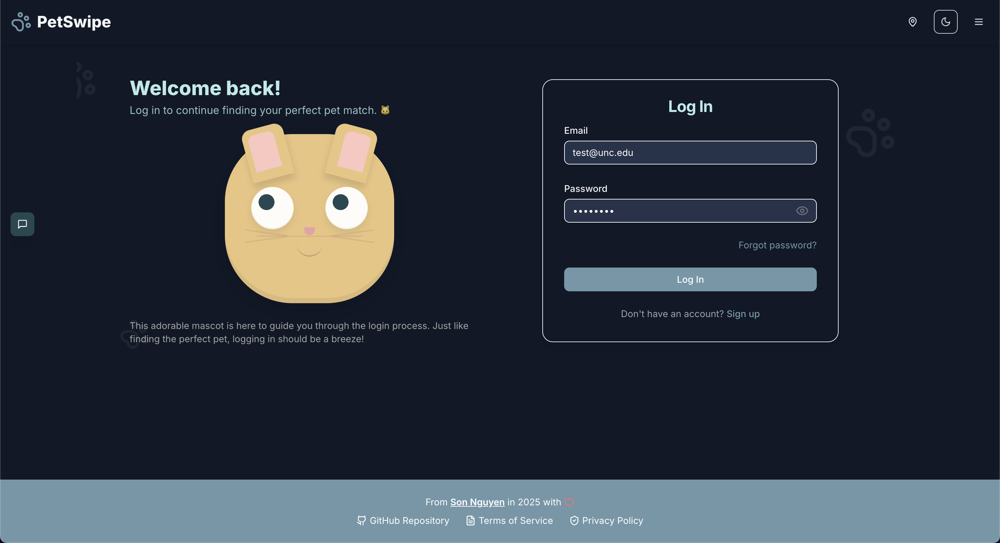
</p>

<p align="center">
  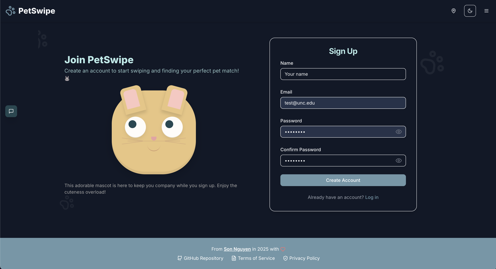
</p>

### Reset Password

<p align="center">
  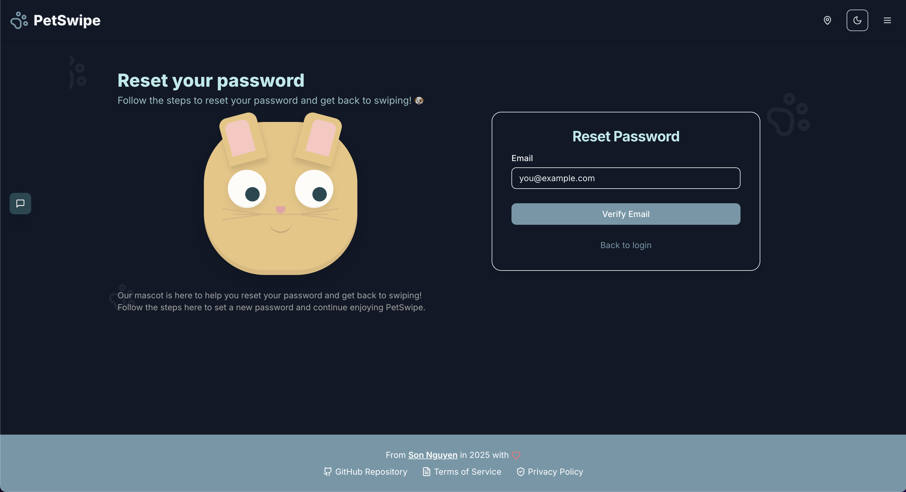
</p>

### FAQ

<p align="center">
  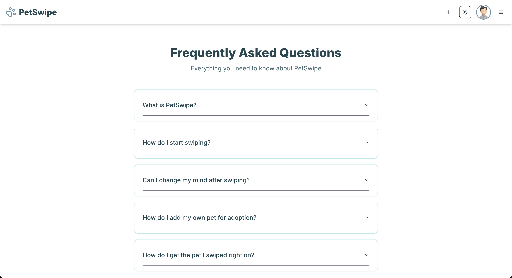
</p>

_and so many more..._

---

## 🗄 Database Schema (TypeORM Entities)

| Entity      | Column           | Type                  | Nullable | Description                     | Notes / Relations                              |
| ----------- | ---------------- | --------------------- | -------- | ------------------------------- | ---------------------------------------------- |
| **Match**   | `id`             | `uuid`                | No       | Primary key                     | `@PrimaryGeneratedColumn("uuid")`              |
|             | `user`           | `ManyToOne → AppUser` | No       | Who is swiping                  | FK → `AppUser.id`, cascade on delete           |
|             | `pet`            | `ManyToOne → Pet`     | No       | Which pet was presented         | FK → `Pet.id`, cascade on delete               |
|             | `matchedAt`      | `timestamp`           | No       | When it was shown               | `@CreateDateColumn()`                          |
| **Pet**     | `id`             | `uuid`                | No       | Primary key                     | `@PrimaryGeneratedColumn("uuid")`              |
|             | `name`           | `varchar`             | No       | e.g. “Buddy” or “Whiskers”      | `@Column()`                                    |
|             | `type`           | `varchar`             | No       | e.g. “Dog”, “Cat”               | `@Column()`                                    |
|             | `description`    | `text`                | Yes      | Breed, color, age etc.          | `@Column({ type: "text", nullable: true })`    |
|             | `photoUrl`       | `text`                | Yes      | URL to photo(s)                 | `@Column({ type: "text", nullable: true })`    |
|             | `shelterName`    | `varchar`             | Yes      | The shelter this pet is from    | `@Column({ type: "varchar", nullable: true })` |
|             | `shelterContact` | `text`                | Yes      | Contact info for the shelter    | `@Column({ type: "text", nullable: true })`    |
|             | `shelterAddress` | `text`                | Yes      | Physical address of the shelter | `@Column({ type: "text", nullable: true })`    |
|             | `matches`        | `OneToMany → Match[]` | —        | All Match records for this pet  | inverse of `Match.pet`                         |
|             | `swipes`         | `OneToMany → Swipe[]` | —        | All Swipe records for this pet  | inverse of `Swipe.pet`                         |
|             | `createdAt`      | `timestamp`           | No       | When record was created         | `@CreateDateColumn()`                          |
|             | `updatedAt`      | `timestamp`           | No       | When record was last updated    | `@UpdateDateColumn()`                          |
| **Swipe**   | `id`             | `uuid`                | No       | Primary key                     | `@PrimaryGeneratedColumn("uuid")`              |
|             | `user`           | `ManyToOne → AppUser` | No       | Who swiped                      | FK → `AppUser.id`, cascade on delete           |
|             | `pet`            | `ManyToOne → Pet`     | No       | Which pet was swiped on         | FK → `Pet.id`, cascade on delete               |
|             | `liked`          | `boolean`             | No       | `true` = adopt, `false` = pass  | `@Column()`                                    |
|             | `swipedAt`       | `timestamp`           | No       | When the swipe occurred         | `@CreateDateColumn()`                          |
|             | **unique index** | `(user, pet)`         | —        | Prevent duplicate swipes        | `@Index(["user","pet"],{unique:true})`         |
| **AppUser** | `id`             | `uuid`                | No       | Primary key                     | `@PrimaryGeneratedColumn("uuid")`              |
|             | `email`          | `varchar`             | No       | Unique user email               | `@Column({ unique: true })`                    |
|             | `password`       | `varchar`             | Yes      | Hashed password                 | `@Column({ nullable: true })`                  |
|             | `name`           | `varchar`             | Yes      | User’s full name                | `@Column({ nullable: true })`                  |
|             | `dob`            | `date`                | Yes      | Date of birth                   | `@Column({ type: "date", nullable: true })`    |
|             | `bio`            | `text`                | Yes      | User biography                  | `@Column({ type: "text", nullable: true })`    |
|             | `avatarUrl`      | `text`                | Yes      | URL to avatar image             | `@Column({ type: "text", nullable: true })`    |
|             | `matches`        | `OneToMany → Match[]` | —        | All Match records by this user  | inverse of `Match.user`                        |
|             | `swipes`         | `OneToMany → Swipe[]` | —        | All Swipe records by this user  | inverse of `Swipe.user`                        |
|             | `createdAt`      | `timestamp`           | No       | When user was created           | `@CreateDateColumn()`                          |
|             | `updatedAt`      | `timestamp`           | No       | When user was last updated      | `@UpdateDateColumn()`                          |

> [!NOTE]
> This table may not be up-to-date, as more entities and relationships could be introduced in the near future to support additional features and enhancements!

---

## 🏁 Getting Started

### Prerequisites

- **Node.js** ≥ v18
- **npm** ≥ v8 or **Yarn**
- **PostgreSQL** (AWS RDS recommended)
- **AWS CLI** & IAM credentials for S3, RDS
- **Docker** (optional, for local Postgres container)
- **Google AI** API key (for chatbot feature)

> [!CAUTION]
> ⚠️ **Note**: Due to `shadcn/ui` peerDeps, install frontend dependencies with:
>
> ```bash
> npm install --legacy-peer-deps
> # or
> yarn install --ignore-engines
> ```

---

### 🛠 Backend Setup

1. **Clone & Install**

   ```bash
   git clone https://github.com/hoangsonww/PetSwipe-Match-App.git
   cd PetSwipe-Match-App/backend
   npm install
   ```

2. **Environment**
   Copy and configure:

   ```bash
   cp .env.example .env
   ```

   - `DATABASE_URL`: your AWS RDS Postgres connection string
   - `JWT_SECRET`, `COOKIE_SECRET`
   - AWS: `AWS_ACCESS_KEY_ID`, `AWS_SECRET_ACCESS_KEY`, `S3_BUCKET_NAME`
   - More in `.env.example`. Be sure that you have all required environment variables set up before running the app!

3. **Seed Sample Pets** (optional)

   ```bash
   npm run seed:pets
   ```

4. **Run in Development**

   ```bash
   npm run dev
   ```

   The backend API is now available at `http://localhost:5001/api`.

---

### 🖥 Frontend Setup

1. **Clone & Install**

   ```bash
   cd frontend
   npm install --legacy-peer-deps
   ```

2. **Environment**
   Create `.env.local`: (replace `http://localhost:5001` with your backend URL)

   ```bash
   NEXT_PUBLIC_API_URL=http://localhost:5001/api
   ```

3. **Run in Development**

   ```bash
   npm run dev
   ```

   Frontend available at `http://localhost:3000`

4. **Build & Production**

   ```bash
   npm run build
   npm run start
   ```

---

## 📚 API Reference

Swagger docs are served locally at `http://localhost:5001/api-docs.json`. You can also access the live API documentation at **[PetSwipe API](https://petswipe-backend-api.vercel.app/)**, and the JSON format at **[PetSwipe API JSON](https://petswipe-backend-api.vercel.app/api-docs.json)**.

### Authentication

- **POST** `/api/auth/signup`
- **POST** `/api/auth/login`
- **POST** `/api/auth/logout`
- **POST** `/api/auth/verify-email`
- **POST** `/api/auth/reset-password`

### Matches

- **POST** `/api/matches`
- **GET** `/api/matches`
- **GET** `/api/matches/me`

### Pets

- **GET** `/api/pets`
- **POST** `/api/pets`
- **GET** `/api/pets/export`
- **POST** `/api/pets/:petId/photo`
- **POST** `/api/pets/upload`
- **GET** `/api/pets/mine`
- **PUT** `/api/pets/:petId`
- **GET** `/api/pets/:petId`

### Swipes

- **POST** `/api/swipes`
- **GET** `/api/swipes/me`
- **GET** `/api/swipes/me/liked`
- **GET** `/api/swipes` (Admins only)

### Users

- **GET** `/api/users/me`
- **PUT** `/api/users/me`
- **POST** `/api/users/me/avatar`
- **DELETE** `/api/users/me/avatar`

### Chatbot

- **POST** `/api/chat`

More endpoints may be added as the app evolves. Refer to the Swagger docs for the most up-to-date information!

### Swagger UI

Swagger UI is available at `https://petswipe-backend-api.vercel.app/`.

<p align="center">
  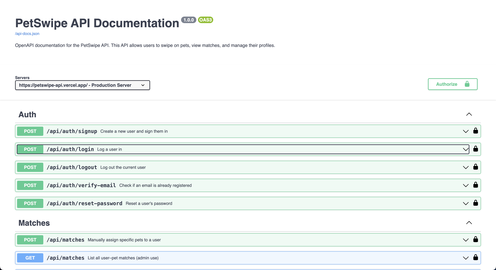
</p>

---

## ☁️ Deployment

### Kubernetes Stack

PetSwipe now ships with a first-class Kubernetes deployment stack under [`k8s/`](k8s/README.md).

- `k8s/base` contains production-oriented manifests for frontend and backend deployments
- readiness and liveness probes target `/ready`, `/health`, and `/`
- horizontal autoscaling and PodDisruptionBudgets are included for both workloads
- ingress is split across `petswipe.example.com` and `api.petswipe.example.com`
- containers run as non-root users and are ready for EKS, GKE, AKS, or any conformant cluster

Quick start:

```bash
kubectl apply -k k8s/base
```

Before applying, replace the placeholder image names, hostnames, database endpoints, and secrets in [`k8s/base`](k8s/base).

### AWS Deployment

### Production-Ready Deployment Strategies

PetSwipe features **enterprise-grade deployment strategies** for zero-downtime releases:

#### 🔵🟢 Blue-Green Deployment
- **Zero-downtime** deployments with instant rollback
- Two identical environments (Blue & Green)
- Perfect for major releases and database migrations
- Rollback time: < 30 seconds

#### 🐤 Canary Deployment
- **Gradual traffic shifting** (5% → 10% → 25% → 50% → 100%)
- Automated rollback on errors or high latency
- Real-time health monitoring during rollout
- Progressive validation with production traffic

#### ⚖️ Predicted Scaling & Auto-Scaling

- Scale based on CPU, memory, and request metrics
- Scheduled scaling for predictable traffic patterns
- Load testing prior to deployment for capacity planning

📖 **[Full Deployment Guide](docs/DEPLOYMENT.md)** | 🚀 **[Quick Reference](docs/DEPLOYMENT_QUICK_REFERENCE.md)**

### Infrastructure Stack

Our production infrastructure can run either on Kubernetes or on AWS-native container services. The repository currently includes Terraform-based AWS infrastructure plus a portable Kubernetes manifest set.

**Compute & Orchestration:**
- **Kubernetes**: Portable orchestration for EKS, GKE, AKS, or self-managed clusters
  - Frontend and backend `Deployment` resources
  - HPAs, PDBs, rolling updates, readiness/liveness probes
  - TLS ingress with separate web and API hosts
- **AWS ECS Fargate**: Serverless container orchestration
  - Blue, Green, and Canary environments
  - Auto-scaling based on CPU/memory metrics
  - Circuit breaker deployment with automated rollback
- **AWS ECR**: Private Docker registry with vulnerability scanning
  - Backup: **GitHub Container Registry (GHCR)**

**Networking & Load Balancing:**
- **Application Load Balancer**: Traffic routing and health checks
  - Weighted routing for canary deployments
  - SSL/TLS termination with ACM certificates
  - HTTP/2 and WebSocket support
- **Route 53**: DNS management
- **CloudFront**: CDN for static assets (optional)

**Data & Storage:**
- **AWS RDS PostgreSQL**: Multi-AZ database with automated backups
  - Read replicas for scaling
  - Performance Insights enabled
  - Point-in-time recovery
- **AWS S3**: Object storage
  - Static assets bucket (public)
  - Uploads bucket (private)
  - ALB access logs
  - Lifecycle policies for cost optimization
  - Backup: **Supabase Storage**

**Monitoring & Observability:**
- **CloudWatch**: Comprehensive monitoring
  - Custom dashboards (main + canary-specific)
  - Metric alarms with SNS notifications
  - Log aggregation and Insights queries
  - X-Ray distributed tracing
- **CloudWatch Alarms**: Proactive alerts
  - Service health (CPU, memory, errors)
  - Deployment health (canary metrics)
  - Database performance
  - Composite alarms for deployment quality

**Security & Compliance:**
- **AWS KMS**: Encryption for all resources
- **AWS WAF**: Web application firewall
- **AWS Shield**: DDoS protection (Standard)
- **IAM**: Least-privilege access policies
- **Security Groups**: Network-level access control
- **Secrets Manager**: Sensitive configuration management

**CI/CD & Deployment:**
- **Jenkins**: Automated build and deployment pipelines
  - Blue-Green pipeline: `Jenkinsfile.bluegreen`
  - Canary pipeline: `Jenkinsfile.canary`
  - Main CI pipeline with strategy selection
- **AWS CodeDeploy**: ECS blue-green deployments
- **Lambda**: Automated canary rollback function
- **GitHub Actions**: Backup CI/CD
- **Terraform**: Infrastructure as Code (100+ resources)

**HashiCorp Stack (Optional):**
- **Vault**: Secrets management and encryption-as-a-service
- **Consul**: Service discovery and distributed configuration
- **Nomad**: Alternative workload orchestration

**Frontend Hosting:**
- **Vercel**: Next.js application hosting with edge functions
  - Automatic deployments from Git
  - Preview deployments for PRs
  - Global CDN distribution

> [!NOTE]
> Our infrastructure is designed for **production-grade reliability, security, and scalability**. The use of blue-green and canary deployments ensures zero-downtime releases with instant rollback capabilities. All infrastructure is version-controlled and reproducible via Terraform.

### Terraform

To deploy the app to AWS, we use **Terraform** for Infrastructure as Code (IaC). This allows us to define our AWS resources in code and deploy them easily.

To get started with Terraform:

1. Install Terraform on your machine.
2. Navigate to the `infrastructure` directory:

   ```bash
   cd terraform
   ```

3. Initialize Terraform:

   ```bash
    terraform init
   ```

4. Configure your AWS credentials in `~/.aws/credentials` or set them as environment variables.
5. Run the following commands to deploy:

   ```bash
   terraform plan    # Preview the changes
   terraform apply   # Apply the changes
   ```

This will create the necessary AWS resources for the AWS-native deployment path, including RDS, S3, ECS, ECR, IAM roles, and more.

> [!CAUTION]
> Make sure you have the necessary permissions to create and manage AWS resources. Review the Terraform scripts before applying them to avoid any unintended changes. For more details on how to configure and use Terraform with AWS, check out the [Terraform AWS Provider documentation](https://registry.terraform.io/providers/hashicorp/aws/latest/docs).

### Vault, Consul, Nomad

For managing secrets and service discovery, we use **HashiCorp Vault**, **Consul**, and **Nomad**. These tools help us securely store sensitive information, manage configurations, and orchestrate our services.

These tools provide:

- **Secure secret storage & dynamic secret issuance** (Vault)
- **Encryption-as-a-Service & audit logging** (Vault)
- **Distributed service discovery & health checking** (Consul)
- **Centralized key/value configuration store** (Consul)
- **Identity-based service mesh (mTLS) for secure service-to-service communication** (Consul)
- **Flexible, multi-region workload orchestration & scheduling** (Nomad)
- **Rolling upgrades, canary deployments & autoscaling** (Nomad)
- **Support for containers, VMs & standalone binaries** (Nomad)

These tools are optional but recommended for larger, more complex deployments. They can be set up using Terraform as well. For more information, refer to the [terraform/README.md](terraform/README.md) file in the `terraform` directory to see how to configure and deploy these tools.

> [!NOTE]
> If you are not familiar with these tools, you can skip this section for now. The app can run without them, but they provide additional security and flexibility for production deployments.

### Ansible

For managing the deployment and configuration of the app, we also use **Ansible**. Ansible playbooks are used to automate tasks such as:

- **Provisioning AWS infrastructure**
  Create or update RDS instances, S3 buckets (static + uploads), ECR repositories, Application Load Balancer & Target Group, ECS clusters and services.

- **Building & deploying containers**
  Build, tag and push backend and frontend Docker images to ECR, then trigger zero-downtime rolling updates of your Fargate service.

- **Configuring frontend hosting**
  Sync Next.js static build to S3 and invalidate CloudFront distributions for instant cache busting.

- **Managing application configuration**
  Template out and distribute environment variables, secrets (via AWS Secrets Manager or HashiCorp Vault), and config files to running services.

- **Database migrations & backups**
  Run schema migrations on PostgreSQL (via TypeORM) and schedule or trigger automated backups and snapshots.

- **Lifecycle & housekeeping**
  Apply S3 lifecycle rules (e.g. purge old uploads), rotate credentials, and clean up unused resources.

- **Service discovery & secrets bootstrap**
  (If using HashiCorp stack) Bootstrap or update Consul/Nomad clusters, deploy Vault auto-unseal configuration, and distribute ACL tokens.

- **OS & user management**
  Install OS packages, manage system users, SSH keys, and security hardening on any EC2 hosts you might run.

- **CI/CD integration**
  Hook into GitHub Actions workflows to run Ansible playbooks on push or merge, ensuring every change is tested and deployed automatically.

> [!CAUTION]
> Remember to set up your AWS credentials and permissions correctly before running any Ansible playbooks. Ensure that the IAM user/role has the necessary permissions to create and manage the resources defined in your playbooks.

> [!TIP]
> For more information on how to use Ansible with AWS, check out the [ansible/README.md](ansible/README.md) file and the [Ansible AWS documentation](https://docs.ansible.com/ansible/latest/collections/amazon/aws/index.html).

#### Important Notes

> [!WARNING]
> NEVER store sensitive information (like AWS credentials, database passwords, etc.) directly in your Ansible playbooks or inventory files. Use Ansible Vault or environment variables to securely manage secrets. Also, NEVER commit your `.env` files or any sensitive configuration files to version control!

---

## 🤖 Agentic AI Integration

PetSwipe features a sophisticated **multi-agent AI system** built with **LangGraph** and **LangChain** that provides intelligent pet matching, personalized recommendations, and natural language conversations. The system uses an assembly line architecture where specialized agents work together to deliver the best possible pet-to-human matches.

### Key Features

- 🤖 **6 Specialized AI Agents** - User profiler, pet analyzer, matcher, recommender, conversation, and monitoring agents
- ⚡ **Assembly Line Processing** - Sequential, observable agent execution with workflow timeouts
- 🎯 **Intelligent Matching** - AI-powered compatibility scoring between users and pets
- 💬 **Natural Conversations** - Context-aware chat with profile + recommendation grounding
- 🌐 **REST + MCP Platform** - `/v1/*` endpoints, standalone MCP server, and an agent-side MCP client package
- 📊 **Cost + Metrics Tracking** - Token/cost reporting, Prometheus metrics, Grafana dashboards
- 🔐 **Production Controls** - API key auth, rate limiting, caching, and structured logging

### Architecture

The agentic AI pipeline processes user requests through multiple stages:

1. **User Profiling** - Analyzes user preferences and swipe history
2. **Pet Analysis** - Extracts personality traits and compatibility factors from pet profiles
3. **Matching** - Calculates compatibility scores using semantic matching
4. **Recommendations** - Generates personalized pet recommendations
5. **Conversation** - Handles natural language interactions
6. **Monitoring** - Tracks performance metrics and system health

For detailed information about the AI system, including installation, configuration, REST API reference, cost tracking, and deployment guides, see the **[Agentic AI README](agentic_ai/README.md)**.  
For standalone MCP server setup and client integration examples, see **[docs/AGENTIC_MCP.md](docs/AGENTIC_MCP.md)**.

---

## 🛠 Scripts & Utilities

The app also comes with several scripts and utilities to help with development and deployment:

- **Seed Pets**: `npm run seed:pets`
- **Assign Pets**: `npm run assign:user`
- **TypeORM CLI**: `npm run typeorm <command>`
- **Swagger**: Auto-generated OpenAPI spec

Additionally, a `Makefile` is included for common tasks:

```bash
make install        # Install dependencies
make start          # Start the backend server
make dev            # Start the backend server in development mode
make up             # Start the backend server with Docker
make test           # Run tests
make lint           # Lint the codebase
make deploy         # Deploy to AWS
make clean          # Clean up Docker containers

# and more...
```

### Docker

To start the entire app with Docker, run:

```bash
docker-compose up --build
```

This will pull the images from ECR and start the backend and database containers locally on your machine.

Additionally, there are also Shell scripts that help you run Docker commands easily:

1. `pull_and_run.sh`: Pulls the latest Docker image from ECR and runs it.
2. `upload_to_ghcr.sh`: Builds the Docker image and uploads it to GitHub Container Registry (remember to set up your GitHub PAT and username in the script/export them in your shell).

#### Docker Compute Terminal

PetSwipe also includes a Docker Compute Terminal for running commands inside the Docker container. You can use it to run database migrations, seed data, or any other commands you need.

To hop into the Docker Compute Terminal, run:

```bash
docker-compose exec compute /bin/zsh
```

This will give you a shell inside the Docker container where you can run commands as if you were on a regular terminal, plus you can access all the installed dependencies and tools of the application.

---

## ⚛️ Testing

PetSwipe includes a comprehensive testing suite to ensure the application works as expected. The tests are organized into three main categories:

- **Playwright**: End-to-end tests for the frontend UI.
- **Jest**: Unit and integration tests for the backend API and frontend API helper functions.
- **Chai & Mocha**: Additional tests for specific features and functionalities.
- **Commitlint**: Ensures commit messages follow the conventional commit format.

### Playwright

Playwright is used for end-to-end testing of the frontend application. It simulates user interactions and verifies that the UI behaves as expected.

To run Playwright tests, navigate to the `frontend` directory and run:

```bash
cd frontend
npm run test:e2e
```

### Jest

Jest is used for unit and integration tests in the backend API and some frontend components. It provides a fast and reliable testing framework.

To run Jest tests in the backend, navigate to the `backend` directory and run:

```bash
cd backend
npm run test
```

This will run all tests in the backend API, including unit tests for controllers, services, and integration tests for the database.

To run Jest tests in the frontend, navigate to the `frontend` directory and run:

```bash
cd frontend
npm run test
```

### Chai & Mocha

Chai and Mocha are used for additional tests in the frontend. To run Chai & Mocha tests, navigate to the `frontend` directory and run:

```bash
cd frontend
npm run test:mocha
```

---

## 📝 GitHub Actions

PetSwipe uses GitHub Actions for Continuous Integration and Continuous Deployment (CI/CD). The workflow is defined in `.github/workflows/workflow.yml`.

The CI/CD pipeline includes the following steps:

- **Checkout Code**: Pulls the latest code from the repository.
- **Set Up Node.js**: Installs the specified Node.js version.
- **Install Dependencies**: Installs the necessary dependencies for both backend and frontend.
- **Run Linting**: Runs ESLint and Prettier to ensure code quality and formatting.
- **Run Tests**: Executes Jest tests for the backend and Playwright tests for the frontend.
- **Build Frontend**: Builds the Next.js frontend application.
- **Build Docker Images**: Builds Docker images for both backend and frontend.
- **Push Docker Images**: Pushes the built images to GitHub Container Registry (GHCR).
- **Deploy to AWS**: Deploys the backend API to AWS ECS and the frontend to Vercel.
- **Notify on Failure**: Sends notifications via email if any step fails.
- **Commitlint**: Ensures commit messages follow the conventional commit format.

This setup ensures that every change pushed to the repository is automatically tested, built, and deployed, providing a robust and reliable development workflow.

<p align="center">
  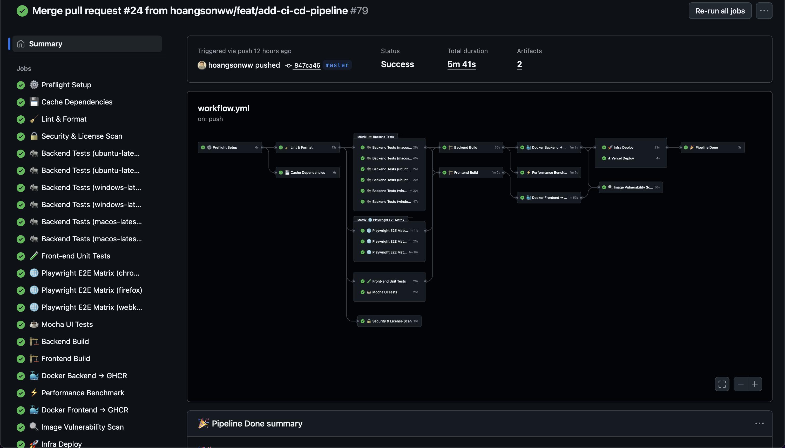
</p>

---

## 🧪 Command Line Interface

The app also includes a CLI for managing pets and users. You can run the CLI commands from the root directory:

```bash
petswipe <command> [options]
```

### Available Commands

- `petswipe dev`: Start backend & frontend in development mode.
- `petswipe build`: Build both backend & frontend applications.
- `petswipe docker:build`: Build & push Docker images to GitHub Container Registry.
- `petswipe up`: Pull Docker images and start the stack.
- `petswipe down`: Stop the Docker Compose stack.
- `petswipe clean`: Remove build artifacts.
- `petswipe lint`: Run linters in both projects.
- `petswipe test`: Run tests in both projects.

This CLI is designed to make it easier to manage the application and perform common tasks without having to navigate through multiple directories or run multiple commands.

---

## 📊 Monitoring & Observability

PetSwipe includes comprehensive monitoring and observability using Prometheus and Grafana to track application performance, health, and metrics.

### Quick Access

- **Prometheus**: http://localhost:9090 - Metrics collection and querying
- **Grafana**: http://localhost:3001 - Dashboards and visualization (admin/admin)

### Getting Started

The monitoring stack is automatically included when you run:

```bash
docker-compose up -d
```

This starts Prometheus, Grafana, and configures them to monitor your application services including the backend API, frontend, and database.

### What's Monitored

- Service uptime and health checks
- Backend API performance metrics
- Frontend application metrics
- Database connection status
- System resource usage

For detailed configuration and customization options, see [monitoring/Monitoring.md](monitoring/Monitoring.md).

---

## 🤝 Contributing

1. Fork the repo & clone
2. Create a feature branch
3. Code, lint, test
   - **IMPORTANT:** Run `npm run format` in the root directory to format all files before committing!
4. Open a Pull Request. We'll review and merge it if it is meaningful and useful!

**Please** follow the existing code style (ESLint, Prettier, TypeScript). This helps maintain a clean and consistent codebase!

---

## 📝 License

© 2025 **[Son Nguyen](https://sonnguyenhoang.com)**. I hope this code is useful for you and your projects. Feel free to use it, modify it, and share it with others.

Licensed under the **MIT License**. See [LICENSE](LICENSE) for details.

> [!IMPORTANT]
> In short, you may use this code for personal or educational purposes, but please do not use it for commercial purposes without permission. If you do use this code, please give proper credit to the original author.

---

## 💁🏻‍♂️ Author

This application is built with ❤️ by **[Son Nguyen](https://sonnguyenhoang.com)** in 2025:

- [My GitHub](https://github.com/hoangsonww)
- [My LinkedIn](https://www.linkedin.com/in/hoangsonw/)
- [Email Me](mailto:hoangson091104@gmail.com)

Feel free to reach out for any questions, suggestions, or even collaborations!

---

❤️ _Thank you for helping pets find their forever homes!_ 🐶🐱
