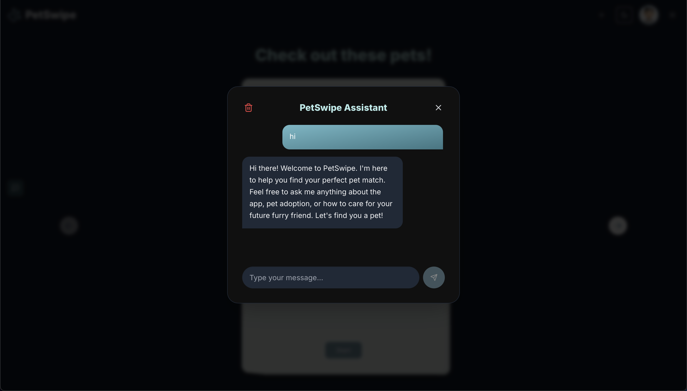

# 🐾 PetSwipe - Swipe to Adopt

Built with an aim to help shelter animals find loving homes, **PetSwipe** is a swipe-to-adopt platform connecting prospective pet parents with shelter animals.
Users can browse pets, swipe to adopt or pass, and manage their profile. They can also view their matches and history of swipes.

<p align="center">
  <a href="https://petswipe.vercel.app" target="_blank">
    
  </a>
</p>

> [!NOTE]
> Inspired by Tinder UX, but for pets to find their loving humans! 🐶🐱

                                     

---

## 📋 Table of Contents

1. [About PetSwipe](#-about-petswipe)
2. [Live App](#-live-app)
3. [Features](#-features)
4. [Tech Stack & Architecture](#-tech-stack--architecture)
5. [User Interface](#-user-interface)
6. [Database Schema](#-database-schema-typeorm-entities)
7. [Getting Started](#-getting-started)
   - [Backend Setup](#-backend-setup)
   - [Frontend Setup](#-frontend-setup)
8. [API Reference](#-api-reference)
   - [Authentication](#authentication)
   - [Matches](#matches)
   - [Pets](#pets)
   - [Swipes](#swipes)
   - [Users](#users)
   - [Swagger UI](#swagger-ui)
9. [AWS Deployment](#-aws-deployment)
   - [Our Stack](#our-stack)
   - [Terraform](#terraform)
   - [Vault, Consul, Nomad](#vault-consul-nomad)
   - [Ansible](#ansible)
10. [Scripts & Utilities](#-scripts--utilities)
    - [Docker](#docker)
11. [Command Line Interface](#-command-line-interface)
12. [Contributing](#-contributing)
13. [License](#-license)
14. [Author](#-author)

---

## 🐾 About PetSwipe

PetSwipe is a full-stack application that allows users to swipe through pets available for adoption. The app is designed to be user-friendly and visually appealing, with a focus on providing a seamless experience for both users and shelter staff.

The app is built using modern technologies, including **TypeScript**, **Next.js**, **Express**, and **PostgreSQL**. It leverages the power of **AWS** for storage and deployment, ensuring scalability and reliability.

The app is also designed to be modular and easy to extend, with a focus on clean code and best practices. It includes features such as user authentication, a swipe interface, personalized pet decks, and admin tools for managing pets and users.

And most importantly, it is built with the goal of helping shelter animals find their forever homes. By providing a fun and engaging way for users to browse pets, PetSwipe aims to increase adoption rates and raise awareness about the importance of pet adoption. 🐾

I hope you enjoy using PetSwipe as much as I enjoyed building it! 🐱

> [!TIP]
> Please spread the word about PetSwipe to your friends and family, and help us find loving homes for as many pets as possible! 🏠❤️

---

## 🌐 Live App

**[PetSwipe](https://petswipe.vercel.app)** is live on Vercel! You can now try it out and see how it works.

> [!TIP]
> Link not working? Copy and paste this URL into your browser: [https://petswipe.vercel.app](https://petswipe.vercel.app).

Also, checkout the backend API at **[PetSwipe API](https://petswipe-backend-api.vercel.app/)**. You can use tools like Postman or Swagger UI to explore the API endpoints.

> [!IMPORTANT] 
> **Note**: Currently, most of the data is seeded with dummy data. We hope the app will be used by more real users and pet adoption shelters in the future. If you are a shelter or a pet adoption organization, please reach out to us to get **all** your data integrated into the app in seconds! Or you can also use the in-app manual add pet features to further enrich our pets database (only works for authenticated users).

---

## 🚀 Features

PetSwipe is a full-stack application with the following features:

- **User Authentication**:
  - Login, signup, password reset functionalities are all implemented
  - **JWT-based authentication**, where tokens are stored in **HTTP-only cookies** for security
- **Swipe Interface**:
  - Swipe left/right or press arrow keys/buttons to navigate through the deck of pets cards
  - For each card, users can view pet details, photos, and decide to adopt or pass
  - Each user is randomly assigned a sample selection of pet cards (around 90-110 cards) to review. As the app gathers more real, user-added pet data, it will improve in matching users with the most relevant pets.
- **Personalized Deck**:
  - Deck is generated based on user preferences and past swipes
  - Users will only see pets that they haven't swiped on before, and pets that are most relevant to them
- **History**: View all swipes & liked (adopted) pets
- **Chatbot**:
  - A simple chatbot to answer common questions about the app and pets (e.g. breeds, adoption process, pet care tips, etc.)
  - Powered by **Google AI** and **Retrieval-Augmented Generation (RAG)** for personalized responses
- **Admin Tools**:
  - Bulk upload pets via CSV
  - Export pets data
  - Photo uploads to S3
  - Manual match assignment
  - and more!
- **Responsive UI**: Built with **Tailwind CSS** and **shadcn/ui**
  - Fully responsive design for mobile and desktop
  - Light and dark mode support
  - Accessible design for all users
- **Real-time Animations**:
  - Framer Motion for smooth transitions and animations
  - Swipe animations for a more engaging experience
  - Loading spinners and skeleton screens for better UX
- **Analytics**: Countups of swipes, matches, adoptions, etc. all are available to admins

---

## 🏛 Tech Stack & Architecture

PetSwipe is built using a modern tech stack, ensuring scalability, maintainability, and performance. The architecture is designed to be modular and easy to extend.

| Layer                   | Technology                                                                                |
| ----------------------- | ----------------------------------------------------------------------------------------- |
| **Frontend**            | Next.js, React, TypeScript, Tailwind CSS, shadcn/ui, Framer Motion, SWR                   |
| **Backend & API**       | Node.js, Express, TypeScript, TypeORM, PostgreSQL, OpenAPI (via Swagger), RabbitMQ, Redis |
| **Data & Storage**      | AWS RDS (PostgreSQL), AWS S3                                                              |
| **Security & Auth**     | JSON Web Tokens, bcryptjs, cookie-parser                                                  |
| **DevOps & Deployment** | Docker, AWS ECR & ECS (Fargate), Vercel, GitHub Actions                                   |
| **Infrastructure**      | Terraform, Consul, Vault, Nomad, AWS IAM, AWS CloudWatch, AWS ALB                         |
| **AI**                  | Google AI, Retrieval-Augmented Generation (RAG)                                           |
| **Testing**             | Playwright (frontend), Jest (backend)                                                     |

Below is a high-level Mermaid diagram of our architecture/infrastructure:

<p align="center">
  
</p>

> [!TIP]
> Image not showing? Here's the link to the diagram: [Mermaid Live Diagram](https://www.mermaidchart.com/raw/3c7480d2-191d-4d09-a8f1-6678de344fa4?theme=light&version=v0.1&format=svg)

---

## 🏗 User Interface

### Landing Page

<p align="center">
  
</p>

### Home Page

<p align="center">
  
</p>

<p align="center">
  
</p>

#### Home Page Overview

<p align="center">
  
</p>

### All Swipes

<p align="center">
  
</p>

### Adopted Pets

<p align="center">
  
</p>

### Chatbot

<p align="center">
  
</p>

### Profile

<p align="center">
  
</p>

### Login & Signup

<p align="center">
  
</p>

<p align="center">
  
</p>

### FAQ

<p align="center">
  
</p>

_and more..._

---

## 🗄 Database Schema (TypeORM Entities)

| Entity      | Column           | Type                  | Nullable | Description                     | Notes / Relations                              |
| ----------- | ---------------- | --------------------- | -------- | ------------------------------- | ---------------------------------------------- |
| **Match**   | `id`             | `uuid`                | No       | Primary key                     | `@PrimaryGeneratedColumn("uuid")`              |
|             | `user`           | `ManyToOne → AppUser` | No       | Who is swiping                  | FK → `AppUser.id`, cascade on delete           |
|             | `pet`            | `ManyToOne → Pet`     | No       | Which pet was presented         | FK → `Pet.id`, cascade on delete               |
|             | `matchedAt`      | `timestamp`           | No       | When it was shown               | `@CreateDateColumn()`                          |
| **Pet**     | `id`             | `uuid`                | No       | Primary key                     | `@PrimaryGeneratedColumn("uuid")`              |
|             | `name`           | `varchar`             | No       | e.g. “Buddy” or “Whiskers”      | `@Column()`                                    |
|             | `type`           | `varchar`             | No       | e.g. “Dog”, “Cat”               | `@Column()`                                    |
|             | `description`    | `text`                | Yes      | Breed, color, age etc.          | `@Column({ type: "text", nullable: true })`    |
|             | `photoUrl`       | `text`                | Yes      | URL to photo(s)                 | `@Column({ type: "text", nullable: true })`    |
|             | `shelterName`    | `varchar`             | Yes      | The shelter this pet is from    | `@Column({ type: "varchar", nullable: true })` |
|             | `shelterContact` | `text`                | Yes      | Contact info for the shelter    | `@Column({ type: "text", nullable: true })`    |
|             | `shelterAddress` | `text`                | Yes      | Physical address of the shelter | `@Column({ type: "text", nullable: true })`    |
|             | `matches`        | `OneToMany → Match[]` | —        | All Match records for this pet  | inverse of `Match.pet`                         |
|             | `swipes`         | `OneToMany → Swipe[]` | —        | All Swipe records for this pet  | inverse of `Swipe.pet`                         |
|             | `createdAt`      | `timestamp`           | No       | When record was created         | `@CreateDateColumn()`                          |
|             | `updatedAt`      | `timestamp`           | No       | When record was last updated    | `@UpdateDateColumn()`                          |
| **Swipe**   | `id`             | `uuid`                | No       | Primary key                     | `@PrimaryGeneratedColumn("uuid")`              |
|             | `user`           | `ManyToOne → AppUser` | No       | Who swiped                      | FK → `AppUser.id`, cascade on delete           |
|             | `pet`            | `ManyToOne → Pet`     | No       | Which pet was swiped on         | FK → `Pet.id`, cascade on delete               |
|             | `liked`          | `boolean`             | No       | `true` = adopt, `false` = pass  | `@Column()`                                    |
|             | `swipedAt`       | `timestamp`           | No       | When the swipe occurred         | `@CreateDateColumn()`                          |
|             | **unique index** | `(user, pet)`         | —        | Prevent duplicate swipes        | `@Index(["user","pet"],{unique:true})`         |
| **AppUser** | `id`             | `uuid`                | No       | Primary key                     | `@PrimaryGeneratedColumn("uuid")`              |
|             | `email`          | `varchar`             | No       | Unique user email               | `@Column({ unique: true })`                    |
|             | `password`       | `varchar`             | Yes      | Hashed password                 | `@Column({ nullable: true })`                  |
|             | `name`           | `varchar`             | Yes      | User’s full name                | `@Column({ nullable: true })`                  |
|             | `dob`            | `date`                | Yes      | Date of birth                   | `@Column({ type: "date", nullable: true })`    |
|             | `bio`            | `text`                | Yes      | User biography                  | `@Column({ type: "text", nullable: true })`    |
|             | `avatarUrl`      | `text`                | Yes      | URL to avatar image             | `@Column({ type: "text", nullable: true })`    |
|             | `matches`        | `OneToMany → Match[]` | —        | All Match records by this user  | inverse of `Match.user`                        |
|             | `swipes`         | `OneToMany → Swipe[]` | —        | All Swipe records by this user  | inverse of `Swipe.user`                        |
|             | `createdAt`      | `timestamp`           | No       | When user was created           | `@CreateDateColumn()`                          |
|             | `updatedAt`      | `timestamp`           | No       | When user was last updated      | `@UpdateDateColumn()`                          |

---

## 🏁 Getting Started

### Prerequisites

- **Node.js** ≥ v18
- **npm** ≥ v8 or **Yarn**
- **PostgreSQL** (AWS RDS recommended)
- **AWS CLI** & IAM credentials for S3, RDS
- **Docker** (optional, for local Postgres container)
- **Google AI** API key (for chatbot feature)

> [!CAUTION]
> ⚠️ **Note**: Due to `shadcn/ui` peerDeps, install frontend dependencies with:
>
> ```bash
> npm install --legacy-peer-deps
> # or
> yarn install --ignore-engines
> ```

---

### 🛠 Backend Setup

1. **Clone & Install**

   ```bash
   git clone https://github.com/hoangsonww/PetSwipe-Match-App.git
   cd PetSwipe-Match-App/backend
   npm install
   ```

2. **Environment**
   Copy and configure:

   ```bash
   cp .env.example .env
   ```

   - `DATABASE_URL`: your AWS RDS Postgres connection string
   - `JWT_SECRET`, `COOKIE_SECRET`
   - AWS: `AWS_ACCESS_KEY_ID`, `AWS_SECRET_ACCESS_KEY`, `S3_BUCKET_NAME`
   - More in `.env.example`. Be sure that you have all required environment variables set up before running the app!

3. **Seed Sample Pets** (optional)

   ```bash
   npm run seed:pets
   ```

4. **Run in Development**

   ```bash
   npm run dev
   ```

   The backend API is now available at `http://localhost:5001/api`.

---

### 🖥 Frontend Setup

1. **Clone & Install**

   ```bash
   cd frontend
   npm install --legacy-peer-deps
   ```

2. **Environment**
   Create `.env.local`: (replace `http://localhost:5001` with your backend URL)

   ```bash
   NEXT_PUBLIC_API_URL=http://localhost:5001/api
   ```

3. **Run in Development**

   ```bash
   npm run dev
   ```

   Frontend available at `http://localhost:3000`

4. **Build & Production**

   ```bash
   npm run build
   npm run start
   ```

---

## 📚 API Reference

Swagger docs at `http://localhost:5001/api-docs.json`.

### Authentication

- **POST** `/api/auth/signup`
- **POST** `/api/auth/login`
- **POST** `/api/auth/logout`
- **POST** `/api/auth/verify-email`
- **POST** `/api/auth/reset-password`

### Matches

- **POST** `/api/matches`
- **GET** `/api/matches`
- **GET** `/api/matches/me`

### Pets

- **GET** `/api/pets`
- **POST** `/api/pets`
- **GET** `/api/pets/export`
- **POST** `/api/pets/:petId/photo`
- **POST** `/api/pets/upload`

### Swipes

- **POST** `/api/swipes`
- **GET** `/api/swipes/me`
- **GET** `/api/swipes/me/liked`
- **GET** `/api/swipes`

### Users

- **GET** `/api/users/me`
- **PUT** `/api/users/me`
- **POST** `/api/users/me/avatar`
- **DELETE** `/api/users/me/avatar`

### Chatbot

- **POST** `/api/chat`

More endpoints may be added as the app evolves. Refer to the Swagger docs for the most up-to-date information!

### Swagger UI

Swagger UI is available at `https://petswipe-backend-api.vercel.app/`.

<p align="center">
  
</p>

---

## ☁️ AWS Deployment

The app is designed to be easily deployable to AWS using services like:

- **RDS**: PostgreSQL instance for data
- **S3**: Bucket for pet photo storage
- **Elastic Beanstalk** or **ECS** for backend
- **ECR**: Container registry for Docker images
- **ECS**: For hosting the backend API using Docker containers
  - **Fargate**: Serverless compute engine for containers
- **GHCR**: Backup container registry for Docker images
- **CloudWatch**: For logging and monitoring
- **IAM**: For managing permissions
- **Terraform**: Infrastructure as Code (IaC) for managing AWS resources
  - _Optional:_ **Consul** for service discovery, **Vault** for secrets management, and **Nomad** for orchestration
- **GitHub Actions** for CI/CD
- **Vercel** for frontend

**Tip**: Use IAM roles for EC2/ECS to grant S3 & RDS access securely!

### Our Stack

Currently, our stack is fully deployed on AWS using the following services:

1. **AWS RDS**: Manages our PostgreSQL database.
2. **AWS S3**: Stores pet photos and user avatars.
   - Backup service: **Supabase Storage**.
3. **AWS ECS**: Hosts our backend API using Docker containers.
   - Backup service: **Vercel** (currently, due to AWS pricing issues, we have switched to Vercel for hosting the backend).
   - **AWS Fargate**: Serverless compute engine for running containers.
4. **AWS ECR**: Container registry for our Docker images.
   - Backup service: **GitHub Container Registry (GHCR)**.
5. **AWS ALB**: Application Load Balancer for routing traffic to our ECS services.
6. **AWS IAM**: Manages permissions for accessing AWS resources.
7. **AWS CloudWatch**: For logging and monitoring.
8. **GitHub Actions**: For CI/CD to build and deploy our Docker images to ECR.
9. **Vercel**: Hosts our frontend application.
10. **HashiCorp Stack**: For managing infrastructure and secrets:
    - **Terraform**: Infrastructure as Code (IaC) for managing AWS resources.
    - **Consul**: Service discovery and configuration management.
    - **Vault**: Secrets management for securely storing sensitive information.
    - **Nomad**: Orchestration for deploying and managing applications across a cluster of machines.

> [!NOTE]
> This stack is designed to be flexible and scalable, allowing us to easily add or remove services as needed. The use of Terraform, Consul, Vault, and Nomad provides additional security and flexibility for managing our infrastructure.

### Terraform

To deploy the app to AWS, we use **Terraform** for Infrastructure as Code (IaC). This allows us to define our AWS resources in code and deploy them easily.

To get started with Terraform:

1. Install Terraform on your machine.
2. Navigate to the `infrastructure` directory:

   ```bash
   cd terraform
   ```

3. Initialize Terraform:

   ```bash
    terraform init
   ```

4. Configure your AWS credentials in `~/.aws/credentials` or set them as environment variables.
5. Run the following commands to deploy:

   ```bash
   terraform plan    # Preview the changes
   terraform apply   # Apply the changes
   ```

This will create all the necessary AWS resources for the app, including RDS, S3, ECS, ECR, IAM roles, and more.

> [!CAUTION]
> Make sure you have the necessary permissions to create and manage AWS resources. Review the Terraform scripts before applying them to avoid any unintended changes. For more details on how to configure and use Terraform with AWS, check out the [Terraform AWS Provider documentation](https://registry.terraform.io/providers/hashicorp/aws/latest/docs).

### Vault, Consul, Nomad

For managing secrets and service discovery, we use **HashiCorp Vault**, **Consul**, and **Nomad**. These tools help us securely store sensitive information, manage configurations, and orchestrate our services.

These tools provide:

- **Secure secret storage & dynamic secret issuance** (Vault)
- **Encryption-as-a-Service & audit logging** (Vault)
- **Distributed service discovery & health checking** (Consul)
- **Centralized key/value configuration store** (Consul)
- **Identity-based service mesh (mTLS) for secure service-to-service communication** (Consul)
- **Flexible, multi-region workload orchestration & scheduling** (Nomad)
- **Rolling upgrades, canary deployments & autoscaling** (Nomad)
- **Support for containers, VMs & standalone binaries** (Nomad)

These tools are optional but recommended for larger, more complex deployments. They can be set up using Terraform as well. For more information, refer to the [terraform/README.md](terraform/README.md) file in the `terraform` directory to see how to configure and deploy these tools.

> [!NOTE]
> If you are not familiar with these tools, you can skip this section for now. The app can run without them, but they provide additional security and flexibility for production deployments.

### Ansible

For managing the deployment and configuration of the app, we also use **Ansible**. Ansible playbooks are used to automate tasks such as:

- **Provisioning AWS infrastructure**
  Create or update RDS instances, S3 buckets (static + uploads), ECR repositories, Application Load Balancer & Target Group, ECS clusters and services.

- **Building & deploying containers**
  Build, tag and push backend and frontend Docker images to ECR, then trigger zero-downtime rolling updates of your Fargate service.

- **Configuring frontend hosting**
  Sync Next.js static build to S3 and invalidate CloudFront distributions for instant cache busting.

- **Managing application configuration**
  Template out and distribute environment variables, secrets (via AWS Secrets Manager or HashiCorp Vault), and config files to running services.

- **Database migrations & backups**
  Run schema migrations on PostgreSQL (via TypeORM) and schedule or trigger automated backups and snapshots.

- **Lifecycle & housekeeping**
  Apply S3 lifecycle rules (e.g. purge old uploads), rotate credentials, and clean up unused resources.

- **Service discovery & secrets bootstrap**
  (If using HashiCorp stack) Bootstrap or update Consul/Nomad clusters, deploy Vault auto-unseal configuration, and distribute ACL tokens.

- **OS & user management**
  Install OS packages, manage system users, SSH keys, and security hardening on any EC2 hosts you might run.

- **CI/CD integration**
  Hook into GitHub Actions workflows to run Ansible playbooks on push or merge, ensuring every change is tested and deployed automatically.

> [!CAUTION]
> Remember to set up your AWS credentials and permissions correctly before running any Ansible playbooks. Ensure that the IAM user/role has the necessary permissions to create and manage the resources defined in your playbooks.

> [!TIP]
> For more information on how to use Ansible with AWS, check out the [ansible/README.md](ansible/README.md) file and the [Ansible AWS documentation](https://docs.ansible.com/ansible/latest/collections/amazon/aws/index.html).

#### Important Notes

> [!WARNING]
> NEVER store sensitive information (like AWS credentials, database passwords, etc.) directly in your Ansible playbooks or inventory files. Use Ansible Vault or environment variables to securely manage secrets. Also, NEVER commit your `.env` files or any sensitive configuration files to version control!

---

## 🛠 Scripts & Utilities

The app also comes with several scripts and utilities to help with development and deployment:

- **Seed Pets**: `npm run seed:pets`
- **Assign Pets**: `npm run assign:user`
- **TypeORM CLI**: `npm run typeorm <command>`
- **Swagger**: Auto-generated OpenAPI spec

Additionally, a `Makefile` is included for common tasks:

```bash
make install        # Install dependencies
make start          # Start the backend server
make dev            # Start the backend server in development mode
make up             # Start the backend server with Docker
make test           # Run tests
make lint           # Lint the codebase
make deploy         # Deploy to AWS
make clean          # Clean up Docker containers

# and more...
```

### Docker

To start the entire app with Docker, run:

```bash
docker-compose up --build
```

This will pull the images from ECR and start the backend and database containers locally on your machine.

Additionally, there are also Shell scripts that help you run Docker commands easily:

1. `pull_and_run.sh`: Pulls the latest Docker image from ECR and runs it.
2. `upload_to_ghcr.sh`: Builds the Docker image and uploads it to GitHub Container Registry (remember to set up your GitHub PAT and username in the script/export them in your shell).

#### Docker Compute Terminal

PetSwipe also includes a Docker Compute Terminal for running commands inside the Docker container. You can use it to run database migrations, seed data, or any other commands you need.

To hop into the Docker Compute Terminal, run:

```bash
docker-compose exec compute /bin/zsh
```

This will give you a shell inside the Docker container where you can run commands as if you were on a regular terminal, plus you can access all the installed dependencies and tools of the application.

---

## 🧪 Command Line Interface

The app also includes a CLI for managing pets and users. You can run the CLI commands from the root directory:

```bash
petswipe <command> [options]
```

### Available Commands

- `petswipe dev`: Start backend & frontend in development mode.
- `petswipe build`: Build both backend & frontend applications.
- `petswipe docker:build`: Build & push Docker images to GitHub Container Registry.
- `petswipe up`: Pull Docker images and start the stack.
- `petswipe down`: Stop the Docker Compose stack.
- `petswipe clean`: Remove build artifacts.
- `petswipe lint`: Run linters in both projects.
- `petswipe test`: Run tests in both projects.

This CLI is designed to make it easier to manage the application and perform common tasks without having to navigate through multiple directories or run multiple commands.

---

## 🤝 Contributing

1. Fork the repo & clone
2. Create a feature branch
3. Code, lint, test
   - **IMPORTANT:** Run `npm run format` in the root directory to format all files before committing!
4. Open a Pull Request. We'll review and merge it if it is meaningful and useful!

**Please** follow the existing code style (ESLint, Prettier, TypeScript). This helps maintain a clean and consistent codebase!

---

## 📝 License

© 2025 **[Son Nguyen](https://sonnguyenhoang.com)**. I hope this code is useful for you and your projects. Feel free to use it, modify it, and share it with others.

Licensed under the **MIT License**. See [LICENSE](LICENSE) for details.

> [!IMPORTANT]
> In short, you may use this code for personal or educational purposes, but please do not use it for commercial purposes without permission. If you do use this code, please give proper credit to the original author.

---

## 💁🏻‍♂️ Author

This application is built with ❤️ by **[Son Nguyen](https://sonnguyenhoang.com)** in 2025:

- [My GitHub](https://github.com/hoangsonww)
- [My LinkedIn](https://www.linkedin.com/in/hoangsonw/)
- [Email Me](mailto:hoangson091104@gmail.com)

Feel free to reach out for any questions, suggestions, or even collaborations!

---

❤️ _Thank you for helping pets find their forever homes!_ 🐶🐱
