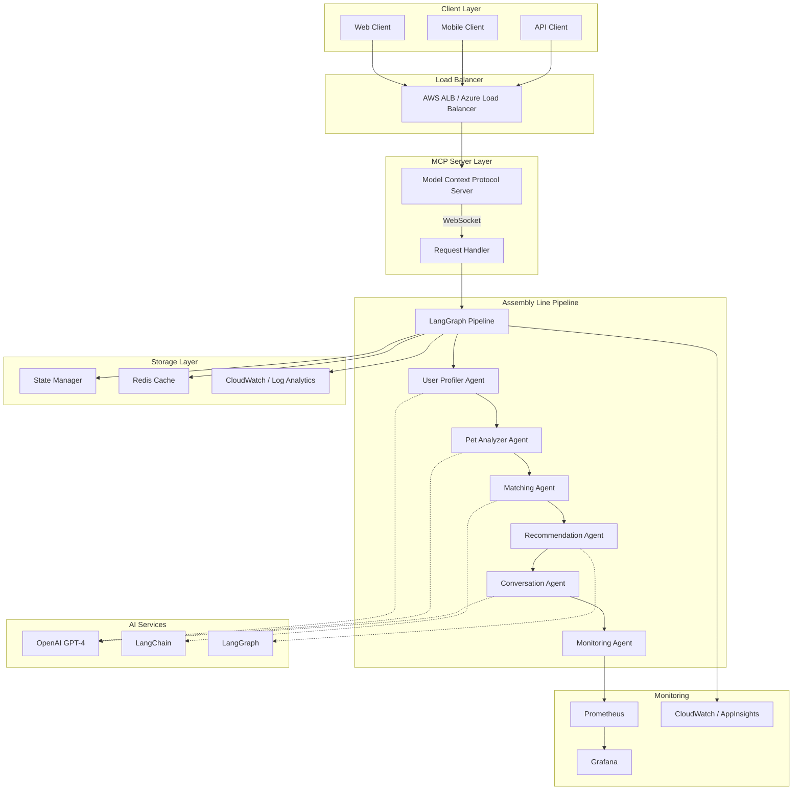
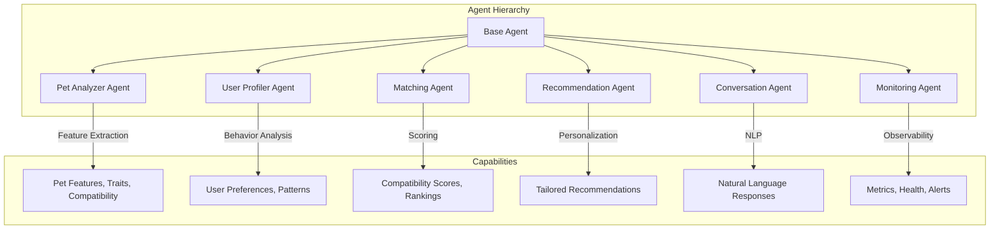
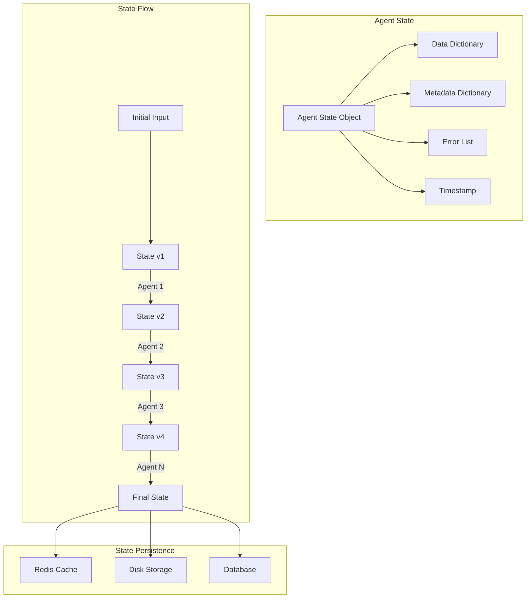
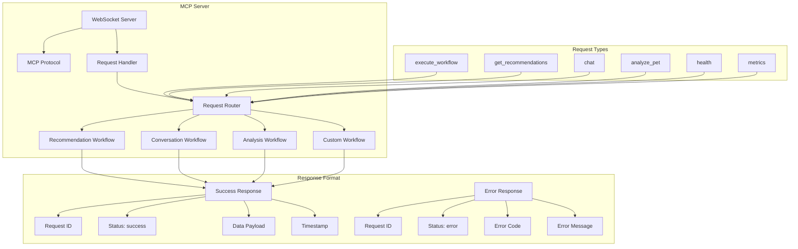
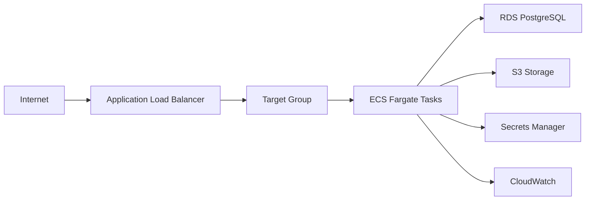
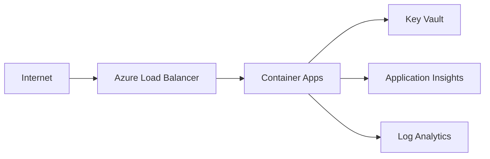

# 🤖 PetSwipe Agentic AI Pipeline

> [!NOTE]
> A sophisticated multi-agent AI system using LangGraph and LangChain with assembly line architecture for intelligent pet matching and recommendations.

[](https://www.python.org/)
[](https://langchain.com/)
[](https://langchain-ai.github.io/langgraph/)
[](https://aws.amazon.com/)
[](https://azure.microsoft.com/)
[](https://www.docker.com/)
[](../LICENSE)

---

## 📋 Table of Contents

1. [Overview](#-overview)
2. [Architecture](#-architecture)
3. [Agent System](#-agent-system)
4. [Assembly Line Pipeline](#-assembly-line-pipeline)
5. [MCP Server](#-mcp-server)
6. [Installation](#-installation)
7. [Configuration](#-configuration)
8. [Usage](#-usage)
9. [Deployment](#-deployment)
   - [AWS Deployment](#aws-deployment)
   - [Azure Deployment](#azure-deployment)
10. [API Reference](#-api-reference)
11. [Monitoring](#-monitoring)
12. [Development](#-development)
13. [Testing](#-testing)
14. [Contributing](#-contributing)
15. [License](#-license)

---

## 🎯 Overview

The PetSwipe Agentic AI Pipeline is a production-ready, scalable AI system that leverages multiple specialized agents working in an assembly line architecture. Built with LangGraph and LangChain, it provides intelligent pet matching, personalized recommendations, and natural language conversations.

### Key Features

- ✅ **Multi-Agent Architecture** - 6 specialized agents working in harmony
- ✅ **Assembly Line Processing** - Sequential and parallel agent execution
- ✅ **LangGraph Orchestration** - State-of-the-art workflow management
- ✅ **MCP Server** - Model Context Protocol for standardized AI interactions
- ✅ **Production Ready** - Full AWS and Azure deployment configurations
- ✅ **Auto-Scaling** - Horizontal scaling for high availability
- ✅ **Monitoring & Observability** - Built-in metrics and logging
- ✅ **Docker Support** - Containerized for easy deployment

---

## 🏗 Architecture

### High-Level System Architecture



### Assembly Line Architecture

The assembly line architecture processes requests through a series of specialized agents, where each agent performs a specific task and passes the enriched data to the next agent.

```mermaid
graph LR
    Input[Input Data] --> Stage1

    subgraph "Stage 1: User Profiling"
        Stage1[User Profiler Agent]
        Stage1 --> |User Profile| Buffer1[State Buffer]
    end

    subgraph "Stage 2: Pet Analysis"
        Buffer1 --> Stage2[Pet Analyzer Agent]
        Stage2 --> |Pet Features| Buffer2[State Buffer]
    end

    subgraph "Stage 3: Matching"
        Buffer2 --> Stage3[Matching Agent]
        Stage3 --> |Compatibility Scores| Buffer3[State Buffer]
    end

    subgraph "Stage 4: Recommendations"
        Buffer3 --> Stage4[Recommendation Agent]
        Stage4 --> |Personalized Recs| Buffer4[State Buffer]
    end

    subgraph "Stage 5: Conversation (Optional)"
        Buffer4 --> Stage5[Conversation Agent]
        Stage5 --> |Enriched Response| Buffer5[State Buffer]
    end

    subgraph "Stage 6: Monitoring"
        Buffer5 --> Stage6[Monitoring Agent]
        Stage6 --> |Metrics & Health| Output[Output Data]
    end
```



---

## 🤖 Agent System

### Agent Overview



### 1. Pet Analyzer Agent

**Purpose**: Analyzes pet profiles and extracts intelligent features using AI.

**Capabilities**:
- Extract personality traits from descriptions
- Identify care requirements
- Generate compatibility factors
- Enrich metadata with AI insights

**Input**: Pet data (name, type, description, shelter info)

**Output**: Structured analysis with personality traits, care needs, and compatibility factors

### 2. User Profiler Agent

**Purpose**: Builds comprehensive user profiles from behavior and preferences.

**Capabilities**:
- Analyze swipe patterns
- Extract user preferences
- Build behavioral profiles
- Generate preference embeddings

**Input**: User data, swipe history

**Output**: User profile with preferences, behavioral patterns, and embeddings

### 3. Matching Agent

**Purpose**: Performs intelligent matching between users and pets.

**Capabilities**:
- Calculate compatibility scores
- Apply semantic matching algorithms
- Implement business rules
- Rank potential matches

**Input**: User profile, pet candidates

**Output**: Ranked matches with compatibility scores and reasons

### 4. Recommendation Agent

**Purpose**: Generates personalized pet recommendations.

**Capabilities**:
- Create personalized recommendations
- Apply collaborative filtering
- Provide detailed explanations
- Diversify results

**Input**: Matches with scores

**Output**: Personalized recommendations with explanations

### 5. Conversation Agent

**Purpose**: Handles natural language conversations with users.

**Capabilities**:
- Answer pet-related questions
- Provide adoption guidance
- Maintain conversation context
- Integrate with RAG system

**Input**: User message, context

**Output**: Natural language response with conversation history

### 6. Monitoring Agent

**Purpose**: Monitors system performance and collects metrics.

**Capabilities**:
- Track pipeline performance
- Log agent executions
- Collect and export metrics
- Alert on anomalies

**Input**: Execution data

**Output**: Metrics, health status, anomaly alerts

---

## 🔄 Assembly Line Pipeline

### Workflow Execution Flow


### State Management



---

## 🌐 MCP Server

### Model Context Protocol Server Architecture



### MCP Protocol Message Format

**Request**:
```json
{
  "id": "unique-request-id",
  "type": "execute_workflow",
  "version": "1.0.0",
  "timestamp": "2025-11-04T18:00:00Z",
  "data": {
    "workflow": "recommendation",
    "input": {
      "user": {...},
      "pet_candidates": [...]
    }
  }
}
```

**Response**:
```json
{
  "id": "unique-request-id",
  "version": "1.0.0",
  "status": "success",
  "timestamp": "2025-11-04T18:00:05Z",
  "data": {
    "recommendations": [...],
    "metadata": {...}
  }
}
```

---

## 📦 Installation

### Prerequisites

- Python 3.11+
- Docker (optional)
- OpenAI API Key
- AWS CLI (for AWS deployment)
- Azure CLI (for Azure deployment)

### Local Installation

```bash
# Clone the repository
git clone https://github.com/hoangsonww/PetSwipe-Match-App.git
cd PetSwipe-Match-App/agentic_ai

# Create virtual environment
python -m venv venv
source venv/bin/activate  # On Windows: venv\Scripts\activate

# Install dependencies
pip install -r requirements.txt

# Copy environment configuration
cp config/.env.example .env

# Edit .env with your configuration
nano .env
```

### Docker Installation

```bash
# Build the image
docker-compose build

# Start the services
docker-compose up -d

# Check logs
docker-compose logs -f agentic-ai
```

---

## ⚙️ Configuration

### Environment Variables

Create a `.env` file in the root directory:

```env
# Core Configuration
ENVIRONMENT=production
OPENAI_API_KEY=your_openai_api_key

# Server
SERVER_HOST=0.0.0.0
SERVER_PORT=8765

# Agent Configuration
MODEL=gpt-4o-mini
TEMPERATURE=0.7
MIN_SCORE_THRESHOLD=0.5

# AWS (Optional)
AWS_REGION=us-east-1
AWS_ACCESS_KEY_ID=your_key
AWS_SECRET_ACCESS_KEY=your_secret

# Azure (Optional)
AZURE_LOCATION=eastus
AZURE_SUBSCRIPTION_ID=your_subscription_id
```

### Configuration File

Modify `config/config.yaml` for advanced settings:

```yaml
server:
  host: "0.0.0.0"
  port: 8765

models:
  default_model: "gpt-4o-mini"
  temperature: 0.7

agents:
  pet_analyzer:
    enabled: true
    model: "gpt-4o-mini"
  # ... more agent configs

costs:
  enabled: true
  export_path: "./logs/ai_costs.jsonl"
  require_known_models: true
  models:
    gpt-4o-mini:
      input_per_1k: 0.00015
      output_per_1k: 0.0006
    gemini-3-pro-preview:
      tiers:
        - max_prompt_tokens: 200000
          input_per_1k: 0.002
          cached_input_per_1k: 0.0002
          output_per_1k: 0.012
        - min_prompt_tokens: 200001
          input_per_1k: 0.004
          cached_input_per_1k: 0.0004
          output_per_1k: 0.018
    gpt-realtime:
      modalities:
        text:
          input_per_1k: 0.004
          cached_input_per_1k: 0.0004
          output_per_1k: 0.016
        audio:
          input_per_1k: 0.032
          cached_input_per_1k: 0.0004
          output_per_1k: 0.064
    claude-sonnet-4.5:
      input_per_1k: 0.003
      cache_write_5m_per_1k: 0.00375
      cache_write_1h_per_1k: 0.006
      cached_input_per_1k: 0.0003
      output_per_1k: 0.015
```

---

## 🚀 Usage

### Starting the API Server

```bash
# Activate virtual environment
source venv/bin/activate

# Start the server
python -m agentic_ai.api.server

# Or with Docker
docker-compose up
```

### Using the Python API

```python
from workflows import WorkflowBuilder

# Initialize configuration
config = {
    "model": "gpt-4o-mini",
    "temperature": 0.7,
    "openai_api_key": "your-api-key"
}

# Build recommendation workflow
pipeline = WorkflowBuilder.build_recommendation_workflow(config)

# Execute workflow
result = await pipeline.execute({
    "user": {...},
    "swipe_history": [...],
    "pet_candidates": [...]
})

# Access results
recommendations = result["data"]["recommendations"]
```

### Using the WebSocket (MCP) API

```python
import asyncio
import websockets
import json

async def get_recommendations():
    uri = "ws://localhost:8765/mcp"

    async with websockets.connect(uri) as websocket:
        request = {
            "id": "req-123",
            "type": "get_recommendations",
            "version": "1.0.0",
            "data": {
                "user": {...},
                "pet_candidates": [...]
            }
        }

        await websocket.send(json.dumps(request))
        response = await websocket.recv()

        result = json.loads(response)
        return result

# Run
recommendations = asyncio.run(get_recommendations())
```

### Using the REST API

```bash
curl -X POST http://localhost:8765/v1/recommendations \
  -H "Content-Type: application/json" \
  -d '{
    "user": {"id": "user-1", "bio": "I love dogs"},
    "swipe_history": [],
    "pet_candidates": []
  }'
```

---

## 🚢 Deployment

### AWS Deployment

#### Option 1: ECS Fargate (Recommended)

```bash
cd aws/terraform

# Initialize Terraform
terraform init

# Plan deployment
terraform plan \
  -var="container_image=your-ecr-repo/agentic-ai:latest" \
  -var="openai_api_key=your-key"

# Apply deployment
terraform apply
```

**Architecture**:


#### Option 2: AWS Lambda

```bash
cd aws/lambda

# Package dependencies
pip install -r requirements.txt -t ./package
cd package && zip -r ../layer.zip . && cd ..

# Package function
zip -r function.zip handler.py

# Deploy with Terraform
terraform init
terraform apply
```

### Azure Deployment

#### Option 1: Azure Container Apps (Recommended)

```bash
cd azure/terraform

# Login to Azure
az login

# Initialize Terraform
terraform init

# Deploy
terraform apply \
  -var="container_image=your-acr.azurecr.io/agentic-ai:latest" \
  -var="openai_api_key=your-key"
```

**Architecture**:


#### Option 2: Azure Kubernetes Service (AKS)

```bash
cd azure/aks

# Create AKS cluster
az aks create \
  --resource-group agentic-ai-rg \
  --name agentic-ai-aks \
  --node-count 3 \
  --enable-addons monitoring

# Get credentials
az aks get-credentials --resource-group agentic-ai-rg --name agentic-ai-aks

# Deploy application
kubectl apply -f deployment.yaml
```

---

## 📖 API Reference

### MCP Server Endpoints

#### Execute Workflow

```json
POST /execute
{
  "type": "execute_workflow",
  "data": {
    "workflow": "recommendation",
    "input": {...}
  }
}
```

#### Get Recommendations

```json
POST /recommendations
{
  "type": "get_recommendations",
  "data": {
    "user": {...},
    "pet_candidates": [...]
  }
}
```

#### Chat

```json
POST /chat
{
  "type": "chat",
  "data": {
    "message": "Tell me about this pet",
    "context": {...}
  }
}
```

#### Health Check

```json
GET /health
```

Response:
```json
{
  "status": "healthy",
  "workflows": ["recommendation", "conversation", "analysis", "profile", "match"]
}
```

---

## 📊 Monitoring

### Metrics Collection

The system collects the following metrics:

- **Request Metrics**: Total requests, success rate, error rate
- **Performance Metrics**: Processing time, agent execution time
- **Resource Metrics**: CPU usage, memory usage, active connections
- **Business Metrics**: Recommendations generated, matches created
- **Cost Metrics**: Token usage and USD cost by workflow, agent, and model
  - Detailed entries are also written to `logs/ai_costs.jsonl` when enabled
  - Pricing supports tiers (`tiers`) and modality-based rates (`modalities`)
  - Unit pricing supported via `unit_cost`/`unit_costs` (pass `unit_count` + `unit_tier`)

### Prometheus Integration

```yaml
# prometheus.yml
scrape_configs:
  - job_name: 'agentic-ai'
    static_configs:
      - targets: ['localhost:8765']
```

### Grafana Dashboards

Access Grafana at `http://localhost:3000` (default: admin/admin)

Pre-configured dashboards:
- System Overview
- Agent Performance
- Error Tracking
- Request Analytics
- Cost & Token Usage

### Cost Tracking Endpoints

```bash
# Summary (optionally scoped by minutes)
curl http://localhost:8765/v1/costs/summary?since_minutes=60

# Recent cost entries
curl http://localhost:8765/v1/costs/recent?limit=50
```

---

## 🧪 Testing

### Run Unit Tests

```bash
pytest tests/ -v
```

### Run Integration Tests

```bash
pytest tests/integration/ -v --asyncio-mode=auto
```

### Test Coverage

```bash
pytest --cov=agentic_ai --cov-report=html
```

---

## 🤝 Contributing

We welcome contributions! Please see the main [CONTRIBUTING.md](../CONTRIBUTING.md) for guidelines.

---

## 📄 License

MIT License - see [LICENSE](../LICENSE) for details.

---

## 👨‍💻 Authors

Built with ❤️ by the PetSwipe Team

- **Son Nguyen** - [GitHub](https://github.com/hoangsonww) | [LinkedIn](https://linkedin.com/in/hoangsonw/)

---

## 🙏 Acknowledgments

- LangChain team for the amazing framework
- LangGraph for workflow orchestration
- OpenAI for GPT models
- The open-source community

---

**⭐ If you find this project useful, please consider giving it a star!**
