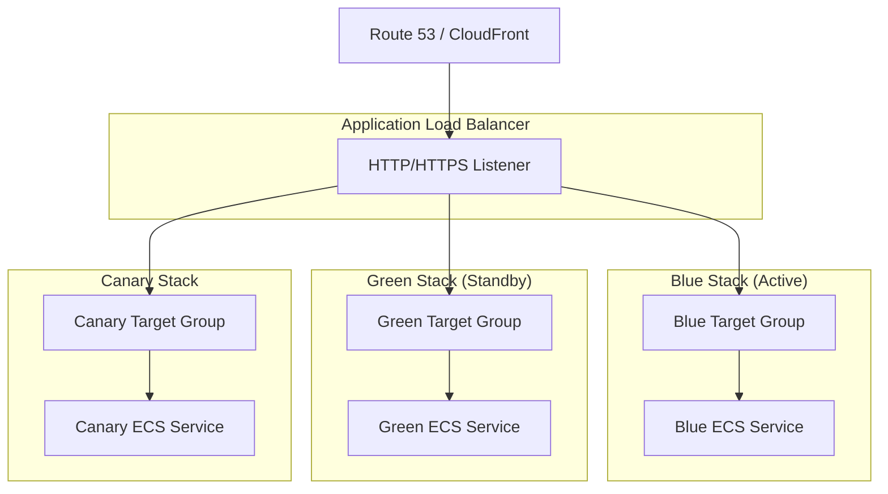

# 🚀 PetSwipe Production Deployment Guide

## Table of Contents

1. [Overview](#overview)
2. [Deployment Strategies](#deployment-strategies)
   - [Blue-Green Deployment](#blue-green-deployment)
   - [Canary Deployment](#canary-deployment)
3. [Infrastructure](#infrastructure)
4. [Prerequisites](#prerequisites)
5. [Quick Start](#quick-start)
6. [Deployment Workflow](#deployment-workflow)
7. [Monitoring & Observability](#monitoring--observability)
8. [Rollback Procedures](#rollback-procedures)
9. [Troubleshooting](#troubleshooting)
10. [Best Practices](#best-practices)

---

## Overview

PetSwipe uses advanced deployment strategies to ensure zero-downtime deployments with instant rollback capabilities. The infrastructure is built on AWS ECS Fargate with Terraform for Infrastructure as Code (IaC).

### Key Features

- ✅ **Zero-Downtime Deployments** - Users never experience service interruptions
- ✅ **Automated Rollback** - Failures trigger automatic rollback to previous version
- ✅ **Health Checks** - Comprehensive health monitoring during deployments
- ✅ **Traffic Control** - Gradual or instant traffic shifting
- ✅ **Observability** - Full CloudWatch integration with dashboards and alerts
- ✅ **Security** - KMS encryption, WAF, and security scanning

---

## Deployment Strategies

PetSwipe supports two production-grade deployment strategies:

### Blue-Green Deployment

**Best For:** Major releases, database migrations, high-risk changes

#### How It Works

1. **Two Identical Environments**
   - Blue (currently serving production traffic)
   - Green (receives new deployment)

2. **Deployment Process**
   ```mermaid
   flowchart LR
       Deploy[Deploy to Green] --> Test[Run smoke/integration tests]
       Test --> Approve[Manual approval]
       Approve --> Switch[Switch ALB listener to Green]
       Switch --> Monitor[Monitor health and metrics]
       Monitor --> Cleanup[Decommission old Blue tasks]
   ```

3. **Traffic Switch**
   - Instant cutover via ALB listener modification
   - Can revert in seconds if issues detected

#### Benefits

- ✅ Instant rollback capability
- ✅ Full production testing before cutover
- ✅ No version mixing
- ✅ Simple to understand and execute

#### When to Use

- Major version upgrades
- Database schema changes
- High-risk features
- When you need quick rollback

---

### Canary Deployment

**Best For:** Feature releases, performance improvements, gradual rollouts

#### How It Works

1. **Progressive Traffic Shift**
   ```mermaid
   flowchart LR
       Start[Start: Blue 100%]
       Stage5[Canary at 5%]
       Stage10[Canary at 10%]
       Stage25[Canary at 25%]
       Stage50[Canary at 50%]
       Stage100[Full rollout 100%]

       Start --> Stage5 --> Stage10 --> Stage25 --> Stage50 --> Stage100
   ```

2. **Monitoring at Each Stage**
   - Error rates
   - Latency (P50, P95, P99)
   - CPU/Memory utilization
   - Custom application metrics

3. **Automated Rollback**
   - CloudWatch alarms trigger Lambda function
   - Automatic traffic revert to stable version
   - Canary service scaled down

#### Benefits

- ✅ Early detection of issues
- ✅ Minimal user impact if problems occur
- ✅ Production traffic validation
- ✅ Confidence through gradual rollout

#### When to Use

- New features
- Performance optimizations
- A/B testing scenarios
- Gradual user base exposure

---

## Infrastructure

### Architecture Diagram



### Components

| Component | Purpose | Configuration |
|-----------|---------|---------------|
| **ALB** | Load balancing & traffic routing | Multi-AZ, HTTPS, health checks |
| **Target Groups** | Route traffic to ECS tasks | Blue, Green, Canary |
| **ECS Cluster** | Container orchestration | Fargate, auto-scaling |
| **ECS Services** | Run containerized apps | Blue (prod), Green (standby), Canary |
| **ECR** | Docker image registry | Automated scanning |
| **RDS** | PostgreSQL database | Multi-AZ, automated backups |
| **CloudWatch** | Monitoring & logging | Dashboards, alarms, logs |
| **CodeDeploy** | Deployment orchestration | Canary configurations |

---

## Prerequisites

### Required Tools

```bash
# AWS CLI
aws --version  # >= 2.0

# Terraform
terraform version  # >= 1.0

# Docker
docker --version  # >= 20.10

# Node.js
node --version  # >= 18.0

# Jenkins (for CI/CD)
```

### AWS Permissions

Required IAM permissions:
- ECS full access
- ECR full access
- ALB management
- CloudWatch full access
- S3 access for state/logs
- RDS management
- Lambda (for canary rollback)

### Environment Variables

```bash
export AWS_REGION=us-east-1
export AWS_ACCOUNT_ID=$(aws sts get-caller-identity --query Account --output text)
export PROJECT=petswipe
export ENVIRONMENT=production
```

---

## Quick Start

### 1. Infrastructure Setup

```bash
# Navigate to terraform directory
cd terraform

# Initialize Terraform
terraform init

# Review planned changes
terraform plan

# Apply infrastructure
terraform apply
```

### 2. Build & Push Docker Images

```bash
# Login to ECR
aws ecr get-login-password --region $AWS_REGION | \
  docker login --username AWS --password-stdin \
  ${AWS_ACCOUNT_ID}.dkr.ecr.${AWS_REGION}.amazonaws.com

# Build backend image
docker build -t petswipe-backend:latest -f backend/Dockerfile backend/

# Tag image
docker tag petswipe-backend:latest \
  ${AWS_ACCOUNT_ID}.dkr.ecr.${AWS_REGION}.amazonaws.com/petswipe-backend:latest

# Push to ECR
docker push ${AWS_ACCOUNT_ID}.dkr.ecr.${AWS_REGION}.amazonaws.com/petswipe-backend:latest
```

### 3. Deploy Using Blue-Green

```bash
# Run blue-green deployment script
export IMAGE_TAG=v1.2.3
export AUTO_PROMOTE=false  # Require manual approval

./scripts/blue-green-deploy.sh
```

### 4. Deploy Using Canary

```bash
# Run canary deployment script
export IMAGE_TAG=v1.2.3
export CANARY_STAGES=5,10,25,50,100
export STAGE_DURATION=300  # 5 minutes per stage
export AUTO_PROMOTE=false

./scripts/canary-deploy.sh
```

---

## Deployment Workflow

### Option 1: Jenkins Pipeline (Recommended)

#### Blue-Green via Jenkins

```groovy
// Trigger blue-green deployment
build job: 'petswipe-bluegreen-deploy',
  parameters: [
    string(name: 'IMAGE_TAG', value: 'v1.2.3')
  ]
```

**Pipeline Stages:**

1. ✅ Preflight Checks
2. ✅ Lint & Test
3. ✅ Security Scan
4. ✅ Build Docker Image
5. ✅ Container Vulnerability Scan
6. ✅ Push to ECR
7. ⏸️  Deploy to Inactive Environment
8. ✅ Integration Tests
9. ✅ Load Testing
10. 🛑 **Manual Approval**
11. ⏸️  Traffic Switch
12. ✅ Post-Deployment Monitoring
13. ✅ Cleanup Old Environment

#### Canary via Jenkins

```groovy
// Trigger canary deployment
build job: 'petswipe-canary-deploy',
  parameters: [
    string(name: 'IMAGE_TAG', value: 'v1.2.3'),
    string(name: 'CANARY_STAGES', value: '5,10,25,50,100')
  ]
```

**Pipeline Stages:**

1. ✅ Preflight Checks
2. ✅ Tests & Security
3. ✅ Build & Scan
4. ⏸️  Deploy Canary 5%
5. 📊 Monitor 5 minutes
6. 🛑 **Approval for 10%**
7. ⏸️  Deploy Canary 10%
8. 📊 Monitor 5 minutes
9. 🛑 **Approval for 25%**
10. ⏸️  Deploy Canary 25%
11. ... (continues through 50%, 100%)

### Option 2: Manual Script Execution

#### Blue-Green Manual Deployment

```bash
#!/bin/bash
set -e

# Configuration
export AWS_REGION=us-east-1
export PROJECT=petswipe
export ENVIRONMENT=production
export IMAGE_TAG=v1.2.3

# Execute deployment
./scripts/blue-green-deploy.sh

# Monitor deployment
aws ecs describe-services \
  --cluster ${PROJECT}-${ENVIRONMENT}-cluster \
  --services ${PROJECT}-${ENVIRONMENT}-green
```

#### Canary Manual Deployment

```bash
#!/bin/bash
set -e

# Configuration
export AWS_REGION=us-east-1
export PROJECT=petswipe
export ENVIRONMENT=production
export IMAGE_TAG=v1.2.3
export CANARY_STAGES=5,10,25,50,100
export STAGE_DURATION=300
export ERROR_THRESHOLD=5.0
export LATENCY_THRESHOLD=1000

# Execute deployment
./scripts/canary-deploy.sh
```

---

## Monitoring & Observability

### CloudWatch Dashboards

Access dashboards at:
```
https://console.aws.amazon.com/cloudwatch/home?region=us-east-1#dashboards:name=petswipe-production-overview
```

**Available Dashboards:**

1. **Main Overview** - `petswipe-production-overview`
   - ECS CPU/Memory
   - ALB metrics
   - RDS performance
   - Application metrics

2. **Canary Deployment** - `petswipe-production-canary-deployment`
   - Canary health
   - Traffic split
   - Error rates
   - Latency comparison

### Key Metrics

| Metric | Threshold | Action |
|--------|-----------|--------|
| Error Rate | > 5% | Auto-rollback (canary) / Alert |
| P99 Latency | > 1.5s | Alert |
| CPU Utilization | > 85% | Auto-scale / Alert |
| Unhealthy Hosts | > 0 | Alert + Investigation |
| DB Connections | > 80 | Alert |

### CloudWatch Alarms

**Deployment Health Alarms:**
- `petswipe-production-alb-unhealthy-hosts`
- `petswipe-production-alb-high-latency`
- `petswipe-production-alb-5xx-errors`
- `petswipe-production-canary-high-errors`
- `petswipe-production-canary-high-latency`

**System Health Alarms:**
- `petswipe-production-rds-cpu-high`
- `petswipe-production-rds-storage-low`
- `petswipe-production-rds-connections-high`

### Logs

**CloudWatch Log Groups:**
```
/aws/ecs/petswipe-production               # ECS container logs
/aws/application/petswipe-production       # Application logs
/aws/elasticloadbalancing/petswipe-production  # ALB logs
```

**Useful Log Queries:**

```
# Find errors
fields @timestamp, @message
| filter @message like /ERROR/
| sort @timestamp desc
| limit 100

# Slow queries (> 1 second)
fields @timestamp, @message
| filter @message like /duration/
| parse @message /duration: (?<duration>\d+)/
| filter duration > 1000
| sort duration desc

# Request patterns
fields @timestamp, request_uri, status_code, response_time
| stats count() by request_uri, status_code
| sort count desc
```

---

## Rollback Procedures

### Blue-Green Rollback

**Automatic Rollback:**
- Occurs if health checks fail during deployment
- Script automatically reverts traffic to previous environment

**Manual Rollback:**

```bash
# Get current active environment
ACTIVE=$(aws elbv2 describe-listeners \
  --listener-arns $LISTENER_ARN \
  --query 'Listeners[0].DefaultActions[0].TargetGroupArn' \
  --output text)

# Switch back to blue
aws elbv2 modify-listener \
  --listener-arn $LISTENER_ARN \
  --default-actions Type=forward,TargetGroupArn=$BLUE_TG_ARN

# Scale up blue if needed
aws ecs update-service \
  --cluster petswipe-production-cluster \
  --service petswipe-production-blue \
  --desired-count 4
```

**Recovery Time:** < 30 seconds

### Canary Rollback

**Automatic Rollback:**
- Triggered by CloudWatch alarms
- Lambda function automatically:
  1. Sets traffic to 100% blue, 0% canary
  2. Scales down canary service
  3. Sends SNS notification

**Manual Rollback:**

```bash
# Revert traffic
./scripts/canary-deploy.sh --rollback

# Or manually
aws elbv2 modify-rule \
  --rule-arn $CANARY_RULE_ARN \
  --actions Type=forward,ForwardConfig="{
    TargetGroups=[
      {TargetGroupArn=${BLUE_TG_ARN},Weight=100},
      {TargetGroupArn=${CANARY_TG_ARN},Weight=0}
    ]
  }"
```

**Recovery Time:** < 1 minute

---

## Troubleshooting

### Common Issues

#### 1. Deployment Stuck in "Deploying" State

**Symptoms:**
- ECS service stuck deploying
- Tasks failing health checks

**Solution:**
```bash
# Check service events
aws ecs describe-services \
  --cluster petswipe-production-cluster \
  --services petswipe-production-green \
  --query 'services[0].events[0:10]'

# Check task logs
aws logs tail /aws/ecs/petswipe-production --follow

# Force new deployment
aws ecs update-service \
  --cluster petswipe-production-cluster \
  --service petswipe-production-green \
  --force-new-deployment
```

#### 2. High Error Rate During Canary

**Symptoms:**
- 5XX errors spike
- Canary rollback triggered

**Solution:**
```bash
# Check application logs
aws logs tail /aws/application/petswipe-production --follow --filter ERROR

# Check database connections
aws rds describe-db-instances \
  --db-instance-identifier petswipe-production-db \
  --query 'DBInstances[0].DBInstanceStatus'

# Review canary metrics
aws cloudwatch get-metric-statistics \
  --namespace AWS/ApplicationELB \
  --metric-name HTTPCode_Target_5XX_Count \
  --start-time $(date -u -d '30 minutes ago' +%Y-%m-%dT%H:%M:%S) \
  --end-time $(date -u +%Y-%m-%dT%H:%M:%S) \
  --period 60 \
  --statistics Sum
```

#### 3. Database Migration Issues

**Symptoms:**
- New code fails with DB errors
- Rollback needed

**Solution:**
```bash
# Run migration rollback
cd backend
npm run migration:revert

# Rollback deployment
./scripts/blue-green-deploy.sh --rollback

# Investigate migration logs
aws logs filter-pattern /aws/ecs/petswipe-production "migration"
```

#### 4. ALB Health Check Failures

**Symptoms:**
- Targets marked unhealthy
- Traffic not routing

**Solution:**
```bash
# Check target health
aws elbv2 describe-target-health \
  --target-group-arn $TG_ARN

# Verify health endpoint
curl -v https://your-alb-dns/health

# Check security groups
aws ec2 describe-security-groups \
  --group-ids $SG_ID

# Review health check configuration
aws elbv2 describe-target-groups \
  --target-group-arns $TG_ARN \
  --query 'TargetGroups[0].HealthCheckPath'
```

---

## Best Practices

### Pre-Deployment

✅ **Run tests locally**
```bash
cd backend && npm test
cd frontend && npm test
```

✅ **Security scan images**
```bash
trivy image petswipe-backend:latest
```

✅ **Validate Terraform changes**
```bash
cd terraform
terraform plan
```

✅ **Database migrations**
```bash
# Test migrations in staging first
npm run migration:run --dry-run
```

### During Deployment

✅ **Monitor dashboards actively**

✅ **Keep communication channel open**
- Slack/Teams notification
- On-call engineer available

✅ **Document deployment**
- Note deployment time
- Track any issues
- Record metrics

✅ **Gradual rollout for high-risk changes**
- Use canary for major features
- Start with small traffic percentages

### Post-Deployment

✅ **Verify functionality**
```bash
# Smoke tests
curl https://petswipe.com/health
curl https://petswipe.com/api/pets?limit=1
```

✅ **Check metrics for 30 minutes**

✅ **Review error logs**

✅ **Update runbook if needed**

✅ **Celebrate success** 🎉

---

## Additional Resources

- [Terraform AWS Provider Docs](https://registry.terraform.io/providers/hashicorp/aws/latest/docs)
- [AWS ECS Best Practices](https://docs.aws.amazon.com/AmazonECS/latest/bestpracticesguide/intro.html)
- [Blue-Green Deployment Pattern](https://martinfowler.com/bliki/BlueGreenDeployment.html)
- [Canary Deployments](https://martinfowler.com/bliki/CanaryRelease.html)
- [AWS CodeDeploy Documentation](https://docs.aws.amazon.com/codedeploy/)

---

## Support

For deployment issues or questions:
- Email: devops@petswipe.com
- Slack: #petswipe-deployments
- On-call: PagerDuty escalation

---

**Last Updated:** November 2025
**Version:** 2.0.0
