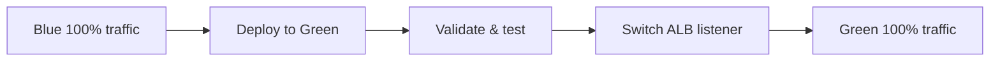
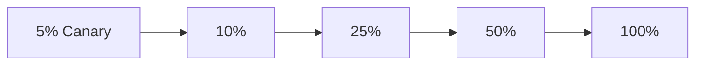

# 🚀 Deployment Quick Reference

## Blue-Green Deployment

### When to Use
- Major version upgrades
- Database schema changes
- High-risk features
- Need instant rollback

### Quick Deploy
```bash
export IMAGE_TAG=v1.2.3
export AUTO_PROMOTE=false
./scripts/blue-green-deploy.sh
```

### Traffic Flow


### Rollback Time
< 30 seconds

---

## Canary Deployment

### When to Use
- Feature releases
- Performance improvements
- A/B testing
- Gradual user exposure

### Quick Deploy
```bash
export IMAGE_TAG=v1.2.3
export CANARY_STAGES=5,10,25,50,100
export STAGE_DURATION=300
./scripts/canary-deploy.sh
```

### Traffic Flow


### Rollback Time
< 1 minute (automated)

---

## Emergency Rollback

### Blue-Green
```bash
# Switch back to blue environment
aws elbv2 modify-listener \
  --listener-arn $LISTENER_ARN \
  --default-actions Type=forward,TargetGroupArn=$BLUE_TG_ARN
```

### Canary
```bash
# Automatic via CloudWatch alarms
# Manual:
./scripts/canary-deploy.sh --rollback
```

---

## Health Check Commands

### Check ECS Service
```bash
aws ecs describe-services \
  --cluster petswipe-production-cluster \
  --services petswipe-production-blue
```

### Check Target Health
```bash
aws elbv2 describe-target-health \
  --target-group-arn $TG_ARN
```

### View Logs
```bash
aws logs tail /aws/ecs/petswipe-production --follow
```

### Check Metrics
```bash
aws cloudwatch get-metric-statistics \
  --namespace AWS/ApplicationELB \
  --metric-name HTTPCode_Target_5XX_Count \
  --start-time $(date -u -d '5 minutes ago' +%Y-%m-%dT%H:%M:%S) \
  --end-time $(date -u +%Y-%m-%dT%H:%M:%S) \
  --period 60 \
  --statistics Sum
```

---

## Jenkins Pipelines

### Trigger Blue-Green
```
Job: petswipe-bluegreen-deploy
Parameters: IMAGE_TAG=v1.2.3
```

### Trigger Canary
```
Job: petswipe-canary-deploy
Parameters: IMAGE_TAG=v1.2.3, CANARY_STAGES=5,10,25,50,100
```

---

## Monitoring Dashboards

- **Main**: [petswipe-production-overview](https://console.aws.amazon.com/cloudwatch/)
- **Canary**: [petswipe-production-canary-deployment](https://console.aws.amazon.com/cloudwatch/)

---

## Key Metrics Thresholds

| Metric | Threshold | Action |
|--------|-----------|--------|
| Error Rate | > 5% | Rollback |
| P99 Latency | > 1.5s | Alert |
| CPU | > 85% | Scale |
| Unhealthy Hosts | > 0 | Alert |

---

## Contact

- **Email**: devops@petswipe.com
- **Slack**: #petswipe-deployments
- **On-call**: PagerDuty
